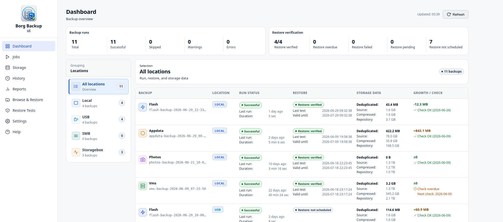

# Borg Backup UI

Web UI for BorgBackup on Unraid. Borg Backup UI provides a guided interface for
creating backup jobs, managing storage targets, running restore tests, browsing
archives, and monitoring backup health from one place.

> Project status: active development before public Community Apps publication.
> Public installation URLs are intentionally not listed here yet.



## Highlights

- Guided backup job wizard for common Unraid backup workflows.
- Storage profiles for local paths, USB devices, SMB shares, SSH targets, and
  Hetzner Storage Box style repositories.
- Selective Docker container and VM shutdown handling during backup runs.
- Backup dashboard with run status, restore verification, storage data, and
  repository checks.
- Backup history, reports, repository information, and Borg check integration.
- Browse & Restore assistant with configurable safe restore target roots.
- Automated restore tests with structured reports and restore history.
- Notifications through Unraid notifications, email, and ntfy.
- Import/export, support bundle, system health, and auditable migrations.

## What It Does

Borg Backup UI is built for Unraid users who want BorgBackup without maintaining
all operational glue by hand. It keeps the Borg repository model intact while
adding an Unraid-focused UI around jobs, storage profiles, schedules, checks,
reports, restore workflows, and notifications.

The plugin stores configuration under the Unraid flash configuration area and
keeps runtime data under the configured data directory. Secrets are handled via
dedicated secret files and must not be written into normal logs or public
artifacts.

## Feature Overview

### Backup Jobs

- Create and edit jobs through a multi-step wizard.
- Choose backup type, source paths, repository target, retention, passphrase,
  schedule, and runtime behavior.
- Stop all or selected Docker containers and VMs before a backup, then restart
  them after the run.
- Review a flow preview before saving the job.

### Storage and Repositories

- Manage storage targets and profiles for local, USB, SMB, SSH, and Storagebox
  style repositories.
- Run connection and repository checks from the UI.
- View repository size, compression, deduplication, and check state.
- Keep location grouping consistent across Dashboard, Jobs, History, Reports,
  Restore Tests, and Browse & Restore.

### Restore and Verification

- Browse Borg archives and restore selected files or directories.
- Restrict restore targets to administrator-approved safe roots.
- Track active restore runs and completed restore history.
- Configure and run automated restore tests for backup verification.
- Use restore test reports to verify repository accessibility, archive
  readability, metadata checks, sample restore, integrity comparison, and
  cleanup.

### Monitoring and Notifications

- Dashboard overview for backup runs, restore verification, and growth/check
  state.
- Backup history and reports for operational review.
- Notification events for successful, warning, failed, skipped, and overdue
  backup runs.
- Restore test notifications for success, failure, and overdue tests.
- Notification channels include Unraid notifications, email, and ntfy.

### Operations

- System health and migration status inside Settings.
- Structured migration state and JSONL audit logs.
- Support bundle creation for troubleshooting.
- Import/export flows for jobs, profiles, and secrets.
- Plugin packaging for Unraid with bundled BorgBackup runtime.

## Requirements

- Unraid with a running array.
- Python 3.10 or newer.
- Recommended on Unraid: `Python 3 for Unraid` from Community Applications.
- Reachable storage targets for the selected backup locations.

BorgBackup is bundled with the plugin package. No pip-based runtime dependency
installation is required for normal operation.

## Getting Started

1. Install the required Python runtime on Unraid.
2. Install Borg Backup UI through the approved project or release channel.
3. Open the Borg Backup UI plugin page from Unraid.
4. Configure the global data directory and basic settings.
5. Create at least one storage profile or local repository target.
6. Create a backup job with the wizard.
7. Run the first backup manually and review Dashboard, History, and Reports.
8. Configure restore tests and notifications for ongoing verification.

Public installation instructions will be added after the Community Apps
publication requirements are complete.

## Documentation

| Document | Purpose |
| --- | --- |
| [Technical overview](docs/README.md) | Runtime architecture, paths, build notes, and development basics. |
| [Release workflow](docs/release-workflow.md) | Build, test-channel, and stable release process. |
| [Manual maintenance tests](docs/manual-maintenance-tests.md) | Manual validation checklist for Unraid test systems. |
| [Changelog](docs/changelog.md) | Technical and release history. |
| [German user manual](docs/handbuch/README.md) | Current German handbuch draft. |

## Development

Syntax check example:

```bash
python3 -m py_compile borg_backup_ui.py api/*.py runtime/scripts/*.py
```

Build a plugin package:

```bash
./plugin/build.sh
```

Run the merge-request preflight:

```bash
./plugin/mr-preflight.sh
```

See [docs/release-workflow.md](docs/release-workflow.md) before preparing
plugin builds, test-channel deployments, or stable release promotions.

## Support

Use GitHub Issues for bugs, feature requests, and design discussions. When
reporting runtime problems, include the generated support bundle where possible
and remove private infrastructure details before sharing logs publicly.

## License

- Project: MIT
- Bundled BorgBackup: BSD-3-Clause, see
  [runtime/licenses/borg/LICENSE](runtime/licenses/borg/LICENSE)
