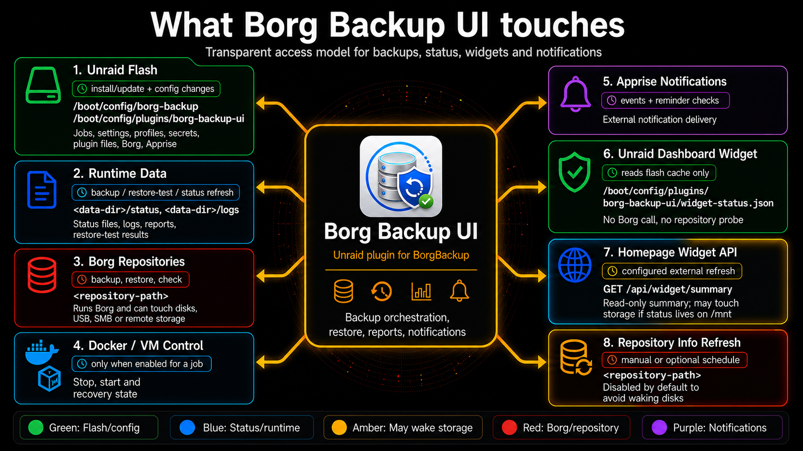
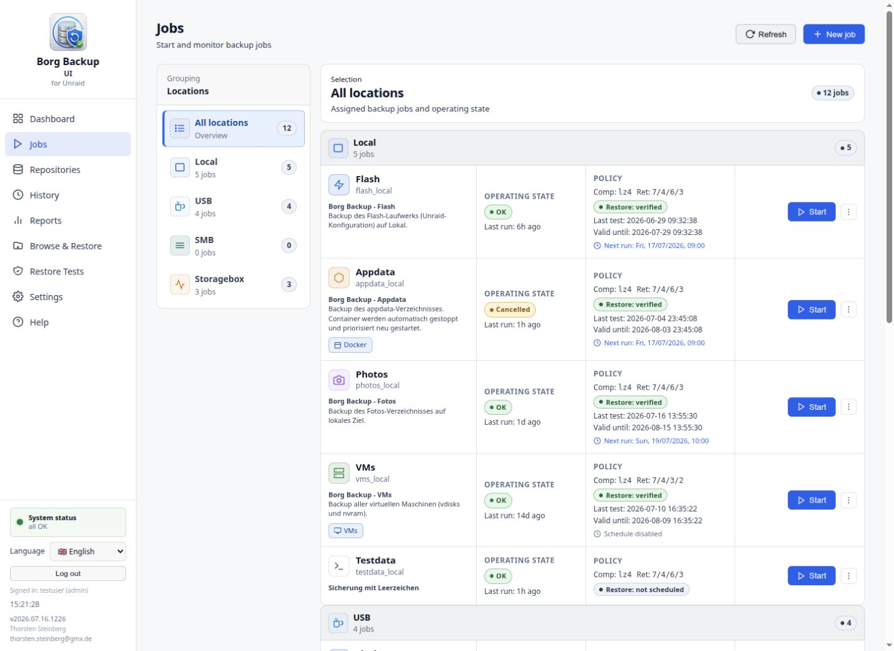
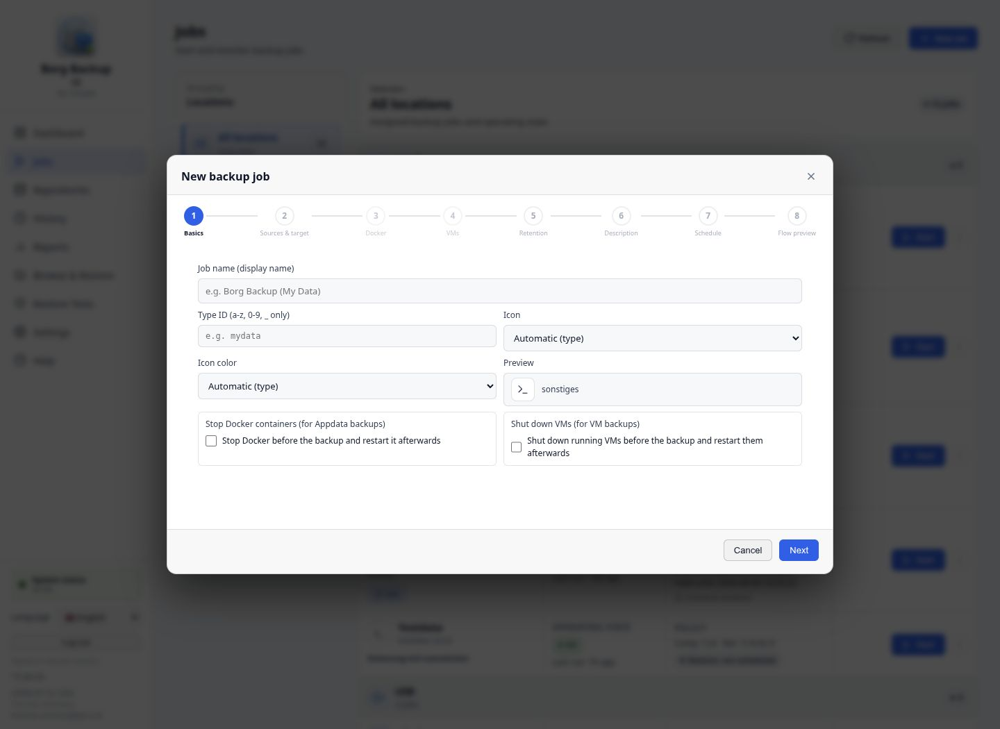
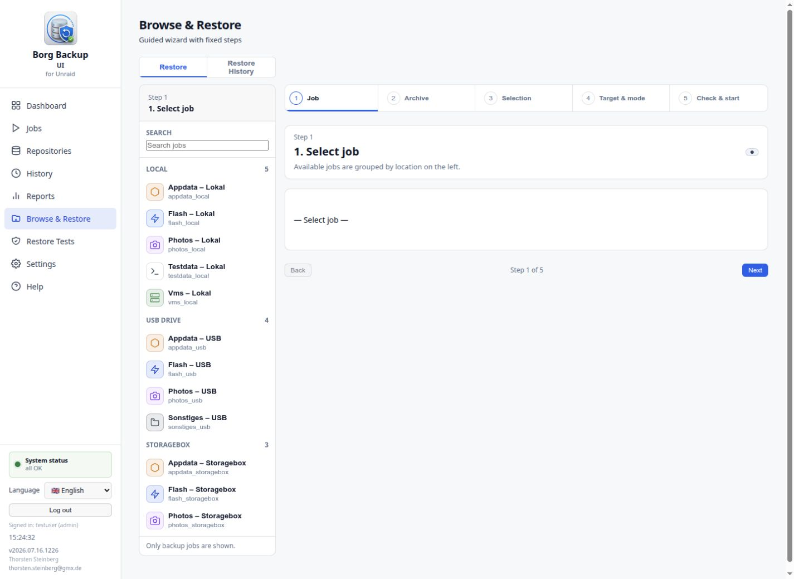
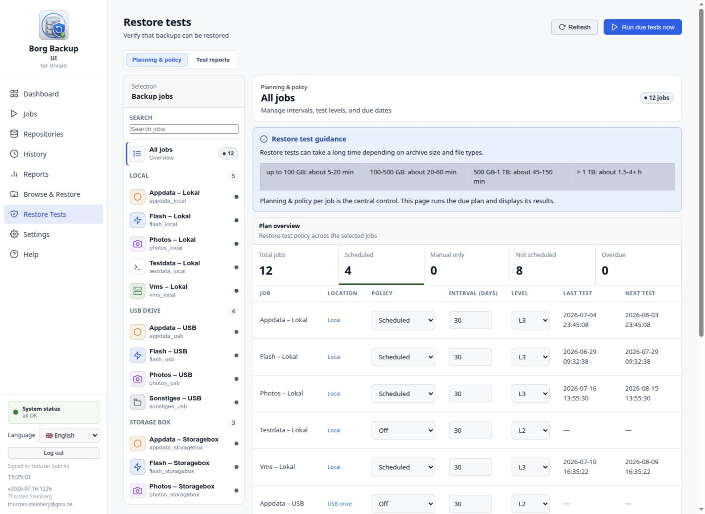

# Borg Backup UI

An Unraid plugin that turns BorgBackup into a guided backup and restore
workflow: configure jobs and repositories, browse archives, verify restores,
review reports, and receive notifications from one web interface.

Borg Backup UI is built for Unraid users who want the reliability of BorgBackup
without maintaining custom shell scripts for everyday operation. BorgBackup
remains the backup engine; this project adds the Unraid-focused control layer
around jobs, storage targets, schedules, restore workflows, checks, and support
diagnostics.

> Status: public beta, available through Unraid Community Apps. Start with
> non-critical data and verify a restore before relying on any backup setup.
> This project is not affiliated with BorgBackup or other Borg UI projects.

[Community Apps listing](https://ca.unraid.net/apps/borg-backup-ui-17vu3jm06a2wie) |
[English manual](https://github.com/borgforge/borg-backup-ui/blob/main/docs/user-manual/en/user-manual.md) |
[Deutsches Handbuch](https://github.com/borgforge/borg-backup-ui/blob/main/docs/user-manual/de/user-manual.md) |
[Unraid support thread](https://forums.unraid.net/topic/198728-plugin-borg-backup-ui-web-ui-for-borg-backup-on-unraid/) |
[Issues](https://github.com/borgforge/borg-backup-ui/issues)

## Install

1. Open **Apps** in the Unraid web interface.
2. Install **Python 3 for Unraid** if it is not already installed.
3. Search for **Borg Backup UI** and open its Community Apps listing.
4. Review the public beta notice and install the plugin.
5. Open **Settings > Borg Backup UI**, start the service, and complete the
   initial setup.

If the Apps tab is unavailable, follow the official
[Community Applications instructions](https://docs.unraid.net/unraid-os/manual/applications/).

## Overview

- Guided job wizard for common Unraid backup workflows.
- Storage profiles for local paths, USB devices, SMB shares, SSH targets, and
  Hetzner Storage Box style repositories.
- Docker container and VM runtime handling during backup runs.
- Dashboard overview for backup runs, restore proof, storage data, and checks.
- Browse and Restore assistant with configurable safe restore target roots.
- Automated restore tests with structured reports and restore history.
- Notifications through Apprise profiles, Unraid notifications, and email.
- Import/export, support bundle, system health, and auditable migrations.

## Feature Overview

### Backup Jobs

- Create and edit jobs through a guided multi-step wizard.
- Choose backup type, source paths, repository target, retention, passphrase,
  schedule, and runtime behavior.
- Stop all Docker containers, selected containers, or all except selected
  containers before a backup, then restart them after the run.
- Stop selected VMs when a VM backup requires consistent runtime state.
- Review a flow preview before saving the job.

### Storage and Repositories

- Manage storage targets and profiles for local, USB, SMB, SSH, and Storagebox
  style repositories.
- Run connection and repository checks from the UI.
- View repository size, compression, deduplication, and check state.
- Keep location grouping consistent across Dashboard, Jobs, History, Reports,
  Restore Tests, and Browse & Restore.

### Restore and Verification

- Browse Borg archives and restore selected files or directories.
- Restrict restore targets to administrator-approved safe roots.
- Prevent unsafe backup and restore write operations from using the same
  repository at the same time.
- Track active restore runs and completed restore history.
- Configure and run automated restore tests for backup verification.
- Use restore test reports to verify repository accessibility, archive
  readability, metadata checks, sample restore, integrity comparison, and
  cleanup.

### Monitoring and Notifications

- Dashboard overview for backup runs, restore verification, and growth/check
  state.
- Backup history and reports for operational review.
- Notification events for successful, warning, failed, skipped, and overdue
  backup runs.
- Restore test notifications for success, failure, and overdue tests.
- Notification channels are configured through Apprise profiles and can include
  providers such as ntfy, email-capable services, and other Apprise-supported
  targets.

### Operations and Safety

- System health and migration status inside Settings.
- Structured migration state and JSONL audit logs.
- Support bundle creation for troubleshooting.
- Import/export flows for jobs, profiles, and secrets.
- Plugin packaging for Unraid with bundled BorgBackup runtime.
- Admin access recovery from the Unraid control page through a short-lived,
  one-time recovery link.

## Requirements

- Unraid with a running array.
- Python 3.10 or newer.
- Recommended on Unraid: `Python 3 for Unraid` from Community Applications.
- Reachable storage targets for the selected backup locations.

BorgBackup is bundled with the plugin package. No pip-based runtime dependency
installation is required for normal operation.

## First Run

1. Create the first administrator account.
2. Confirm the main data directory in the setup wizard.
3. Create or select a storage target and repository.
4. Create the first backup job with the guided wizard.
5. Run the first backup manually and review Dashboard, History, and Reports.
6. Restore a small sample into a separate test folder and verify the result.
7. Configure restore tests and notifications for ongoing verification.

For first tests, start with a small test folder or non-critical share. Do not
begin with irreplaceable data until backup and restore behavior has been
verified on your system.

## Screenshots

### Dashboard

Backup status, restore verification, repository health, and recent activity in
one overview.

### Access Model

Transparent overview of what Borg Backup UI touches, when background activity
can happen, and which operations may wake storage or access repositories.

### Jobs

Grouped backup jobs with operational status, next run information, restore
verification state, and manual start controls.

### Job Wizard

A step-by-step workflow for sources, repositories, Docker/VM handling,
retention, description, schedule, and flow preview.

### Browse and Restore

Browse archives, select content, precheck the restore target, and restore into
administrator-approved paths.

### Restore Tests

Plan and review automated restore checks so backups are not only written, but
also verified.

## Data and Secrets

The plugin stores configuration below the Unraid flash configuration area and
keeps runtime data below the configured data directory. Repository passphrases
and profile secrets are stored in dedicated secret files and are excluded from
normal logs, public artifacts, and support bundle output.

Backups are only useful when restores are proven. Borg Backup UI therefore
treats restore tests and restore history as first-class operating data.

## Support

Use the
[Unraid support thread](https://forums.unraid.net/topic/198728-plugin-borg-backup-ui-web-ui-for-borg-backup-on-unraid/)
for setup questions and community discussion. Use
[GitHub Issues](https://github.com/borgforge/borg-backup-ui/issues) for bugs,
feature requests, and design discussions. When reporting runtime problems,
include the generated support bundle where possible and remove private
infrastructure details before sharing logs publicly.

## License

- Project: MIT, see [LICENSE](LICENSE)
- Bundled BorgBackup: BSD-3-Clause, see
  [runtime/licenses/borg/LICENSE](runtime/licenses/borg/LICENSE)
- Bundled Apprise notification runtime: BSD-2-Clause and permissive Python
  dependency licenses, see
  [runtime/licenses/THIRD-PARTY-NOTICES.md](runtime/licenses/THIRD-PARTY-NOTICES.md)
