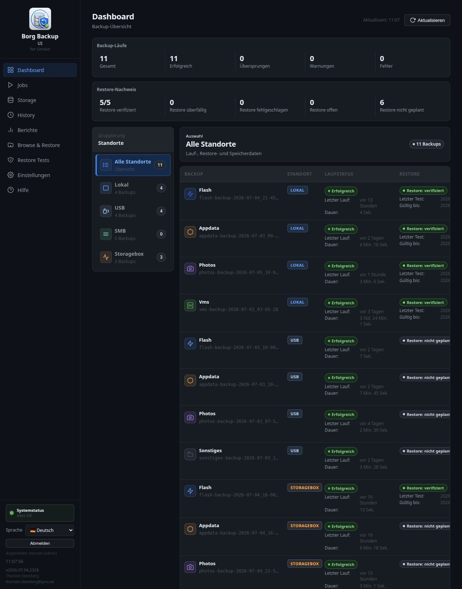
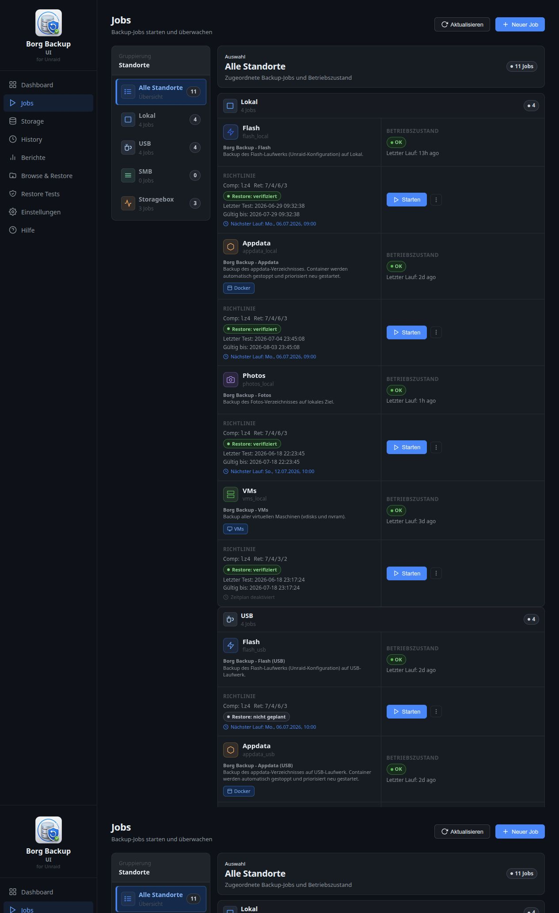
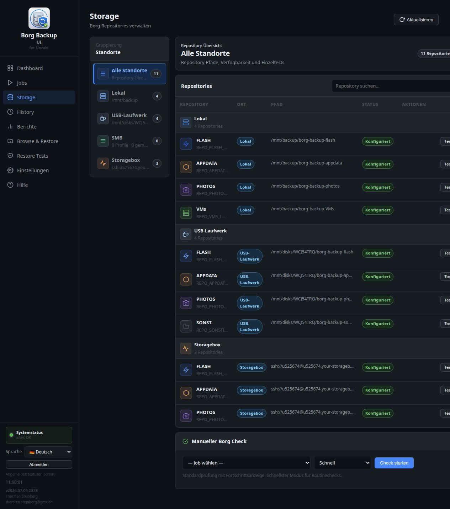
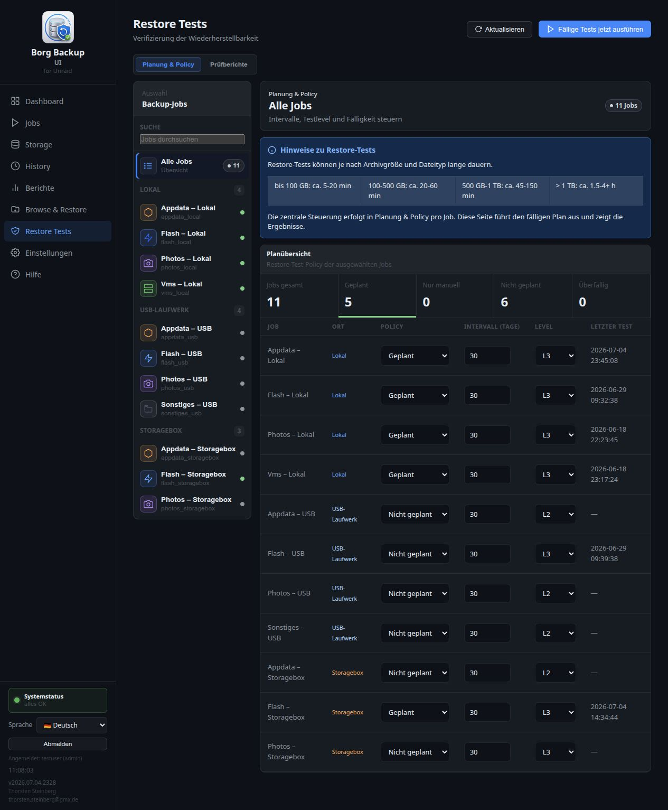
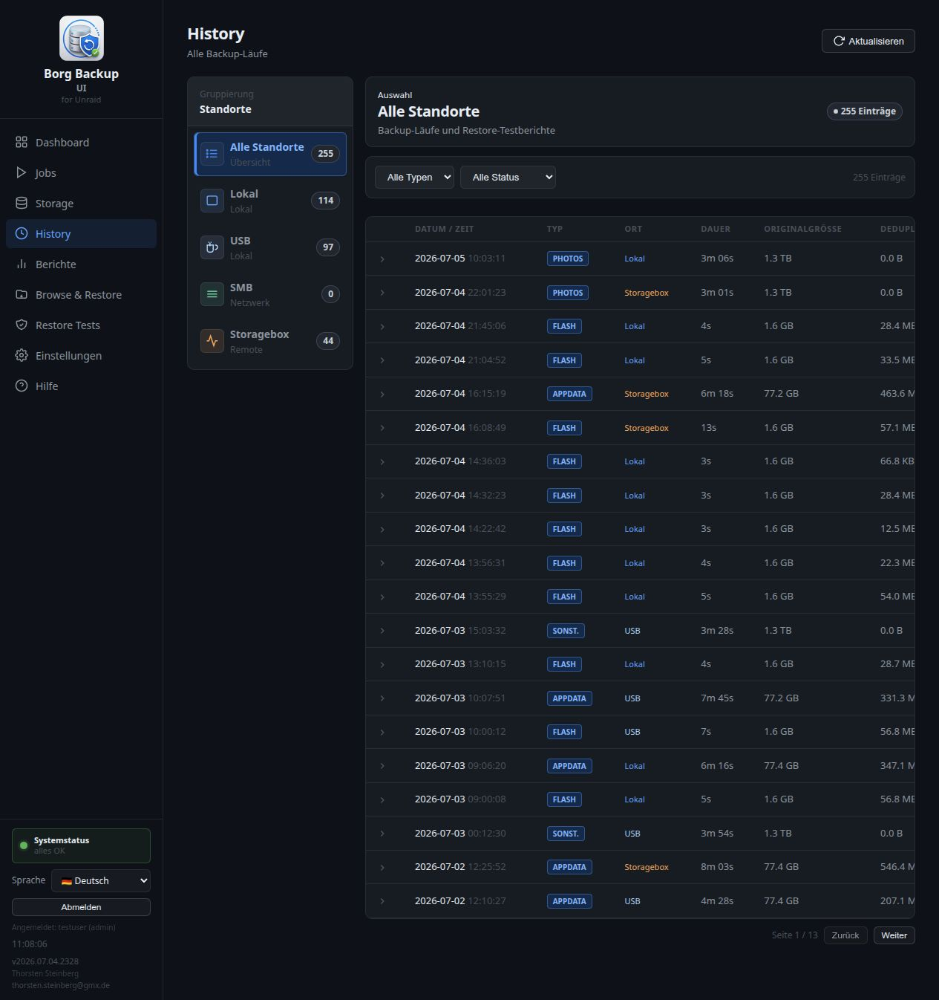
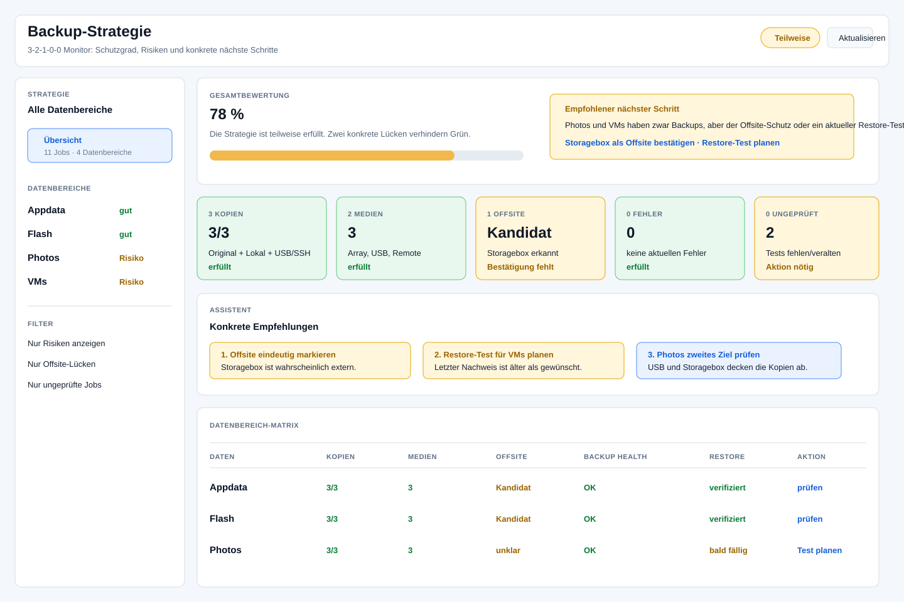
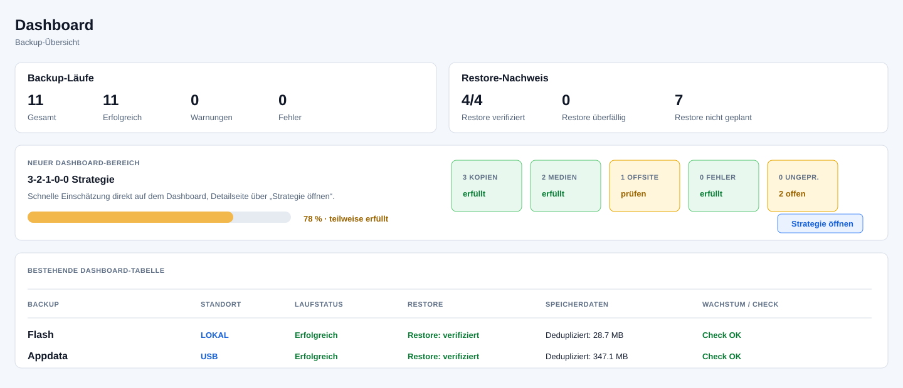

# Konzept- und Designstudie: 3-2-1-0-0 Strategy Monitor

- Issue: #94
- Status: Konzept, keine Implementierung
- Stand: 2026-07-05
- Referenzsystem: Borg Backup UI v2026.07.04.2328

## Inhaltsverzeichnis

1. [Zusammenfassung](#1-zusammenfassung)
2. [Zielbild](#2-zielbild)
3. [Ist-Analyse](#3-ist-analyse)
4. [Fachliches Bewertungsmodell](#4-fachliches-bewertungsmodell)
5. [Scoring- und Ampelmodell](#5-scoring--und-ampelmodell)
6. [UX-Konzept](#6-ux-konzept)
7. [Designstudie](#7-designstudie)
8. [Benötigte Daten](#8-benötigte-daten)
9. [Benutzerführung und Beispieltexte](#9-benutzerführung-und-beispieltexte)
10. [Technische Einschätzung](#10-technische-einschätzung)
11. [Offene Fragen](#11-offene-fragen)
12. [Umsetzungsvorschlag in späteren Phasen](#12-umsetzungsvorschlag-in-späteren-phasen)

## 1. Zusammenfassung

Der geplante **3-2-1-0-0 Strategy Monitor** soll Borg Backup UI um eine
verständliche Strategie-Ebene ergänzen. Die Anwendung soll nicht nur einzelne
Backups, Speicherorte und Restore-Tests anzeigen, sondern daraus ableiten, wie
gut die gesamte Backup-Strategie des Benutzers ist.

Das Feature soll folgende Fragen beantworten:

- Gibt es pro Datenbereich ausreichend Kopien?
- Liegen die Kopien auf unterschiedlichen Medien oder Fehlerdomänen?
- Gibt es mindestens eine externe oder entfernte Kopie?
- Sind die letzten Backup-Läufe fehlerfrei?
- Sind die Backups durch Restore-Tests überprüft?
- Welche konkrete Aktion sollte der Benutzer als Nächstes durchführen?

Wichtig: Diese Studie schlägt **keine automatische Änderung an Jobs,
Repositories oder Storage-Profilen** vor. Der erste sinnvolle Schritt wäre ein
read-only Monitor mit klaren Empfehlungen. Erst spätere Phasen sollten Assistenten
oder automatische Vorschläge in Wizard und Einstellungen integrieren.

## 2. Zielbild

Das Feature soll wie ein Assistent wirken:

> "Du hast Appdata lokal, auf USB und auf der Storagebox gesichert. Die Anzahl
> der Kopien ist gut. Die Storagebox sieht nach Offsite aus, muss aber als
> extern bestätigt werden. Der Restore-Test ist aktuell gültig."

Damit verschiebt sich die Anwendung von einer reinen Betriebsoberfläche zu einer
Strategie-Oberfläche. Der Benutzer sieht nicht nur, ob ein Job gelaufen ist,
sondern auch, ob sein Schutzkonzept vollständig ist.

### 2.1 Bedeutung von 3-2-1-0-0 in Borg Backup UI

| Regel | Bedeutung in der Anwendung |
| --- | --- |
| 3 Kopien | Originaldaten plus mindestens zwei erfolgreiche Backup-Kopien desselben Datenbereichs |
| 2 Medien | Backup-Kopien liegen auf mindestens zwei unterschiedlichen Medien, Storage-Typen oder Fehlerdomänen |
| 1 Offsite | Mindestens eine Backup-Kopie liegt außerhalb des primären Unraid-Systems oder ist als extern markiert |
| 0 Fehler | Aktuelle Backup-, Repository-Check- und Storage-Zustände enthalten keine kritischen Fehler |
| 0 ungeprüft | Relevante Backups haben gültige Restore-Tests oder eine bewusst deaktivierte Restore-Test-Policy |

## 3. Ist-Analyse

Die Analyse basiert auf der laufenden Anwendung und einer zusätzlichen
Code-/Datenquellen-Sichtung. Die aktuelle UI besitzt bereits mehrere Bausteine,
die für das Feature genutzt werden können.

### 3.1 Menüstruktur

Die sichtbare Menüstruktur lautet:

1. Dashboard
2. Jobs
3. Storage
4. History
5. Berichte
6. Browse & Restore
7. Restore Tests
8. Einstellungen
9. Hilfe

Für den Strategy Monitor bieten sich zwei Integrationspunkte an:

- eigener Menüpunkt **Backup-Strategie** zwischen Dashboard und Jobs
- kompakter Statusbereich im Dashboard mit Link zur Detailseite

### 3.2 Aktuelle Dashboard-Sicht

Das Dashboard zeigt bereits Backup-Läufe, Restore-Nachweise, Standortgruppen,
Backup-Status, Restore-Status, Speicherdaten und Repository-Checks.



Beobachteter Ist-Zustand im Referenzsystem:

- 11 Backup-Jobs
- 4 lokale Jobs
- 4 USB-Jobs
- 0 SMB-Jobs
- 3 Storagebox-Jobs
- Restore-Nachweise sind bereits im Dashboard sichtbar

Das Dashboard ist damit eine gute Quelle für Betriebszustand und letzte
Ergebnisse, aber es erklärt noch nicht, ob daraus eine vollständige
3-2-1-0-0-Strategie entsteht.

### 3.3 Jobs

Die Job-Seite zeigt Jobs gruppiert nach Standort und enthält Start, Bearbeiten,
Zeitplan, Aktivierung und Löschung.



Für den Strategy Monitor sind besonders relevant:

- `job_key`
- Anzeigename
- `backup_type`
- `location`
- aktiv/deaktiviert
- Repository-Ziel
- Quellpfade
- Restore-Test-Policy
- Zeitplan
- Docker-/VM-Kontext als Hinweis auf Datenart und Risiko

### 3.4 Storage

Die Storage-Seite zeigt lokale Repositories, USB-Laufwerke, SMB-Profile und
Storagebox/SSH-Ziele.



Für die 3-2-1-0-0-Bewertung reicht der technische Storage-Typ allein nicht
vollständig aus. Ein SSH-Ziel ist ein starker Offsite-Kandidat, kann aber auch
ein Server im selben Raum sein. Ein USB-Ziel ist ein anderes Medium, aber nicht
automatisch offsite. Daher braucht der Strategy Monitor zusätzliche
Benutzerbestätigungen.

### 3.5 Restore Tests

Die Restore-Test-Seite enthält Planung, Policies, Status, letzte Tests und
Prüfberichte.



Vorhandene Datenquellen:

- Restore-Test-Policy pro Job
- `.test`-Statusdateien
- Test-Level
- letztes Ergebnis
- nächste Fälligkeit
- Überfälligkeit
- Validität des Nachweises

Diese Daten können fast direkt für die zweite Null der Strategie verwendet
werden.

### 3.6 History

Die History-Seite zeigt Backup-Läufe und Restore-Testberichte über alle
Standorte hinweg.



Für den Strategy Monitor ist die History wichtig, weil die Strategie nicht allein
aus vorhandenen Jobs entstehen darf. Ein Job zählt erst dann als belastbare
Backup-Kopie, wenn es einen ausreichend aktuellen erfolgreichen Lauf gibt.

## 4. Fachliches Bewertungsmodell

### 4.1 Zentrale Bewertungslogik

Der Strategy Monitor sollte nicht nur global zählen. Er sollte pro
**Datenbereich** bewerten.

Ein Datenbereich ist eine fachliche Gruppe von Originaldaten. Beispiele:

- Flash
- Appdata
- Photos
- VMs
- Sonstiges
- Custom-Jobs

Ein Datenbereich kann mehrere Backup-Jobs besitzen, zum Beispiel:

- `appdata_local`
- `appdata_usb`
- `appdata_storagebox`

Die Strategie ist erst dann wirklich erfüllt, wenn jeder relevante Datenbereich
ausreichend geschützt ist. Eine globale Anzeige "11 Jobs vorhanden" wäre sonst
irreführend, wenn beispielsweise Photos dreifach gesichert wird, VMs aber nur
lokal.

### 4.2 Welche Jobs zählen als Kopie?

Ein Backup-Job sollte als Backup-Kopie zählen, wenn alle Bedingungen erfüllt
sind:

- Job ist aktiv.
- Job gehört zu einem Datenbereich.
- Repository-Ziel ist konfiguriert.
- Es gibt mindestens einen erfolgreichen Backup-Lauf innerhalb eines
  konfigurierbaren Gültigkeitsfensters.
- Der letzte relevante Status ist nicht `error`.
- Ein `warning` kann zählen, sollte aber als eingeschränkte Kopie markiert
  werden.

Ein Job sollte nicht als gültige Kopie zählen, wenn:

- Job deaktiviert ist.
- Repository fehlt oder ungültig ist.
- Job noch nie erfolgreich gelaufen ist.
- letzter Lauf fehlgeschlagen ist.
- Job dauerhaft übersprungen wurde.
- Repository aktuell nicht erreichbar ist, sofern diese Information verfügbar
  ist.

### 4.3 Originaldaten als Kopie

Bei 3-2-1-0-0 zählen die Originaldaten als erste Kopie. Borg Backup UI kann das
nur indirekt bewerten:

- Ein aktiver Job mit gültigem Quellpfad impliziert, dass es einen
  Originaldatenbereich gibt.
- Der Strategy Monitor sollte Originaldaten nicht als Backup behandeln, sondern
  separat anzeigen: **Original vorhanden / Quelle plausibel**.
- Wenn Quellpfade nicht mehr existieren oder leer sind, sollte der Datenbereich
  rot werden, weil die Strategie fachlich nicht bewertbar ist.

### 4.4 Wann gilt ein Speicherort als anderes Medium?

Eine "andere Speicherart" sollte nicht nur anhand des Anzeigenamens erkannt
werden. Sinnvoll ist eine Kombination aus Heuristik und Benutzerbestätigung.

| Storage-Typ | Standardbewertung | Bemerkung |
| --- | --- | --- |
| local | gleiche Maschine / lokales Repository | zählt als Backup-Kopie, aber normalerweise nicht als anderes externes Medium |
| USB | anderes lokales Medium | zählt als separates Medium, aber nicht automatisch offsite |
| SMB | Netzwerkziel | zählt als separates Medium; offsite nur bei Markierung |
| SSH / Storagebox | Remote-Ziel | starker Offsite-Kandidat; Benutzer sollte bestätigen |
| Rclone / WebDAV | Remote-Ziel | zukünftiger Offsite-Kandidat; abhängig vom Profil |
| custom | unbekannt | nur nach manueller Klassifizierung sauber bewertbar |

Empfehlung: Jeder Storage-Standort erhält perspektivisch Metadaten:

- Medium-Klasse
- Fehlerdomäne
- Offsite ja/nein
- vom Benutzer bestätigt ja/nein

### 4.5 Wann gilt ein Backup als offsite?

Offsite sollte nicht blind aus `ssh` oder `storagebox` abgeleitet werden. Besser:

1. Heuristik erkennt Offsite-Kandidaten.
2. UI zeigt Hinweis: "Storagebox sieht nach externem Ziel aus."
3. Benutzer bestätigt: "Dieses Ziel ist offsite."
4. Erst danach zählt es sicher für die 1-Regel.

Beispiele:

- Hetzner Storage Box: wahrscheinlich offsite.
- SSH zu NAS im selben Haus: nicht offsite.
- USB-Platte: nur offsite, wenn sie regelmäßig extern gelagert wird.
- SMB-Freigabe: abhängig vom Standort.

### 4.6 Wie werden erfolgreiche oder fehlerhafte Backups erkannt?

Vorhandene `.status`-Dateien enthalten unter anderem:

- `backup_type`
- `location`
- `timestamp`
- `duration_seconds`
- `exit_code`
- `status`
- `archive_name`
- `log_file`
- `repository_check_status`
- `repository_next_check`

Bewertung:

- `success`: gültig, sofern nicht zu alt
- `warning`: gültig mit Hinweis, sofern keine harte Policy dagegen spricht
- `skipped`: nicht als aktuelle Kopie zählen, wenn dadurch der geplante Lauf
  fehlt
- `error`: rot
- fehlender Status: nie erfolgreich oder unbekannt

### 4.7 Wie werden Restore-Tests berücksichtigt?

Vorhandene Restore-Test-Daten liefern:

- Policy pro Job: `off`, `scheduled`, `manual_only`
- letzter Test
- Test-Level
- Ergebnis
- Gültigkeit
- Fälligkeit

Bewertung:

- `verified`: grün
- `stale`: gelb oder rot je nach Policy
- `failed`: rot
- `never`: rot bei geplanten Tests, gelb bei manueller Policy
- `not_required`: neutral, aber nicht als 0-ungeprüft erfüllt anzeigen, wenn
  der Datenbereich strategisch relevant ist

### 4.8 Umgang mit deaktivierten oder nicht konfigurierten Jobs

Deaktivierte Jobs sollten nicht als Kopie zählen. Sie sollten aber in der
Detailansicht sichtbar bleiben:

- "Job vorhanden, aber deaktiviert"
- "Kann für diese Strategie nicht gewertet werden"
- "Aktivieren oder bewusst aus Strategie ausschließen"

Nicht konfigurierte Jobs sollten nicht negativ zählen, solange der Datenbereich
nicht als schützenswert markiert ist. Sobald ein Datenbereich aktiv gesichert
wird, sollten fehlende Kopien als Lücke erscheinen.

## 5. Scoring- und Ampelmodell

### 5.1 Regelkarten statt nur Gesamtpunktzahl

Eine Gesamtpunktzahl ist hilfreich, aber sie darf die eigentliche Aussage nicht
verstecken. Der Benutzer sollte fünf Regelkarten sehen:

1. Data Copies
2. Storage Diversity
3. Offsite Protection
4. Backup Health
5. Restore Verification

Jede Karte bekommt:

- Status: grün, gelb, rot
- kurze Erklärung
- betroffene Datenbereiche
- nächste Aktion

### 5.2 Vorschlag für Punktmodell

| Bereich | Gewicht | Grün | Gelb | Rot |
| --- | ---: | --- | --- | --- |
| Data Copies | 20 | Original + mindestens 2 gültige Backups pro relevantem Datenbereich | ein Datenbereich hat nur 2 Kopien insgesamt | ein Datenbereich hat nur Original oder keine gültige Backup-Kopie |
| Storage Diversity | 20 | mindestens 2 unterschiedliche Medien/Fehlerdomänen | zweite Fehlerdomäne unbestätigt | alle Backups in derselben Fehlerdomäne |
| Offsite Protection | 20 | mindestens eine bestätigte Offsite-Kopie | Offsite-Kandidat vorhanden, aber unbestätigt | keine Offsite-Kopie |
| Backup Health | 20 | keine aktuellen Fehler, keine überfälligen geplanten Jobs | Warnungen oder einzelne überfällige Jobs | Fehlerhafte letzte Läufe oder wiederholte Ausfälle |
| Restore Verification | 20 | alle relevanten Jobs aktuell verifiziert | einzelne Tests bald fällig oder manuell | fehlgeschlagen, nie getestet oder überfällig |

### 5.3 Gesamtstatus

| Gesamtstatus | Regel |
| --- | --- |
| Grün | mindestens 90 Punkte und keine rote Einzelregel |
| Gelb | 60 bis 89 Punkte oder mindestens eine gelbe Einzelregel |
| Rot | unter 60 Punkte oder mindestens eine kritische rote Einzelregel |

Kritische rote Einzelregeln sollten den Gesamtstatus immer auf Rot setzen:

- kein erfolgreicher Backup-Lauf für einen aktiven Datenbereich
- kein zweites Backup-Ziel für einen wichtigen Datenbereich
- Restore-Test fehlgeschlagen für ein als kritisch markiertes Backup
- Repository nicht erreichbar, wenn dies bestätigt geprüft wurde

### 5.4 Beispielbewertung für den Referenzzustand

Die folgende Bewertung ist ein Konzeptbeispiel auf Basis der sichtbaren
Referenzdaten:

| Regel | Beobachtung | Mögliche Bewertung |
| --- | --- | --- |
| 3 Kopien | Lokal, USB und Storagebox sind für mehrere Datenbereiche vorhanden | Grün, sofern alle Datenbereiche abgedeckt sind |
| 2 Medien | Lokal, USB und Remote/SSH sind vorhanden | Grün |
| 1 Offsite | Storagebox ist vorhanden, aber Offsite sollte bestätigt werden | Gelb |
| 0 Fehler | Dashboard und History zeigen aktuell erfolgreiche Läufe | Grün |
| 0 ungeprüft | Restore-Tests sind vorhanden, aber Policies müssen pro Datenbereich gelten | Grün bis Gelb |

## 6. UX-Konzept

### 6.1 Empfohlene Platzierung

Empfehlung:

- neuer Menüpunkt **Backup-Strategie** direkt nach Dashboard
- zusätzlicher kompakter Widget-Bereich im Dashboard

Begründung:

- Die Strategie ist mehr als ein Dashboard-Zähler.
- Der Benutzer braucht eine eigene Detailseite mit Erklärungen.
- Das Dashboard sollte nur den Gesamtzustand und die wichtigsten Risiken zeigen.

### 6.2 Seitenstruktur

Die neue Seite sollte aus folgenden Bereichen bestehen:

1. Kopfbereich
   - Titel: Backup-Strategie
   - Untertitel: 3-2-1-0-0 Monitor
   - Gesamtstatus
   - Aktualisieren

2. Gesamtbewertung
   - Prozent oder Stufenanzeige
   - Ampelstatus
   - kurze Erklärung

3. Fünf Regelkarten
   - 3 Kopien
   - 2 Medien
   - 1 Offsite
   - 0 Fehler
   - 0 ungeprüft

4. Assistentenbereich
   - konkrete Empfehlungen
   - priorisierte nächste Schritte
   - Links zu passenden Seiten

5. Datenbereich-Matrix
   - Zeilen: Appdata, Flash, Photos, VMs, Sonstiges, Custom
   - Spalten: Kopien, Medien, Offsite, Backup Health, Restore

6. Detailansicht pro Regel
   - Warum ist diese Regel grün/gelb/rot?
   - Welche Jobs zählen?
   - Welche Jobs zählen nicht?
   - Welche Daten fehlen?

7. Konfigurationshinweise
   - "Storagebox als Offsite bestätigen"
   - "USB als Wechselmedium markieren"
   - "Datenbereich bewusst aus Strategie ausschließen"

### 6.3 Tonalität

Die Texte sollten nicht wie technische Prüfberichte klingen, sondern wie eine
verständliche Hilfestellung:

- gut: "Dir fehlt noch eine bestätigte Offsite-Kopie für VMs."
- weniger gut: "Rule offsite_protection failed for dataset vms."

### 6.4 Keine versteckten Informationen

Die Seite sollte keine wesentlichen Informationen nur per Mouseover zeigen.
Tooltips sind als Zusatz okay, aber die Hauptaussage muss sichtbar sein.

## 7. Designstudie

### 7.1 Variante A: Eigene Strategie-Seite

Diese Variante ist die empfohlene Hauptlösung. Sie nutzt die bestehende
Karten-, Sidebar- und Tabellenoptik, führt aber eine eigene strategische Ebene
ein.



Stärken:

- genug Platz für Erklärung und Empfehlungen
- gute Trennung zwischen Betrieb und Strategie
- normale Benutzer verstehen den Status ohne Rohdaten
- Detailmatrix kann wachsen, ohne das Dashboard zu überladen

Schwächen:

- neuer Menüpunkt nötig
- Benutzer muss die Seite aktiv öffnen

### 7.2 Variante B: Dashboard-Widget plus Detailseite

Diese Variante ergänzt das Dashboard um eine kompakte Strategie-Zeile. Die
eigentliche Analyse bleibt auf der Detailseite.



Stärken:

- Risiken sind direkt nach dem Login sichtbar
- wenig zusätzlicher Platzbedarf
- guter Einstieg in die Detailseite

Schwächen:

- Dashboard darf nicht zu dicht werden
- nur die Kurzfassung passt sinnvoll hinein

### 7.3 Variante C: Wizard-Integration

Eine spätere Variante könnte im Job-Wizard Hinweise anzeigen:

- "Dieser Job ergänzt die zweite Kopie für Appdata."
- "Dieses Ziel ist ein Offsite-Kandidat."
- "Für eine vollständige 3-2-1-0-0-Strategie fehlt noch ein Restore-Test."

Diese Variante sollte nicht die erste Phase sein, weil dafür mehr
Entscheidungslogik im Wizard nötig wäre. Als spätere Ergänzung ist sie aber
wertvoll.

### 7.4 Empfehlung

Empfohlene Kombination:

1. Variante A als neue Detailseite.
2. Variante B als kompakter Dashboard-Einstieg.
3. Variante C später, sobald das Bewertungsmodell stabil ist.

## 8. Benötigte Daten

### 8.1 Bereits vorhandene Daten

| Datenbereich | Quelle | Verwendung |
| --- | --- | --- |
| Jobs | Job-Metadaten unter `config/jobs` | Datenbereich, Standort, Aktivstatus, Repository, Quellpfade |
| Backup-Läufe | `.status`-Dateien | letzter Lauf, Status, Exit-Code, Archiv, Repository-Check |
| History | History-API über Statusdateien | Verlauf und Fehlerhistorie |
| Restore-Tests | `.test`-Dateien | letzter Test, Test-Level, Ergebnis, Gültigkeit |
| Restore-Test-Policy | Job-Metadaten | geplant, manuell, aus, Intervall, Level |
| Storage-Profile | Settings/Storage-Profile | Profile, Zieltypen, Pfade, SSH/Storagebox |
| Schedules | Schedule-Konfiguration | erwartete Läufe und Überfälligkeit |

### 8.2 Neue oder erweiterte Daten

Für eine belastbare Strategieauswertung werden zusätzliche Metadaten empfohlen.

#### Storage-Strategie-Metadaten

Pro Storage-Profil oder Standort:

- `strategy_enabled`
- `medium_class`
- `failure_domain`
- `is_offsite`
- `offsite_confirmed_at`
- `is_removable`
- `rotation_group`
- `notes`

Beispiele für `medium_class`:

- `same_system`
- `usb`
- `network_share`
- `remote_server`
- `cloud`
- `unknown`

Beispiele für `failure_domain`:

- `unraid-host`
- `usb-disk-wcj54trq`
- `home-nas`
- `hetzner-storagebox`

#### Datenbereich-Metadaten

Pro Datenbereich:

- `dataset_id`
- Anzeigename
- Kritikalität: normal / wichtig / kritisch
- Strategie aktiv ja/nein
- gewünschte Mindestkopien
- Restore-Test erforderlich ja/nein

Diese Felder sollten optional starten. In Phase 1 kann die Anwendung
Datenbereiche aus `backup_type` ableiten.

#### Policy-Metadaten

Globale oder pro Datenbereich konfigurierbare Vorgaben:

- gültiges Backup-Alter
- erforderliche Kopien
- erforderliche Medien
- Offsite erforderlich ja/nein
- Restore-Test-Gültigkeit
- Umgang mit Warnungen
- Umgang mit manuell deaktivierten Tests

### 8.3 Was nicht automatisch entschieden werden sollte

Die Anwendung sollte nicht selbst behaupten:

- "SSH ist immer offsite"
- "USB ist immer sicher getrennt"
- "SMB ist immer ein anderes Gebäude"
- "Custom ist strategisch gleichwertig"

Diese Aussagen brauchen Benutzerkontext. Die UI sollte stattdessen Kandidaten
erkennen und bestätigen lassen.

## 9. Benutzerführung und Beispieltexte

### 9.1 Gesamtfeedback

Beispiele:

- "Deine Backup-Strategie ist fast vollständig. Es fehlt nur noch eine
  bestätigte Offsite-Kopie für VMs."
- "Appdata erfüllt 3-2-1-0-0 vollständig."
- "Photos hat drei Kopien, aber der letzte Restore-Test ist bald fällig."
- "Flash ist fehlerfrei, aber das Offsite-Ziel wurde noch nicht bestätigt."

### 9.2 Regelbezogene Hinweise

#### 3 Kopien

- "Du hast aktuell 2 von 3 empfohlenen Kopien."
- "Eine zweite Backup-Kopie fehlt. Lege zusätzlich ein USB-, SMB- oder
  SSH-Ziel an."
- "Dieser Datenbereich ist dreifach vorhanden: Original, USB und Storagebox."

#### 2 Medien

- "Alle Backup-Kopien liegen auf demselben System. Ein Defekt am Unraid-Server
  könnte alle Kopien betreffen."
- "USB und Storagebox zählen als getrennte Medien."
- "SMB wurde erkannt, aber die Fehlerdomäne ist noch nicht bestätigt."

#### 1 Offsite

- "Storagebox ist ein Offsite-Kandidat. Bitte bestätige, ob dieses Ziel extern
  liegt."
- "Es fehlt eine externe Kopie. Empfohlen ist SSH, Storagebox, SMB an einem
  anderen Standort oder später Rclone/WebDAV."

#### 0 Fehler

- "Alle relevanten letzten Backup-Läufe sind erfolgreich."
- "Der letzte Lauf von Appdata - USB ist fehlgeschlagen. Prüfe Log und
  Speicherziel."
- "Ein Repository-Check ist überfällig."

#### 0 ungeprüft

- "Alle geplanten Restore-Tests sind aktuell gültig."
- "VMs wurden noch nie wiederhergestellt getestet."
- "Der Restore-Test für Photos ist älter als 30 Tage."

### 9.3 Aktionen

Mögliche Aktionslinks:

- "Job erstellen"
- "Zeitplan öffnen"
- "Restore-Test planen"
- "Storage-Profil als Offsite markieren"
- "Letztes Log öffnen"
- "Repository prüfen"
- "Datenbereich aus Strategie ausschließen"

Wichtig: Aktionen sollten zunächst nur auf bestehende Seiten führen. Direkte
automatische Änderungen sind für Phase 1 nicht nötig.

## 10. Technische Einschätzung

### 10.1 Strategische Auswertung als read-only Service

Technisch bietet sich ein neuer interner Analyzer an, der vorhandene Quellen
zusammenführt:

1. Jobs laden.
2. Statusdateien je Job auswerten.
3. Restore-Test-Map laden.
4. Storage-Profile klassifizieren.
5. Datenbereiche gruppieren.
6. Regeln bewerten.
7. Ergebnis als UI-Modell bereitstellen.

Der Analyzer sollte keine Jobs ändern und keine Statusdateien schreiben.

### 10.2 Mögliche Datenstruktur für das Ergebnis

Konzeptionell könnte das UI-Modell so aussehen:

```json
{
  "overall_status": "yellow",
  "score": 78,
  "rules": {
    "copies": { "status": "green", "score": 20 },
    "media": { "status": "green", "score": 20 },
    "offsite": { "status": "yellow", "score": 12 },
    "health": { "status": "green", "score": 20 },
    "restore": { "status": "yellow", "score": 14 }
  },
  "datasets": [
    {
      "dataset_id": "appdata",
      "display_name": "Appdata",
      "status": "yellow",
      "copies": 3,
      "media_count": 3,
      "offsite_status": "candidate",
      "backup_health": "ok",
      "restore_status": "verified",
      "recommendations": [
        "Storagebox als Offsite bestätigen"
      ]
    }
  ]
}
```

Diese Struktur ist bewusst ein Konzept, keine Implementierung.

### 10.3 Heuristiken für Phase 1

Ohne neue Metadaten kann Phase 1 mit konservativen Heuristiken starten:

| Heuristik | Bewertung |
| --- | --- |
| `location=local` | lokale Kopie, gleiche Fehlerdomäne |
| `location=usb` | separates lokales Medium |
| `location=smb` | separates Netzwerkmedium, Offsite unbekannt |
| `location=storagebox` | Offsite-Kandidat |
| SSH-URI | Offsite-Kandidat |
| Repository unter `/mnt/remotes/<name>` | Netzwerk-/Remote-Kandidat |
| Repository unter `/mnt/disks/<name>` | separates lokales Medium |

Heuristiken sollten in der UI als "Kandidat" gekennzeichnet werden, bis der
Benutzer sie bestätigt.

### 10.4 Risiken

| Risiko | Auswirkung | Gegenmaßnahme |
| --- | --- | --- |
| Falsch erkannte Offsite-Ziele | Benutzer erhält trügerisches Grün | Offsite nur als bestätigt werten |
| Mehrere Jobs sichern nicht dieselben Daten | Kopien werden falsch gruppiert | Phase 1 über `backup_type`, später `dataset_id` |
| Alte Statusdateien wirken gültig | Strategie wirkt besser als sie ist | Gültigkeitsfenster pro Job/Policy |
| Restore-Test-Policy ist deaktiviert | 0-ungeprüft wirkt unklar | Deaktiviert sichtbar als bewusste Ausnahme anzeigen |
| Custom-Jobs sind schwer klassifizierbar | Bewertung unscharf | manuelle Zuordnung anbieten |

## 11. Offene Fragen

1. Soll die Strategie standardmäßig für alle aktiven Jobs gelten oder muss ein
   Datenbereich explizit als strategierelevant markiert werden?
2. Wie streng soll die Anwendung bei `warning` sein?
3. Soll ein lokales Repository auf einer separaten Disk als eigenes Medium
   zählen, wenn der Pfad bekannt ist?
4. Soll USB als Offsite zählen können, wenn der Benutzer eine Rotation bestätigt?
5. Braucht jeder Datenbereich dieselbe Policy oder dürfen VMs strenger bewertet
   werden als Flash?
6. Soll die erste Phase bereits Einstellungen für Offsite/Medium enthalten oder
   nur Empfehlungen anzeigen?
7. Wie sollen Custom-Jobs mit mehreren Quellpfaden gruppiert werden?
8. Wie lange bleibt ein Backup-Lauf für die Strategie gültig?
9. Soll ein deaktivierter Restore-Test als "bewusst ausgeschlossen" oder als
   Risiko bewertet werden?
10. Soll der Strategy Monitor später Benachrichtigungen erzeugen, wenn die
    Strategie von Grün auf Gelb/Rot wechselt?

## 12. Umsetzungsvorschlag in späteren Phasen

### Phase 1: Read-only Strategy Monitor

Ziel:

- neue Seite "Backup-Strategie"
- bestehende Jobs, Statusdateien und Restore-Test-Daten auswerten
- konservative Heuristiken verwenden
- keine neuen Pflichtfelder
- keine automatischen Änderungen

Ergebnis:

- Gesamtstatus
- fünf Regelkarten
- Datenbereich-Matrix
- Empfehlungen
- Dashboard-Kurzstatus optional

### Phase 2: Storage- und Datenbereich-Metadaten

Ziel:

- Storage-Profile als Offsite, separates Medium oder Fehlerdomäne markieren
- Custom-Jobs Datenbereichen zuordnen
- Datenbereiche bewusst ein- oder ausschließen

Ergebnis:

- weniger Heuristik
- klarere Bewertung
- weniger falsche Warnungen

### Phase 3: Geführte Empfehlungen

Ziel:

- Aktionen aus Empfehlungen heraus starten
- "Offsite bestätigen"
- "Restore-Test planen"
- "zweites Ziel für diesen Datenbereich anlegen"

Ergebnis:

- die Seite wird vom Monitor zum Assistenten

### Phase 4: Dashboard-Integration

Ziel:

- kompakte 3-2-1-0-0-Zeile im Dashboard
- nur Gesamtstatus und wichtigste Lücke anzeigen
- Link zur Detailseite

Ergebnis:

- Strategie wird direkt nach Login sichtbar

### Phase 5: Wizard-Integration

Ziel:

- beim Erstellen neuer Jobs anzeigen, welchen Strategiebeitrag der Job leistet
- fehlende Kopien/Medien/Offsite-Ziele im Wizard vorschlagen

Ergebnis:

- Benutzer plant Backups von Anfang an strategisch, nicht erst nachträglich.

## Empfehlung

Für Issue #94 sollte zunächst **Phase 1** als eigenes, klar begrenztes
Implementierungs-Issue entstehen:

- read-only Analyse
- eigene Strategie-Seite
- keine automatischen Änderungen
- konservative Bewertung
- Offsite nur als Kandidat, solange nicht bestätigt
- klare Empfehlungstexte

Parallel sollte ein Folge-Issue für Phase 2 vorbereitet werden, weil die
Bewertung ohne Benutzerbestätigung bei Offsite und Fehlerdomänen niemals
vollständig belastbar ist.
