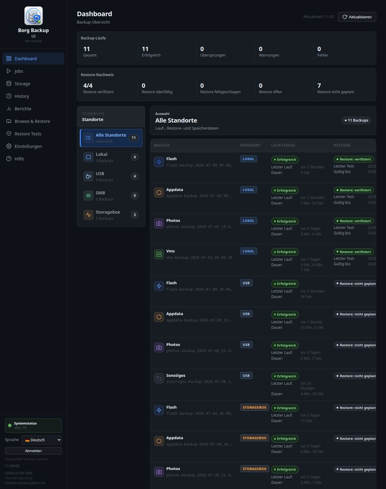
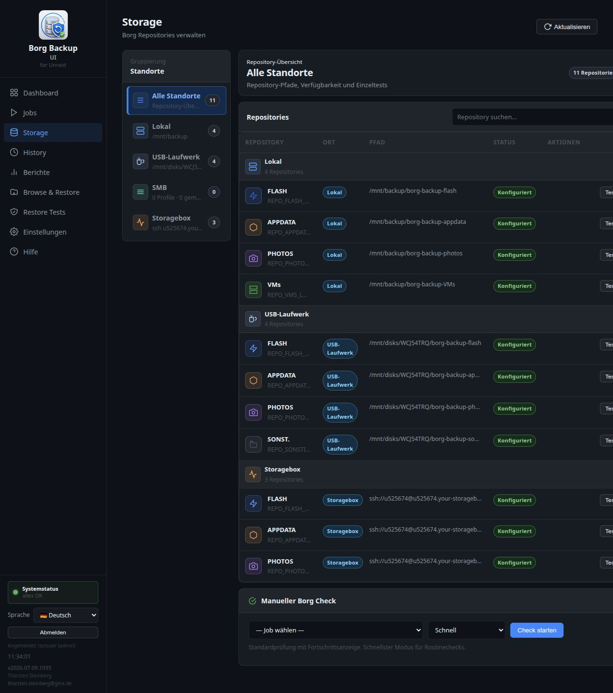
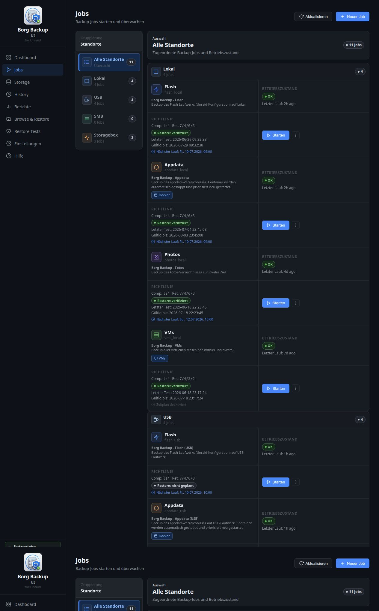
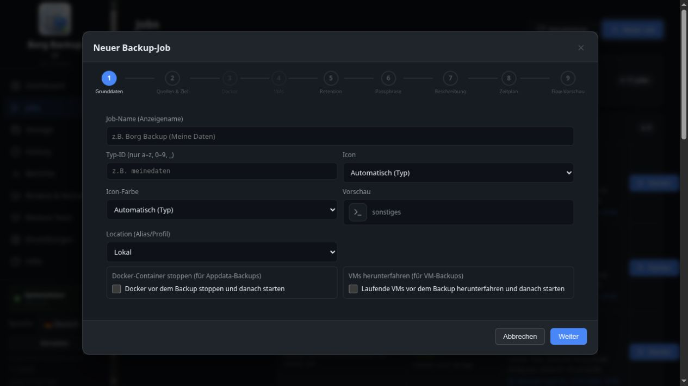
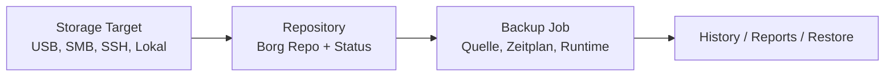
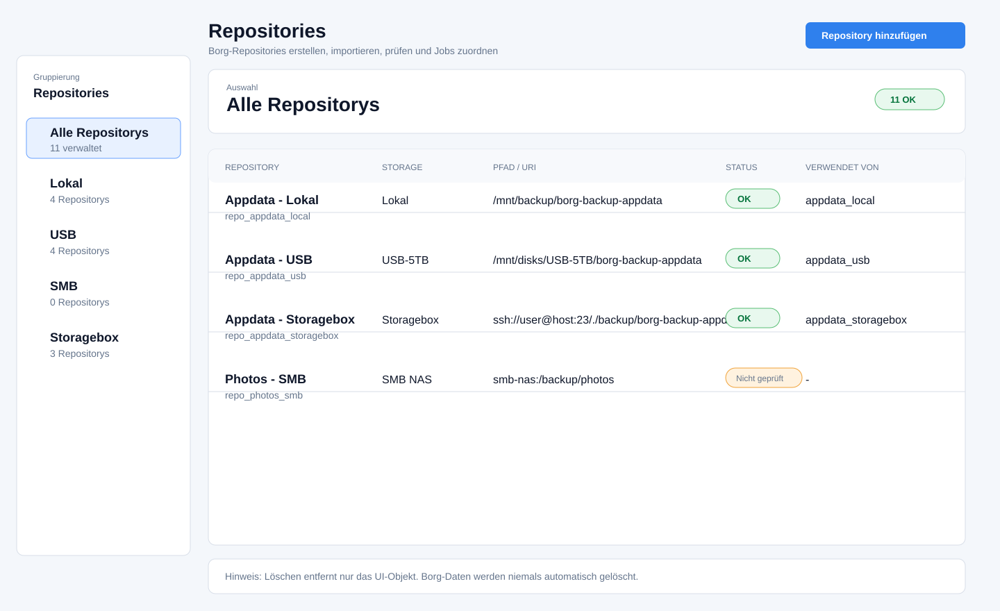
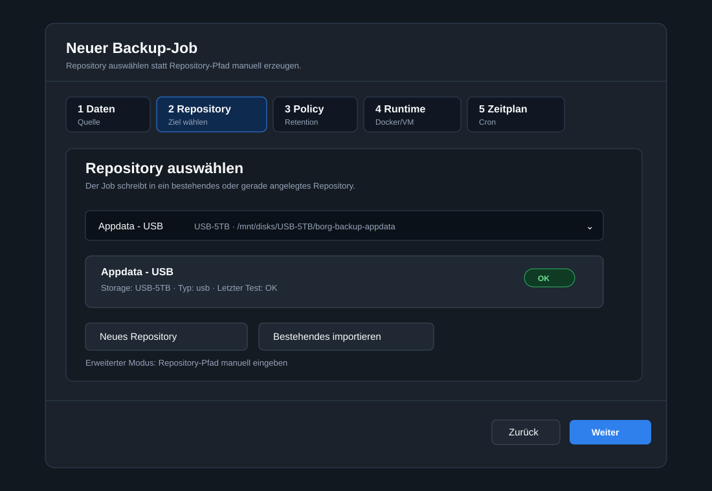

# Designstudie: Repository-Modell und Storage-/Repository-Wizard

- Issues: #184, #187
- Status: Designstudie, keine Implementierung
- Stand: 2026-07-09
- Referenzsystem: Borg Backup UI auf `http://192.168.178.23:8765`

## 1. Ziel der Studie

Diese Designstudie beschreibt, wie die Repository-Objekte aus #184 und der
Storage-/Repository-Wizard aus #187 in die bestehende Oberfläche integriert
werden könnten.

Die Studie ist bewusst **keine Implementierung**. Sie soll klären:

- Wo Repositorys in der UI sichtbar werden.
- Wie Storage und Repository fachlich getrennt werden.
- Wie bestehende Repositorys importiert werden.
- Wie der Job-Wizard künftig Repositorys auswählt.
- Wie der Einstieg für normale Nutzer einfacher wird, ohne Power-User
  auszuschließen.

## 2. Aktuelle Referenz

### 2.1 Dashboard

Das Dashboard zeigt bereits Backup-, Restore- und Speicherdaten pro Standort.
Es ist damit gut geeignet, später Repository-Gesundheit kompakt anzuzeigen,
sollte aber nicht der primäre Ort zum Einrichten von Repositorys werden.

### 2.2 Storage

Storage ist heute die logischste Stelle für Repository-Objekte, weil die Seite
bereits "Borg Repositories verwalten" als Seitentitel nutzt und technische
Repository-Prüfungen bündelt.

### 2.3 Jobs

Jobs sind heute der Einstieg in neue Backup-Jobs. Der bestehende Button
"Neuer Job" sollte bleiben, aber der Job-Wizard sollte künftig nicht mehr
primär Repository-Pfade erzeugen.

### 2.4 Aktueller Job-Wizard

Der aktuelle Job-Wizard ist bereits ein geeignetes Muster: Schrittleiste,
Modal, klare Navigation. Das neue Repository-Verhalten sollte dieses Muster
weiterverwenden.

## 3. Empfohlene Informationsarchitektur

### 3.1 Hauptentscheidung

Repositorys sollten nicht als vollständig neue Hauptnavigation eingeführt
werden, solange Storage bereits eine passende fachliche Heimat bietet.

Empfehlung:

- Menüpunkt bleibt **Storage**.
- Innerhalb von Storage gibt es einen klaren Bereich **Repositories**.
- Optional später: Subtabs `Repositorys`, `Storage-Ziele`, `Prüfungen`.

Das reduziert Menü-Komplexität und passt zu der bisherigen UI.

### 3.2 Neue fachliche Ebenen

Die UI sollte diese Ebenen bewusst zeigen:

- Storage Target beantwortet: "Wo liegt es?"
- Repository beantwortet: "Welches Borg-Repository ist es?"
- Job beantwortet: "Welche Daten werden wann gesichert?"

## 4. Designvariante A: Repositorys in Storage integrieren

Diese Variante ist die bevorzugte Richtung.

### Vorteile

- Nutzt bestehenden Menüpunkt.
- Passt zum aktuellen Storage-Layout mit Standort-Sidebar.
- Repositorys werden dort sichtbar, wo Nutzer Speicherziele erwarten.
- Weniger große Navigationserweiterung.

### Nachteile

- Storage-Seite wird fachlich breiter.
- Es braucht klare Substruktur, damit Profile, Mounts und Repositorys nicht
  wieder vermischt werden.

### Konkrete UI-Elemente

- Button: `Repository hinzufügen`
- Sidebar-Gruppen: Alle Repositorys, Lokal, USB, SMB, Storagebox
- Tabelle/Karten:
  - Repository
  - Storage
  - Pfad/URI
  - Status
  - Verwendet von
- Aktionen:
  - Testen
  - Bearbeiten
  - Importdetails anzeigen
  - Entfernen, nur wenn nicht verwendet

## 5. Designvariante B: Eigene Repository-Seite

Alternative:

- Neuer Menüpunkt **Repositories** zwischen Storage und Jobs.

### Vorteile

- Sehr klare fachliche Trennung.
- Genug Platz für Import, Checks, Zuordnung, Repository-Gesundheit.

### Nachteile

- Mehr Menü-Komplexität.
- Nutzer muss zwischen Storage und Repositories unterscheiden lernen.
- Aktuelle Storage-Seite würde teilweise redundant wirken.

### Einschätzung

Variante B ist sinnvoll, falls Repositorys später sehr umfangreich werden:

- mehrere Jobs pro Repository
- eigene Check-Policies
- Repository-Sperren
- Maintenance-Aktionen
- 3-2-1-0-0-Bewertung direkt auf Repository-Ebene

Für den ersten Umsetzungsschritt ist Variante A pragmatischer.

## 6. Storage-/Repository-Wizard

Der Wizard sollte aus Storage heraus gestartet werden und dieselbe Designsprache
wie bestehende Wizard-Dialoge verwenden.

### 6.1 Schritte

1. Zieltyp wählen
2. Verbindung oder Profil
3. Zugriff testen
4. Repository erstellen oder importieren
5. Zusammenfassung

### 6.2 SMB-Fokus

Bei SMB darf der Nutzer nicht mehr zuerst über einen temporären Mount-Pfad
stolpern. Die UI sollte sagen:

> Borg Backup UI verwaltet den technischen Mount-Pfad automatisch.

Erweiterter Modus:

- Mount-Pfad manuell festlegen
- nur für Power-User
- mit klarer Warnung und Validierung

### 6.3 Import bestehender Repositorys

Der Import muss als gleichwertiger Weg neben "Neu erstellen" sichtbar sein.

Import-Flow:

1. Storage-Ziel auswählen.
2. Repository-Pfad/Unterordner angeben oder später per Path Picker wählen.
3. Passphrase/Secret angeben, falls nötig.
4. `borg info` oder sichere Repository-Prüfung ausführen.
5. Repository-Objekt speichern.

Der Import darf keine Borg-Daten verändern.

## 7. Job-Wizard mit Repository-Auswahl

Der Job-Wizard sollte im Ziel-Schritt künftig Repository-Auswahl zeigen.

### 7.1 Neuer Standard

Statt:

> Repository-Pfad eingeben

zeigt der Wizard:

> Repository auswählen

mit Aktionen:

- Neues Repository einrichten
- Bestehendes Repository importieren
- Erweiterter Modus: Repository-Pfad manuell eingeben

### 7.2 Warum der erweiterte Modus bleiben sollte

Auch wenn der neue Standard Repository-Objekte sind, sollte ein manueller Modus
zunächst bleiben:

- für Power-User
- für ungewöhnliche Borg-Setups
- als Rückfallebene während der Migration

Er sollte aber visuell untergeordnet sein.

## 8. Empfohlener Umsetzungszuschnitt

### Phase 1: Repository-Inventar read-only

- Migration erzeugt Repository-Objekte aus bestehenden Jobs.
- Storage zeigt Repositorys read-only.
- Jobs bleiben ausführbar wie bisher.

### Phase 2: Repository-Aktionen

- Repository testen.
- Repository importieren.
- Repository entfernen, wenn unbenutzt.
- Systemzustand prüft fehlende Repository-Zuordnungen.

### Phase 3: Wizard für Storage und Repository

- Storage-/Repository-Wizard einführen.
- SMB automatisch geführter Mount-Pfad.
- Neues Repository erstellen oder bestehendes importieren.

### Phase 4: Job-Wizard anbinden

- Job-Wizard wählt Repository-Objekt.
- Direkter Pfad wird erweiterter Modus.
- Neue Jobs werden immer mit `repository_key` gespeichert.

### Phase 5: Aufräumen vor Go-Live

- Alte Zwischenmigrationen entfernen, sofern für öffentliche Nutzer nicht
  relevant.
- Nur das saubere Zielmodell behalten.
- Dokumentation und In-App-Hilfe aktualisieren.

## 9. Offene Entscheidungen

1. Soll Storage Subtabs bekommen oder reicht Sidebar + Repository-Karten?
2. Wo liegt der automatisch verwaltete SMB-Mount-Pfad final?
3. Darf ein Repository mehreren Jobs zugeordnet werden?
4. Soll die UI warnen, wenn mehrere Jobs in dasselbe Repository schreiben?
5. Soll ein Repository eigene Check-/Maintenance-Policies bekommen?
6. Wann wird der manuelle Repository-Pfadmodus entfernt oder nur noch als
   Expertenoption angezeigt?

## 10. Empfehlung

Ich würde mit Variante A starten:

1. Repositorys in Storage sichtbar machen.
2. Repository-Objektmodell aus #184 einführen.
3. Storage-/Repository-Wizard aus #187 auf diesem Modell aufbauen.
4. Job-Wizard danach auf Repository-Auswahl umstellen.

Das ist die kleinste Änderung, die trotzdem das Bedienproblem sauber löst.
