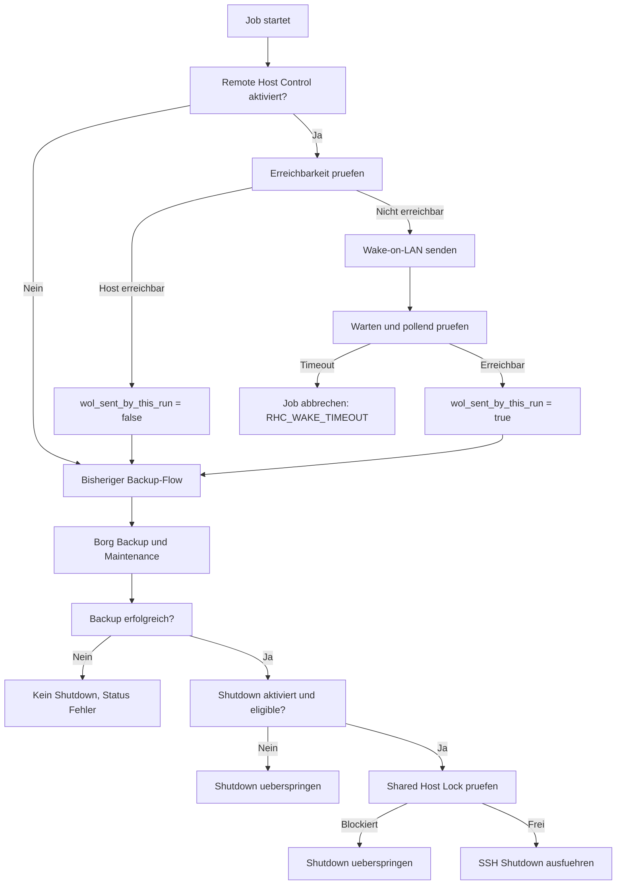

# Konzept- und Designstudie: Wake-on-LAN und Remote-Shutdown

- Issue: #89
- Status: Konzept, keine Implementierung
- Stand: 2026-07-06
- Scope: Analyse, UX-Konzept, Datenmodell und Umsetzungsvorschlag

## Inhaltsverzeichnis

1. [Zusammenfassung](#1-zusammenfassung)
2. [Zielbild](#2-zielbild)
3. [Ist-Analyse](#3-ist-analyse)
4. [Fachliches Konzept](#4-fachliches-konzept)
5. [Datenmodell](#5-datenmodell)
6. [UX- und UI-Konzept](#6-ux--und-ui-konzept)
7. [Backup-Laufzeitlogik](#7-backup-laufzeitlogik)
8. [Logging, Status und Fehler](#8-logging-status-und-fehler)
9. [Sicherheit und Schutzmechanismen](#9-sicherheit-und-schutzmechanismen)
10. [Technische Einschätzung](#10-technische-einschätzung)
11. [Test- und Akzeptanzkriterien](#11-test--und-akzeptanzkriterien)
12. [Umsetzungsvorschlag in Phasen](#12-umsetzungsvorschlag-in-phasen)
13. [Offene Fragen](#13-offene-fragen)

## 1. Zusammenfassung

Dieses Konzept beschreibt eine optionale Erweiterung für Borg Backup UI, mit der
ein Backup-Zielhost vor einem Backup per Wake-on-LAN geweckt und nach einem
erfolgreichen Backup optional wieder heruntergefahren werden kann.

Die Funktion darf nicht automatisch aus einem nicht erreichbaren Repository
abgeleitet werden. Sie muss bewusst pro Job aktiviert werden. Der Benutzer soll
klar sehen, welcher Host geweckt wird, wie die Erreichbarkeit geprüft wird und
unter welchen Bedingungen ein Shutdown ausgeführt wird.

Wichtigste fachliche Regel:

> Ein Remote-Shutdown darf nur ausgeführt werden, wenn dieser konkrete
> Backup-Lauf den Host vorher selbst per Wake-on-LAN geweckt hat und kein anderer
> Job denselben Host noch benötigt.

Damit wird verhindert, dass Borg Backup UI einen bereits laufenden Server
versehentlich herunterfährt.

## 2. Zielbild

Der Benutzer kann bei einem Backup-Job optional konfigurieren:

- Zielhost vor dem Backup per Wake-on-LAN starten
- auf Erreichbarkeit warten
- erst danach Borg-Backup starten
- nach erfolgreichem Backup den Zielhost per SSH herunterfahren

Die UI soll dabei nicht technisch roh wirken, sondern den Ablauf verständlich
zeigen:

1. Host pruefen
2. Wake-on-LAN senden, falls Host nicht erreichbar ist
3. Warten, bis Host erreichbar ist
4. Backup ausfuehren
5. Optional Shutdown ausfuehren, wenn dieser Lauf den Host geweckt hat

Nicht-Ziel dieses ersten Konzepts:

- kein automatisches Einschalten ohne explizite Job-Konfiguration
- kein globaler Host-Autopilot
- kein komplexer Cluster- oder Power-Management-Controller
- kein Shutdown bei fehlgeschlagenem Backup als Standardverhalten

## 3. Ist-Analyse

Die bestehende Architektur bietet bereits geeignete Ankerpunkte.

### 3.1 Job-Metadaten

Wizard-Jobs werden als JSON-Metadaten unter `config/jobs/*.json` gespeichert.
Ein Job enthält bereits:

- `job_key`
- Anzeigename und Beschreibung
- `backup_type`
- `location`
- Repository-Daten
- Storage-Profilreferenzen
- Docker-/VM-Laufzeitsteuerung
- Retention- und Kompressionswerte

Die Remote-Host-Steuerung passt fachlich als zusätzlicher optionaler Block in
diese Job-Metadaten.

### 3.2 Scriptless Runner

Der aktuelle `api/wizard_runner.py` lädt die Job-Metadaten, erzeugt die
Laufzeitumgebung, setzt Resource-Locks und führt anschließend den Backup-Flow
aus. Der Ablauf enthält bereits:

- Repository-Ressourcenlock
- SMB-Mount-Handling
- Repository-Initialisierung
- Docker-/VM-Steuerung
- Borg `create`
- Maintenance
- Status und Notifications über `runtime/lib/backup_job.py`

Wake-on-LAN gehört vor den ersten Repository-Zugriff. Der optionale Shutdown
gehört an das Ende des Laufs, nachdem Borg und Cleanup abgeschlossen sind.

### 3.3 Bestehende Locks und Runtime-State

Es gibt bereits zentrale Konzepte für:

- Resource-Locks im Runner
- Docker-/VM-Recovery unter `runtime-recovery.json`
- Statusdateien und Benachrichtigungen
- strukturierte Fehler- und Supportdaten

Für Remote-Hosts sollte kein paralleles Sondermodell entstehen, sondern ein
kleines eigenes Laufzeitmodell mit Host-ID, Lauf-ID und Zustandsdaten.

## 4. Fachliches Konzept

### 4.1 Aktivierung

Remote Host Control ist pro Job deaktiviert und muss bewusst aktiviert werden.

Ein Job kann optional besitzen:

- Wake-on-LAN vor dem Backup
- Erreichbarkeitsprüfung
- optionalen Shutdown nach erfolgreichem Backup

Wenn Remote Host Control deaktiviert ist, bleibt das bisherige Verhalten
unverändert.

### 4.2 Host-Identität

Jeder kontrollierte Remote-Host benötigt eine stabile Host-ID, zum Beispiel:

- `backup-nas-01`
- `storagebox-gateway`
- `office-backup-server`

Die Host-ID ist nicht zwingend der DNS-Name. Sie ist die logische Kennung, mit
der Borg Backup UI erkennt, dass mehrere Jobs denselben physischen Host
verwenden.

### 4.3 Wake-on-LAN

Wake-on-LAN wird nur gesendet, wenn:

- Remote Host Control aktiviert ist
- Wake-on-LAN für diesen Job aktiviert ist
- der konfigurierte Erreichbarkeitstest vor dem Backup fehlschlägt

Wenn der Host bereits erreichbar ist, darf kein späterer automatischer Shutdown
erfolgen. In diesem Fall hat Borg Backup UI den Host nicht geweckt.

### 4.4 Erreichbarkeitsprüfung

Die Prüfung sollte explizit konfiguriert werden. Empfohlene Modi:

| Modus | Zweck | Empfehlung |
| --- | --- | --- |
| TCP-Port | Prüft, ob ein Hostdienst erreichbar ist, z. B. SSH auf Port 22 | Standard für SSH-/Remote-Ziele |
| Pfad erreichbar | Prüft, ob ein lokaler oder gemounteter Pfad existiert | Sinnvoll für `/mnt/remotes/...` oder `/mnt/disks/...` |
| Borg-Repository lesbar | Prüft optional `borg info` oder eine leichte Repository-Probe | Nur als spätere oder erweiterte Prüfung |
| Ping | ICMP-Prüfung | Nicht als Standard, da ICMP oft blockiert ist |

Der Standard sollte TCP-Port sein, wenn Host und Port konfiguriert sind. Für
lokal gemountete Ziele ist ein Pfadcheck naheliegender.

### 4.5 Shutdown nach Backup

Der Shutdown ist separat zu aktivieren und standardmäßig aus.

Ein Shutdown ist nur zulässig, wenn alle Bedingungen erfüllt sind:

- Backup-Lauf war erfolgreich oder mit Warnung akzeptiert, je nach Einstellung
- dieser Lauf hat den Host per Wake-on-LAN geweckt
- der Host war vor dem Wake-on-LAN nicht erreichbar
- kein anderer aktiver Job nutzt dieselbe Host-ID
- keine Sicherheitsprüfung blockiert den Shutdown

Shutdown bei fehlgeschlagenem Backup sollte standardmäßig deaktiviert bleiben.
Ein späteres Expert-Flag könnte das ändern, sollte aber nicht in Phase 1
enthalten sein.

## 5. Datenmodell

Die effektive Konfiguration sollte im Job-Metadatenfile liegen. Storage-Profile
können später Defaults liefern, aber der Job muss am Ende die autoritative
Laufzeitkonfiguration enthalten.

### 5.1 Vorschlag: Job-Metadaten

```json
{
  "remote_host_control": {
    "enabled": true,
    "host_id": "backup-nas-01",
    "wake": {
      "enabled": true,
      "mac": "AA:BB:CC:DD:EE:FF",
      "broadcast": "255.255.255.255",
      "interface": "",
      "initial_wait_seconds": 60,
      "timeout_seconds": 600,
      "poll_interval_seconds": 10
    },
    "reachability": {
      "mode": "tcp_port",
      "host": "192.168.1.50",
      "port": 22,
      "path": "",
      "borg_probe": false
    },
    "shutdown": {
      "enabled": false,
      "on_success_only": true,
      "allow_on_failure": false,
      "method": "ssh",
      "ssh_host": "192.168.1.50",
      "ssh_user": "root",
      "ssh_key_file": "/boot/config/borg-backup/secrets/.remote-host-backup-nas-01.key",
      "command": "poweroff"
    }
  }
}
```

### 5.2 Laufzeitstatus pro Joblauf

Für Auditierbarkeit sollte pro Lauf gespeichert werden:

```json
{
  "remote_host_control": {
    "enabled": true,
    "host_id": "backup-nas-01",
    "pre_reachable": false,
    "wol_sent_by_this_run": true,
    "wake_started_at": "2026-07-06T09:00:00",
    "reachable_at": "2026-07-06T09:01:14",
    "wake_result": "reachable",
    "shutdown_eligible": true,
    "shutdown_result": "skipped_disabled"
  }
}
```

Der wichtige Schalter ist `wol_sent_by_this_run`. Ohne diesen Wert darf kein
automatischer Shutdown erfolgen.

## 6. UX- und UI-Konzept

### 6.1 Platzierung im Job-Wizard

Empfehlung:

- Im Job-Wizard als optionaler Abschnitt in einem erweiterten Bereich
  "Remote Host Control"
- Im Bearbeiten-Dialog als eigene Karte oder eigener Abschnitt
- In der Job-Übersicht als dezenter Hinweis-Badge

Der Abschnitt sollte standardmäßig eingeklappt sein. Die Funktion ist mächtig
und sollte normale Benutzer nicht ablenken.

### 6.2 Wizard-Karte

```text
+--------------------------------------------------------------+
| Remote Host Control                                          |
| Optional: Zielhost vor dem Backup wecken und danach steuern. |
|                                                              |
| [ ] Remote Host Control aktivieren                           |
+--------------------------------------------------------------+
```

Nach Aktivierung:

```text
+--------------------------------------------------------------+
| Remote Host Control                                          |
|                                                              |
| Host-ID                                                      |
| [ backup-nas-01                                      ]       |
|                                                              |
| Wake-on-LAN                                                  |
| [x] Vor dem Backup Wake-on-LAN senden                        |
| MAC-Adresse        [ AA:BB:CC:DD:EE:FF              ]        |
| Broadcast          [ 255.255.255.255                ]        |
| Wartezeit          [ 60 ] Sek.                              |
| Timeout            [ 600 ] Sek.                             |
|                                                              |
| Erreichbarkeit                                             |
| Modus              [ TCP-Port                         v ]    |
| Host               [ 192.168.1.50                  ]        |
| Port               [ 22                             ]        |
|                                                              |
| Shutdown nach Backup                                       |
| [ ] Nach erfolgreichem Backup per SSH herunterfahren         |
+--------------------------------------------------------------+
```

### 6.3 Shutdown-Karte

Die Shutdown-Karte sollte erst sichtbar oder bearbeitbar werden, wenn Remote
Host Control und Wake-on-LAN aktiv sind.

```text
+--------------------------------------------------------------+
| Shutdown nach erfolgreichem Backup                           |
|                                                              |
| Warnung: Der Host wird nur heruntergefahren, wenn dieser     |
| Backup-Lauf ihn vorher per Wake-on-LAN geweckt hat.          |
|                                                              |
| [ ] Shutdown aktivieren                                      |
| SSH-Host       [ 192.168.1.50                         ]      |
| SSH-Benutzer   [ root                                 ]      |
| SSH-Key        [ Secret-Datei auswählen / erzeugen     ]     |
| Befehl         [ poweroff                             v ]     |
+--------------------------------------------------------------+
```

### 6.4 Vorschau im Wizard

Die Vorschau sollte den Ablauf explizit anzeigen:

```text
Remote Host Control
1. Host backup-nas-01 per TCP 192.168.1.50:22 prüfen
2. Falls nicht erreichbar: Wake-on-LAN an AA:BB:CC:DD:EE:FF senden
3. Bis zu 10 Minuten auf Erreichbarkeit warten
4. Backup ausführen
5. Shutdown: deaktiviert
```

Bei aktivem Shutdown:

```text
Shutdown nach Backup
Der Host wird nur heruntergefahren, wenn dieser Lauf ihn geweckt hat.
Bei Backup-Fehlern bleibt der Host eingeschaltet.
```

### 6.5 Job-Übersicht

In der Job-Liste könnten dezente Badges angezeigt werden:

- `WOL`
- `Remote Host: backup-nas-01`
- `Shutdown nach Erfolg`

Diese Badges sollten nicht dominieren. Sie dienen als Hinweis, dass der Job
zusätzliche Infrastruktur steuert.

### 6.6 Status und History

In History und Reports sollte eine Detailzeile erscheinen:

```text
Remote Host
Host-ID: backup-nas-01
Vorher erreichbar: nein
Wake-on-LAN: gesendet, erreichbar nach 74 Sek.
Shutdown: nicht aktiviert
```

Bei bereits laufendem Host:

```text
Remote Host
Host-ID: backup-nas-01
Vorher erreichbar: ja
Wake-on-LAN: nicht gesendet
Shutdown: übersprungen, Host wurde nicht durch diesen Job geweckt
```

## 7. Backup-Laufzeitlogik

### 7.1 Empfohlener Ablauf



### 7.2 Position im aktuellen Runner

Wake-on-LAN sollte vor folgenden Schritten laufen:

- SMB-Mount, falls der Mount vom Remote-Host abhängt
- Repository-Initialisierung
- Borg-Repository-Zugriff

Shutdown sollte nach folgenden Schritten laufen:

- Borg `create`
- Maintenance
- Statusspeicherung
- Docker-/VM-Neustart
- SMB-Cleanup

Technisch bietet sich ein eigenes Runtime-Modul an, zum Beispiel:

```text
runtime/lib/remote_host_control.py
```

Dieses Modul sollte keine UI-Abhängigkeiten haben und nur konfigurierte Daten
entgegennehmen.

### 7.3 Gemeinsame Hosts

Mehrere Jobs können denselben Host verwenden. Deshalb braucht es eine
Koordination über `host_id`.

Mögliche Runtime-Datei:

```text
/boot/config/borg-backup/locks/remote-host/<host_id>.json
```

oder als Teil des bestehenden Resource-Lock-Modells:

```text
remote-host:backup-nas-01
```

Mindestens in Phase 3 sollte der Runner verhindern:

- Job A fährt Host herunter, während Job B denselben Host noch nutzt
- zwei Jobs senden gleichzeitig Wake-on-LAN und interpretieren den Zustand falsch
- ein Host wird heruntergefahren, obwohl ein weiterer Job für denselben Host
  direkt danach geplant ist

## 8. Logging, Status und Fehler

### 8.1 Logausgaben

Logs bleiben wie bisher maschinen- und supportfreundlich auf Englisch.

Beispiele:

```text
Remote host control enabled: host_id=backup-nas-01
Reachability check failed: tcp 192.168.1.50:22
Wake-on-LAN packet sent: host_id=backup-nas-01 mac=AA:BB:CC:DD:EE:FF
Waiting for remote host: timeout=600s poll_interval=10s
Remote host reachable after 74s
Skipping shutdown: shutdown is disabled
Skipping shutdown: host was already reachable before this run
Remote shutdown succeeded: host_id=backup-nas-01 method=ssh
```

Nicht loggen:

- SSH-Key-Inhalte
- Passwörter
- Tokens
- vollständige Secret-Dateiinhalte
- Authorization-Header

### 8.2 Statusfelder

Backup-Statusdateien könnten erweitert werden um:

- `remote_host_control_enabled`
- `remote_host_id`
- `remote_host_pre_reachable`
- `remote_host_wol_sent`
- `remote_host_wake_result`
- `remote_host_wake_duration_seconds`
- `remote_host_shutdown_result`
- `remote_host_error_code`
- `remote_host_error_message`

### 8.3 Fehlercodes

Empfohlene Fehlercodes:

| Code | Bedeutung | Nutzerhinweis |
| --- | --- | --- |
| `RHC_INVALID_CONFIG` | Konfiguration unvollständig oder ungültig | MAC, Host, Port oder Timeout prüfen |
| `RHC_REACHABILITY_FAILED` | Erreichbarkeitsprüfung fehlgeschlagen | Netzwerk, Hostname oder Firewall prüfen |
| `RHC_WAKE_TIMEOUT` | Host wurde nach WOL nicht erreichbar | WOL im BIOS/OS, Broadcast und Netzwerk prüfen |
| `RHC_SHUTDOWN_FAILED` | SSH-Shutdown fehlgeschlagen | SSH-Key, Benutzer und Berechtigung prüfen |
| `RHC_SHUTDOWN_SKIPPED_BUSY` | Shutdown blockiert, Host wird noch genutzt | Anderen laufenden Job abwarten |

## 9. Sicherheit und Schutzmechanismen

### 9.1 Konservative Defaults

- Remote Host Control: aus
- Wake-on-LAN: aus
- Shutdown: aus
- Shutdown bei Fehler: aus
- Ping nicht als Standard
- kein automatisches WOL aufgrund eines fehlgeschlagenen Repositories

### 9.2 Shutdown-Schutz

Shutdown ist nur erlaubt, wenn:

- `wol_sent_by_this_run == true`
- `pre_reachable == false`
- Job erfolgreich abgeschlossen wurde
- kein anderer Job dieselbe Host-ID aktiv nutzt
- der Benutzer Shutdown explizit aktiviert hat

Dieser Schutz ist wichtiger als Komfort. Ein bereits laufender Server darf
nicht durch Borg Backup UI abgeschaltet werden, nur weil ein Job fertig ist.

### 9.3 SSH-Sicherheit

Empfehlungen:

- SSH-Key statt Passwort
- Secret-Datei nur unter dem Borg-Backup-UI-Secret-Verzeichnis
- Dateirechte prüfen
- SSH-Aufruf ohne Shell, nur über Argumentliste
- Standardbefehl aus Allowlist, zum Beispiel `poweroff` oder `shutdown -h now`
- keine beliebigen Shell-Kommandos in Phase 1

### 9.4 Supportpaket und Maskierung

Supportpakete dürfen enthalten:

- Host-ID
- Wake-/Shutdown-Status
- Fehlercodes
- Zielhost ohne Secret
- SSH-Key-Dateipfad nur maskiert oder als Basename

Supportpakete dürfen nicht enthalten:

- private SSH-Keys
- Passwörter
- Tokens
- geheime Header

## 10. Technische Einschätzung

### 10.1 Bereits vorhandene Daten

Bereits vorhanden:

- Job-Metadaten
- Repository-URI oder lokaler Repository-Pfad
- Storage-Typ und Storage-Profilreferenzen
- Job-History und Statusdateien
- Resource-Locks
- Notification-System
- Supportpaket-Sanitizing
- Secret-Verzeichnis für Borg-Passphrasen

### 10.2 Neu benötigte Daten

Neu benötigt:

- Host-ID
- MAC-Adresse
- Broadcast-Adresse oder Interface
- Wake-Timeouts und Poll-Intervall
- Erreichbarkeitsmodus
- Host/Port oder Pfad für die Prüfung
- optional SSH-Host, Benutzer und Key-Datei
- Shutdown-Befehl aus Allowlist
- Laufzeitstatus, ob dieser Lauf WOL gesendet hat

### 10.3 Architektur-Empfehlung

Empfohlene Struktur:

- Job-Metadaten enthalten effektive Remote-Host-Control-Konfiguration
- `runtime/lib/remote_host_control.py` kapselt Wake, Reachability und Shutdown
- `api/wizard_runner.py` ruft das Modul an definierten Stellen auf
- UI zeigt die Konfiguration im Wizard und in Job-Details an
- Status/History nutzen die gespeicherten Runtime-Ergebnisse

Storage-Profile können später Defaults anbieten. Für die erste Umsetzung ist
Job-Level-Konfiguration klarer und sicherer.

## 11. Test- und Akzeptanzkriterien

### 11.1 Akzeptanzkriterien

- WOL wird nur ausgeführt, wenn es pro Job aktiviert ist.
- Ein erreichbarer Host wird nicht unnötig geweckt.
- Ein Host wird nach dem Backup nur heruntergefahren, wenn dieser Lauf ihn
  vorher geweckt hat.
- Backup bricht verständlich ab, wenn der Host nach WOL nicht erreichbar wird.
- Logs zeigen Wake-, Warte- und Shutdown-Schritte ohne Secrets.
- Status/History zeigen Remote-Host-Ergebnis nachvollziehbar an.
- Shell-Kommandos sind gegen Injection abgesichert.
- Supportpakete enthalten keine Secrets.

### 11.2 Testideen

- WOL deaktiviert: bestehender Job läuft unverändert.
- WOL aktiviert, Host erreichbar: kein WOL, kein Shutdown.
- WOL aktiviert, Host nicht erreichbar, wird erreichbar: Backup läuft.
- WOL aktiviert, Host bleibt nicht erreichbar: Job bricht mit
  `RHC_WAKE_TIMEOUT` ab.
- Shutdown aktiviert, Host wurde durch diesen Job geweckt: Shutdown wird
  ausgeführt.
- Shutdown aktiviert, Host war vorher erreichbar: Shutdown wird übersprungen.
- Zwei Jobs mit gleicher Host-ID: Shutdown wird blockiert, solange der zweite
  Job den Host nutzt.
- Ungültige MAC-Adresse: Konfiguration wird im Wizard abgelehnt.
- SSH-Key fehlt: Shutdown-Konfiguration wird abgelehnt oder Runtime bricht mit
  verständlichem Fehler ab.

## 12. Umsetzungsvorschlag in Phasen

### Phase 1: Wake-on-LAN vor Backup

Umfang:

- Job-Metadaten erweitern
- UI-Abschnitt im Wizard/Bearbeiten-Dialog
- MAC-/Timeout-/Reachability-Validierung
- WOL senden
- auf Erreichbarkeit warten
- Status und Logs speichern

Kein Shutdown in Phase 1.

### Phase 2: Optionaler Shutdown nach erfolgreichem Backup

Umfang:

- SSH-Key/Benutzer/Host konfigurieren
- Shutdown nur bei `wol_sent_by_this_run == true`
- kein Shutdown bei Fehler als Default
- Status, History und Fehlercodes erweitern
- Testfunktion für SSH-Erreichbarkeit ohne echten Shutdown

### Phase 3: Shared Remote Host Coordination

Umfang:

- Host-ID-basierte Locks
- Schutz vor Shutdown bei parallelen Jobs
- optionaler Blick auf geplante Folgejobs
- UI-Hinweise, wenn mehrere Jobs denselben Host verwenden
- Detailansicht für Remote-Host-Ereignisse

### Phase 4: Storage-Profil-Defaults

Umfang:

- Remote-Host-Control-Defaults an Storage-Profilen
- Job übernimmt Defaults beim Erstellen
- Job bleibt autoritative Quelle für den Lauf

Diese Phase sollte erst kommen, wenn Phase 1 bis 3 stabil sind.

## 13. Offene Fragen

### 13.1 Soll Shutdown nur für WOL-Hosts sichtbar sein?

Empfehlung: Ja. In der ersten Umsetzung sollte Shutdown an Wake-on-LAN
gekoppelt sein. Dadurch ist klar, warum Borg Backup UI berechtigt ist, den Host
wieder herunterzufahren.

### 13.2 Welche Erreichbarkeitsprüfung soll Default sein?

Empfehlung:

- SSH-/Remote-Ziele: TCP-Port
- lokal gemountete Ziele: Pfad erreichbar
- Ping nur als optionale Zusatzprüfung
- Borg-Repository lesbar als spätere erweiterte Prüfung

### 13.3 Soll die Konfiguration am Job oder am Storage-Profil hängen?

Empfehlung: zuerst am Job. Storage-Profile können später Defaults liefern. Der
Backup-Lauf muss immer aus der Job-Metadatei eindeutig rekonstruierbar sein.

### 13.4 Was passiert bei Backup-Fehlern?

Empfehlung: Kein Shutdown bei Fehlern. Der Host bleibt erreichbar, damit der
Benutzer Logs, Repository und Netzwerk prüfen kann.

### 13.5 Wie wird verhindert, dass ein aktiver Server heruntergefahren wird?

Durch drei Bedingungen:

1. Vorher war der Host nicht erreichbar.
2. Dieser Lauf hat Wake-on-LAN gesendet.
3. Kein anderer Job mit derselben Host-ID ist aktiv.

Erst wenn alle Bedingungen erfüllt sind, darf Shutdown überhaupt in Frage
kommen.
