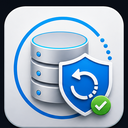
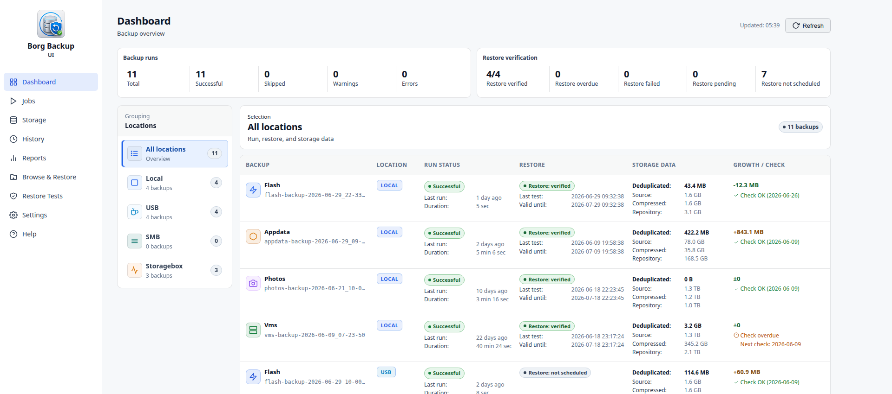

#  Borg Backup UI

Borg Backup UI brings BorgBackup into the Unraid web interface: guided backup
jobs, repository management, restore tests, archive browsing, reports, and
notifications in one place.

It is built for Unraid users who want BorgBackup without maintaining custom
scripts by hand. The goal is to keep backups transparent, verifiable, and
recoverable while making day-to-day operation easier.

> Project status: active development before public Community Apps publication.
> Public installation URLs are intentionally not listed yet.

## Table of Contents

1. [What is this?](#1-what-is-this)
2. [Screenshots](#2-screenshots)
3. [Requirements](#3-requirements)
4. [Install on Unraid](#4-install-on-unraid)
5. [First Setup](#5-first-setup)
6. [How it works](#6-how-it-works)
7. [Security and Recovery Notes](#7-security-and-recovery-notes)
8. [Documentation](#8-documentation)
9. [License](#9-license)

## 1. What is this?

Borg Backup UI is an Unraid plugin and web interface for BorgBackup.

It helps you:

- create backup jobs with a guided wizard
- manage local, USB, SMB, SSH, and Storage Box style repositories
- stop selected Docker containers or VMs during backup runs
- browse Borg archives and restore files through a guided restore workflow
- run restore tests to verify that backups can actually be read and restored
- monitor backup health, missed schedules, repository checks, and reports
- send notifications through Unraid notifications, email, and ntfy

BorgBackup remains the backup engine. Borg Backup UI adds the Unraid-specific
control layer around jobs, repositories, schedules, restore workflows, reports,
notifications, and safe operational checks.

## 2. Screenshots

### Dashboard

Backup status, restore verification, repository health, and recent activity in
one overview.

### Jobs

Grouped backup jobs with operational status, next run information, restore
verification state, and manual start controls.

### Job Wizard

A step-by-step workflow for sources, repositories, Docker/VM handling, retention,
description, schedule, and flow preview.

### Browse and Restore

Browse archives, select content, precheck the restore target, and restore into
administrator-approved paths.

### Restore Tests

Plan and review automated restore checks so backups are not only written, but
also verified.

## 3. Requirements

- Unraid with a running array.
- Python 3.10 or newer.
- Recommended on Unraid: `Python 3 for Unraid` from Community Applications.
- Reachable storage targets for the backup locations you want to use.

BorgBackup is bundled with the plugin package. Normal operation does not require
users to install Python packages with `pip`.

## 4. Install on Unraid

TODO: Community Applications and public installation instructions will be added
after the project is ready for public beta/publication.

## 5. First Setup

1. Install the required Python runtime on Unraid.
2. Open the Borg Backup UI control page in the Unraid web interface.
3. Check that the Python runtime is detected and start Borg Backup UI.
4. Open Borg Backup UI from the control page.
5. Create the first administrator account.
6. Confirm the main data directory.
7. Create or select a storage target and repository.
8. Create the first backup job with the guided wizard.
9. Run the first backup manually.
10. Restore into a separate test folder and verify the result.
11. Configure restore tests and notifications for ongoing monitoring.

For the first test, start with a small test folder or non-critical share. Do not
begin with irreplaceable data until backup and restore behavior has been
verified on your system.

## 6. How it works

- The Unraid plugin installs a bundled BorgBackup runtime and the Borg Backup UI
  application files.
- The control page starts, stops, and restarts the Python-based web interface.
- The web interface stores configuration in the Unraid flash configuration area
  and runtime state below the configured data directory.
- Backup jobs call Borg through controlled runtime scripts and record structured
  status, logs, reports, and notification events.
- Repository locks prevent conflicting write operations such as backup and
  restore extraction against the same repository.
- Restore tests use the same repository configuration to check whether archives
  can be accessed, inspected, restored, and cleaned up safely.

Technical architecture, paths, and development workflow are documented in
[docs/README.md](README.md).

## 7. Security and Recovery Notes

This section needs a final public wording pass before release.

Current design principles:

- BorgBackup remains the encryption and repository format authority.
- Repository passphrases and profile secrets are stored in dedicated secret
  files, not in normal logs or public artifacts.
- Support bundles and diagnostics are sanitized before sharing.
- Restore targets can be restricted to administrator-approved safe paths.
- Browse, precheck, backup, restore, and repository maintenance operations use
  resource locks where concurrent access could be unsafe.
- Restore tests are first-class: a backup should be treated as proven only after
  restore behavior has been verified.

Open wording decision:

- The public README should clearly explain what Borg Backup UI protects, what
  BorgBackup protects, and what the administrator remains responsible for.

## 8. Documentation

| Document | Purpose |
| --- | --- |
| [Technical overview](README.md) | Runtime architecture, paths, build notes, and development basics. |
| [Release workflow](release-workflow.md) | Build, test-channel, and stable release process. |
| [Manual maintenance tests](manual-maintenance-tests.md) | Manual validation checklist for Unraid test systems. |
| [Changelog](changelog.md) | Technical and release history. |
| [Homepage widget](integrations/homepage-widget.md) | Read-only dashboard integration and token setup. |
| [German user manual](handbuch/README.md) | Current German user manual draft. |

## 9. License

- Borg Backup UI: MIT, see [LICENSE](../LICENSE)
- Bundled BorgBackup: BSD-3-Clause, see
  [runtime/licenses/borg/LICENSE](../runtime/licenses/borg/LICENSE)
- Bundled Apprise notification runtime: BSD-2-Clause and permissive Python
  dependency licenses, see
  [runtime/licenses/THIRD-PARTY-NOTICES.md](../runtime/licenses/THIRD-PARTY-NOTICES.md)
