# Borg-Backup-UI Benutzerhandbuch

Stand: 03.07.2026  
Sprache: Deutsch  
Zielgruppe: Anwender und Administratoren eines Unraid-Systems

Dieses Handbuch beschreibt Borg-Backup-UI in der Reihenfolge des Menüs der Anwendung. Es erklärt die sichtbaren Seiten, typische Arbeitsabläufe, wichtige Warnungen und die Auswirkungen der jeweiligen Aktionen.

> **Hinweis:** Dieses Handbuch beschreibt die Anwendung selbst. Es ersetzt keine allgemeine BorgBackup-Dokumentation und keine Unraid-Systemdokumentation. Wenn eine Funktion in der Oberfläche nicht sichtbar ist, ist sie für die aktuell angemeldete Rolle oder die aktuelle Konfiguration möglicherweise nicht verfügbar.

## Inhaltsverzeichnis

1. [Grundlagen](#1-grundlagen)
2. [Dashboard](#2-dashboard)
3. [Jobs](#3-jobs)
4. [Repositories](#4-repositories)
5. [History](#5-history)
6. [Berichte](#6-berichte)
7. [Browse & Restore](#7-browse--restore)
8. [Restore Tests](#8-restore-tests)
9. [Einstellungen](#9-einstellungen)
10. [Hilfe](#10-hilfe)
11. [Typische Aufgaben](#11-typische-aufgaben)
12. [Status, Warnungen und Best Practices](#12-status-warnungen-und-best-practices)

## 1. Grundlagen

Borg-Backup-UI ist eine Weboberfläche für BorgBackup auf Unraid. Die Anwendung verwaltet Backup-Jobs, Speicherziele, Zeitpläne, Restore-Funktionen, Restore-Tests, Berichte, Benachrichtigungen und Systemdiagnosen.

### 1.1 Grundbegriffe

- **Job:** Eine Backup-Definition mit Quellpfaden, Ziel, Borg-Optionen, Retention, Passphrase und optionalem Zeitplan.
- **Repository:** Das BorgBackup-Ziel, in dem Archive gespeichert werden.
- **Archiv:** Ein einzelner BorgBackup-Snapshot innerhalb eines Repositorys.
- **Standort:** Eine Zielgruppe wie `Lokal`, `USB`, `SMB` oder `Storagebox`.
- **Profil:** Wiederverwendbare Zielkonfiguration, z. B. USB-, SMB- oder SSH-Profil.
- **Restore:** Wiederherstellung von Dateien oder Verzeichnissen aus einem Archiv.
- **Restore Test:** Automatisierte Prüfung, ob eine Wiederherstellung technisch möglich ist.
- **Systemstatus:** Zusammenfassung aus Konfiguration, Migration, Jobs, Secrets, Runtime-Recovery und Wartungshinweisen.

### 1.2 Anmeldung, Sprache und Rolle

Nach der Anmeldung zeigt die linke Seitenleiste das Hauptmenü, den Systemstatus, die Sprachauswahl, die Abmeldung, den angemeldeten Benutzer und die installierte Version.

Die Sprache kann unten links zwischen Deutsch und Englisch umgeschaltet werden. Die Änderung betrifft die Weboberfläche, nicht die technischen Logdateien. Logs, maschinenlesbare Werte und technische Fehlercodes können weiterhin englische Begriffe enthalten.

Die Anwendung kennt mindestens die Rollen `admin` und `viewer`. Administratoren können Einstellungen ändern, Jobs verwalten und Benutzeraktionen ausführen. Eine Viewer-Rolle ist lesend eingeschränkt; schreibende Aktionen können deaktiviert oder abgelehnt werden.

> **Warnung:** Bewahren Sie Passwörter, Borg-Passphrasen, SSH-Keys und Export-Passwörter sicher auf. Borg-Backup-UI maskiert Secrets in Diagnoseausgaben, trotzdem sollten Support-Pakete vor einer Weitergabe geprüft werden.

## 2. Dashboard

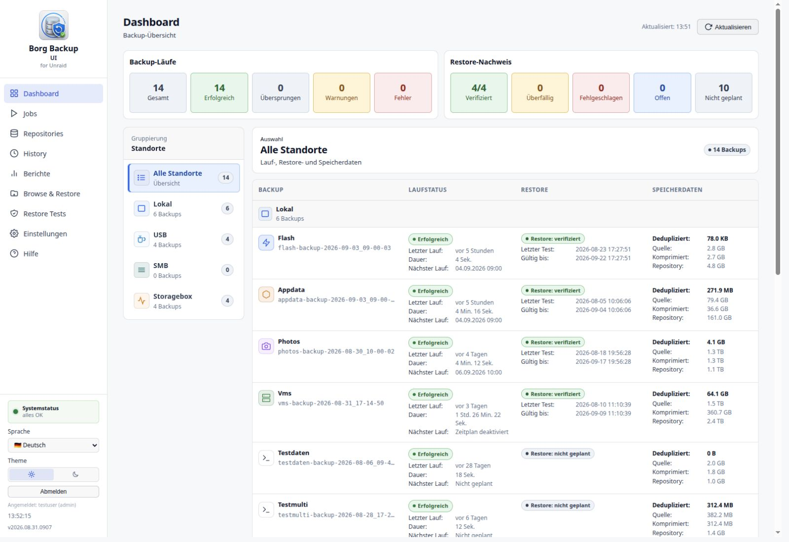

Das Dashboard ist die zentrale Übersicht über Backup-Zustand, Restore-Nachweise, Speicherentwicklung und Repository-Prüfungen.

### 2.1 Zweck der Seite

Das Dashboard beantwortet die wichtigsten Betriebsfragen:

- Welche Jobs existieren?
- Welche Backups waren erfolgreich, übersprungen, mit Warnung oder fehlerhaft?
- Welche Restore-Tests sind verifiziert, überfällig, fehlgeschlagen oder nicht geplant?
- Welche Speicher- und Repository-Daten sind zuletzt bekannt?
- Welche Jobs benötigen Aufmerksamkeit?

### 2.2 Bereiche und Anzeigen

Die Seite besteht aus:

- **Backup-Läufe:** Gesamtzahl, erfolgreiche Läufe, übersprungene Läufe, Warnungen und Fehler.
- **Restore-Nachweis:** Anzahl verifizierter, überfälliger, fehlgeschlagener, offener und nicht geplanter Restore-Tests.
- **Standort-Sidebar:** Filtert die Tabelle nach `Alle Standorte`, `Lokal`, `USB`, `SMB` und `Storagebox`.
- **Auswahlkarte:** Zeigt den aktuell gewählten Standort und die Anzahl der Backups.
- **Job-Tabelle:** Zeigt Job, Standort, Laufstatus, Restore-Status, Speicherdaten und Wachstum/Check.
- **Aktualisieren:** Lädt Dashboard-Daten neu.

### 2.3 Wichtige Spalten

- **Backup:** Name, Schlüssel und Icon des Jobs.
- **Standort:** Speicherziel des Jobs.
- **Laufstatus:** Letzter Lauf, Dauer und Ergebnis.
- **Restore:** Letzter Restore-Test und Gültigkeit, sofern geplant.
- **Speicherdaten:** Deduplizierte Größe, Quelle, komprimierte Größe und Repository-Größe.
- **Wachstum / Check:** Größenänderung und letzter Repository-Check.

### 2.4 Typische Aktionen

1. Öffnen Sie **Dashboard**.
2. Prüfen Sie oben die Zusammenfassungen.
3. Wählen Sie links einen Standort, wenn Sie nur lokale, USB-, SMB- oder Storagebox-Jobs sehen möchten.
4. Lesen Sie pro Job den Laufstatus und Restore-Status.
5. Klicken Sie auf **Aktualisieren**, wenn Sie unmittelbar nach einem Lauf neue Daten erwarten.

### 2.5 Hinweise und Best Practices

> **Tipp:** Nutzen Sie das Dashboard als täglichen Kontrollpunkt. Wenn alle Backup- und Restore-Zähler plausibel sind, können Detailseiten gezielt nur bei Auffälligkeiten geöffnet werden.

> **Hinweis:** Das Dashboard zeigt die zuletzt bekannten Statusdaten. Wenn ein Repository nicht erreichbar ist oder ein Statusfile fehlt, kann die Tabelle veraltete oder unvollständige Werte anzeigen. Prüfen Sie in diesem Fall **History**, **Storage** und die Logs.

## 3. Jobs

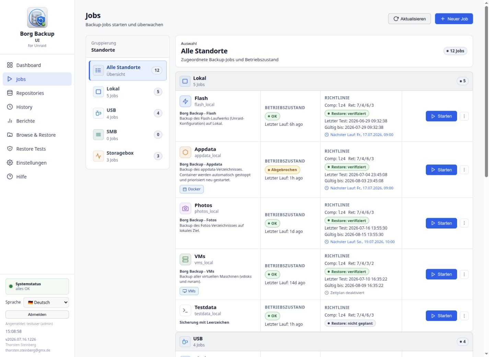

Die Seite **Jobs** verwaltet Backup-Jobs. Hier werden Jobs angezeigt, gestartet, bearbeitet, geplant und gelöscht.

### 3.1 Zweck der Seite

Jobs definieren, welche Daten wohin gesichert werden. Ein Job enthält:

- Anzeigename und Typ-ID
- Standort und Repository
- Quellpfade
- Docker- und VM-Steuerung
- Borg-Optionen wie Kompression, Retention und Passphrase
- Zeitplan
- Beschreibung und Icon

### 3.2 Bereiche und Funktionen

- **Standort-Sidebar:** Gruppiert Jobs nach Speicherziel.
- **Job-Liste:** Zeigt Name, Beschreibung, Betriebszustand, Richtlinie und nächste Ausführung.
- **Starten:** Startet einen Job manuell.
- **Weitere Aktionen:** Öffnet je nach Job Aktionen wie Bearbeiten, Zeitplan, Logs oder Löschen.
- **Neuer Job:** Öffnet den Job-Wizard.
- **Aktualisieren:** Lädt Jobliste und Status neu.
- **Live-Log:** Während eines laufenden Jobs kann die Ausgabe im Browser verfolgt werden.

### 3.3 Job manuell starten

1. Öffnen Sie **Jobs**.
2. Suchen Sie den gewünschten Job über die Standortgruppe oder die Suche.
3. Klicken Sie auf **Starten**.
4. Bestätigen Sie den Startdialog.
5. Beobachten Sie das Live-Log.
6. Prüfen Sie anschließend **History** und ggf. **Storage**.

> **Warnung:** Wenn der Job Docker-Container oder VMs stoppen soll, werden nur die im Job konfigurierten Ziele gesteuert. Prüfen Sie diese Auswahl vor produktiven Läufen.

### 3.4 Job-Wizard

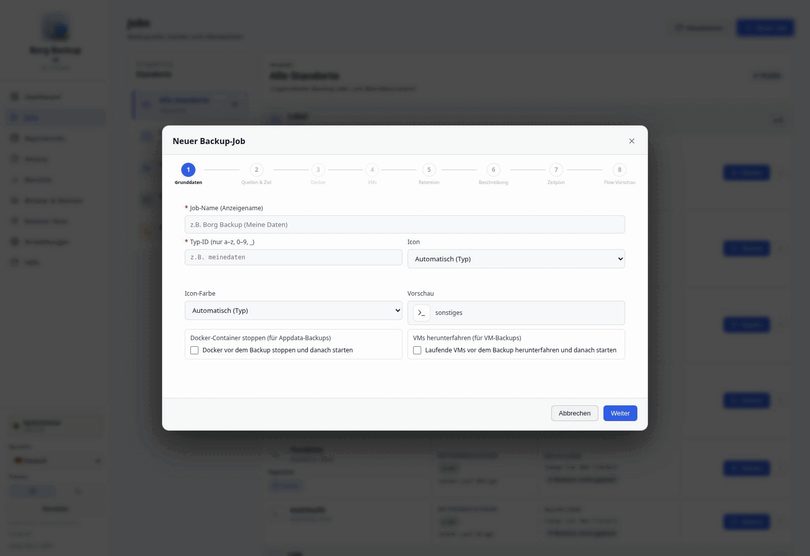

Der Job-Wizard führt in festen Schritten durch die Erstellung oder Bearbeitung eines Jobs.

#### Schritt 1: Grunddaten

Hier werden Jobname, Typ-ID, Icon, Icon-Farbe und erste Laufzeitoptionen gesetzt.

Wichtige Felder:

- **Job-Name:** Sichtbarer Name in UI, Berichten und Benachrichtigungen.
- **Typ-ID:** Technischer Schlüsselbestandteil. Er sollte kurz, eindeutig und stabil sein.
- **Icon / Icon-Farbe:** Darstellung in Dashboard, Jobs, Restore und Reports.
- **Docker vor dem Backup stoppen:** Aktiviert Docker-Steuerung.
- **VMs vor dem Backup herunterfahren:** Aktiviert VM-Steuerung.

#### Schritt 2: Quellen & Ziel

Die kompakte Ansicht zeigt links **Quellen und Ausschlüsse** und rechts das **Backup-Ziel**. Hier werden Quellpfade, optionale Ausschlusspfade, Speichertyp, konkretes Speicherziel, ein vorhandenes Repository und die Job-Kompression gewählt. Die Repository-Liste zeigt ausschließlich Repositorys, die zum ausgewählten Speicherziel gehören. Repository-Pfade werden im Job nicht mehr frei eingegeben.

Typische Quellpfade:

- `/boot/`
- `/mnt/user/appdata/`
- `/mnt/user/domains/`
- `/mnt/user/photos/`

> **Hinweis:** Quellpfade müssen auf dem Unraid-System existieren und für den Backup-Prozess lesbar sein.

Ausschlusspfade sind konkrete Dateien oder Verzeichnisse unterhalb eines ausgewählten Quellpfads. Sie werden nicht in das Borg-Archiv aufgenommen. Bei vielen Einträgen scrollen nur die Pfadlisten innerhalb ihres Bereichs.

#### Docker- und VM-Schritte

Wenn Docker- oder VM-Steuerung aktiviert ist, zeigt der Wizard eigene Schritte für die Auswahl.

Optionen:

- **Alle laufenden Container** oder **nur ausgewählte Container**
- **Alle laufenden VMs** oder **nur ausgewählte VMs**

Bei `/mnt/user/appdata` empfiehlt die Anwendung, alle Docker-Container zu stoppen. Bei `/mnt/user/domains` empfiehlt sie, alle VMs herunterzufahren. Wenn nur einzelne Dienste gestoppt werden, muss der Hinweis bewusst bestätigt werden.

> **Warnung:** Appdata- und VM-Backups können Warnungen oder inkonsistente Daten erzeugen, wenn während des Backups Dateien geändert werden. Stoppen Sie bei vollständigen Appdata- oder Domains-Backups möglichst alle betroffenen Dienste.

#### Retention, Kompression und Beschreibung

Der Wizard setzt jobbezogene Borg-Optionen wie Kompression und Aufbewahrung. Verschlüsselung und Passphrase gehören zum Repository und werden ausschließlich beim Erstellen oder Importieren des Repositorys festgelegt.

#### Zeitplan

Der Zeitplan kann direkt im Wizard gesetzt werden. Die UI unterstützt einfache Frequenzen und einen Cron-Ausdruck.

Cron-Format:

```text
Minute Stunde Tag Monat Wochentag
```

Beispiel:

```text
0 3 * * *
```

Dieser Ausdruck startet täglich um 03:00 Uhr.

#### Flow-Vorschau

Der letzte Schritt zeigt eine technische Vorschau des geplanten Ablaufs. Hier werden Repository, Quellpfade, Docker-/VM-Auswahl und geplante Aktionen zusammengefasst.

### 3.5 Zeitplanung und Cron

Zeitpläne können im Job-Wizard oder über die Job-Aktionen geändert werden. Beim Speichern wird der Cron-Eintrag für die Anwendung aktualisiert.

Best Practices:

- Neue Jobs zuerst manuell testen.
- Danach Zeitplan aktivieren.
- Zeitpläne mit ausreichend Abstand planen, damit sich große Backups nicht überlappen.
- Bei externen Zielen prüfen, ob Netzwerk und Mounts zur geplanten Zeit verfügbar sind.

### 3.6 Typische Meldungen

- **Vorschau Fehler / ungültige Angaben:** Ein Feld im Wizard ist nicht plausibel. Prüfen Sie Quellpfade, Typ-ID, Speicherziel und Repository-Auswahl.
- **Kein Speicherziel oder Repository vorhanden:** Öffnen Sie **Repositories** und richten Sie dort zuerst ein Speicherziel und Repository ein oder importieren Sie ein vorhandenes Repository.
- **Schedule disabled / Zeitplan deaktiviert:** Der Job läuft nur manuell.

## 4. Repositories

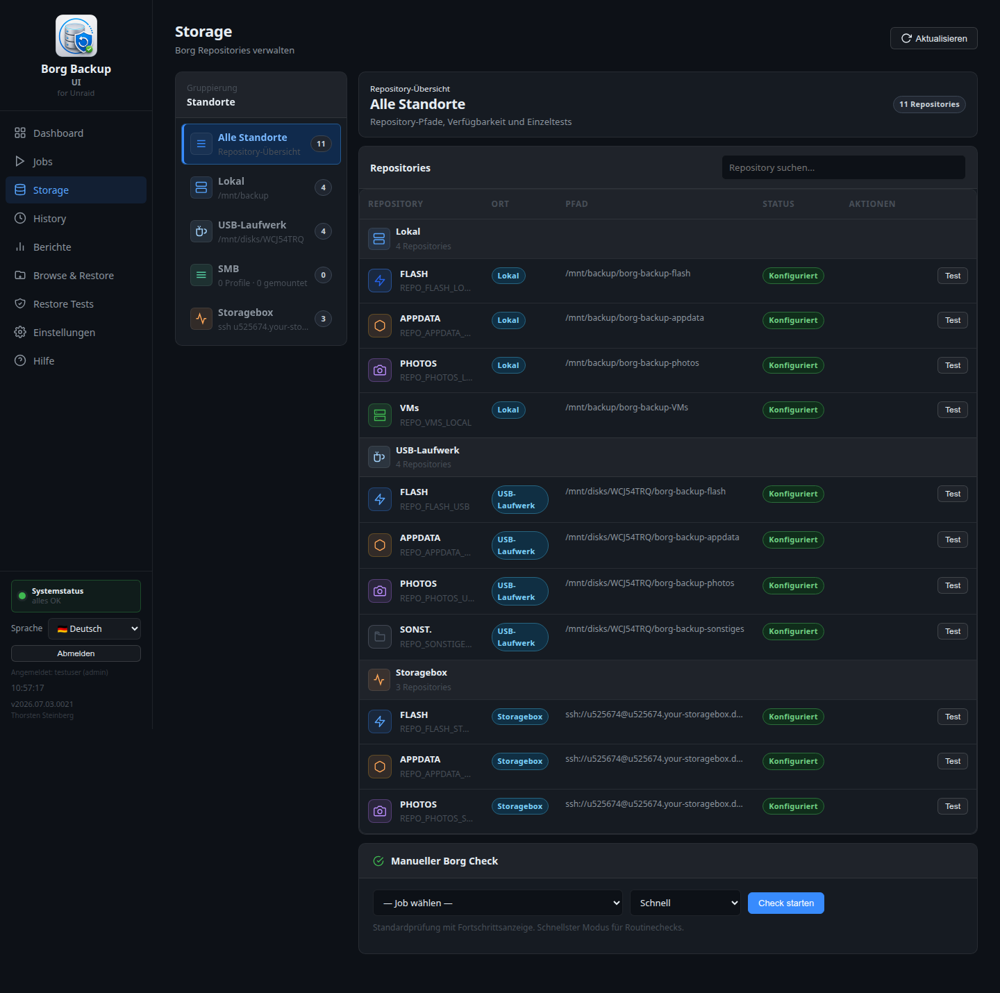

Die Seite **Repositories** verwendet eine Master-Detail-Ansicht. Links werden Borg-Repositorys nach dem exakten Speicherziel gruppiert; rechts bleibt der Arbeitsbereich des ausgewählten Repositorys sichtbar. Über **Repository hinzufügen** können Speicherziele geführt eingerichtet sowie Repositorys erstellt oder importiert werden.

Lokale Speicherziele werden unter **Einstellungen > Lokale Profile** angelegt.
Zulässig sind konkrete Verzeichnisse unter `/mnt`, etwa `/mnt/backup` oder
`/mnt/disks/USB-A`. Zu breite Wurzeln, Systempfade und fehlerhafte Eingaben mit
leeren, `.`- oder `..`-Segmenten werden vor dem Speichern abgelehnt.

### 4.1 Zweck der Seite

Die Seite trennt Speicherziele, Borg-Repositorys und Backup-Jobs. Ein Speicherziel beschreibt den physischen oder entfernten Ort. Ein Repository enthält Borg-Archive. Ein Job wählt ein vorhandenes Repository und bestimmt Quellen, Zeitplan, Kompression und Aufbewahrung.

### 4.2 Bereiche und Funktionen

- **Repository-Sidebar:** Gruppiert Repositorys nach dem konkreten Speicherziel und zeigt pro Eintrag Anzeigename, Repository-Verzeichnis und Status.
- **Suche:** Filtert die Einträge der Sidebar nach Namen, Pfad, Job oder Speicherziel.
- **Kopfbereich:** Zeigt das ausgewählte Repository, seinen Pfad und den aktuellen zusammengefassten Zustand.
- **Übersicht:** Zeigt Borg-Kennzahlen, Wartungsstatus sowie verständliche Angaben zu Repository, Speicherziel, Job, Verschlüsselung und Pfad.
- **Archive:** Lädt die aktuelle Archivliste mit Archivname, technischer ID, Startzeit und Dauer direkt aus Borg.
- **Wartung:** Bietet Check, Datenprüfung, Prune und Compact als klar getrennte Aktionen mit dauerhaft sichtbarem Ergebnis.
- **Verwaltung:** Zeigt aktuelle Job-Verknüpfungen und trennt das nicht-destruktive Entfernen aus der UI von der endgültigen Repository-Löschung.
- **Repository hinzufügen:** Öffnet einen Assistenten für vorhandene oder neue Speicherziele und für Erstellen oder Importieren eines Repositorys.

Die Borg-Kennzahlen werden im Hintergrund alle 24 Stunden aktualisiert und in `repositories.json` zwischengespeichert. Fehlt die Information oder ist sie älter, wird sie beim nächsten stündlichen Prüflauf geladen. Fehlgeschlagene Aktualisierungen werden nach einer Stunde erneut versucht. Der Seitenaufruf selbst wartet dadurch nicht auf alle lokalen und entfernten Repositorys.

Der Repository-Kopf verwendet den beim Erstellen oder Importieren vergebenen **Anzeigenamen**. Das **Repository-Verzeichnis** ist der letzte Verzeichnisname, der **Repository-Pfad** ist der vollständige lokale oder entfernte Zielpfad und **Pfad im Speicherziel** ist der relative Pfad innerhalb des ausgewählten Speicherziels.

### 4.3 Repository erstellen oder importieren

1. Öffnen Sie **Repositories** und klicken Sie **Repository hinzufügen**.
2. Wählen Sie ein vorhandenes Speicherziel oder richten Sie Local, USB, SMB oder Storagebox/SSH ein.
3. Der Assistent prüft Erreichbarkeit und Schreibzugriff. Bei SMB wird der technische Mount-Pfad automatisch verwaltet.
4. Wählen Sie **Neues Repository erstellen** oder **Vorhandenes Repository importieren**.
5. Geben Sie Anzeigename und relativen Repository-Pfad an.
6. Beim Erstellen wählen Sie Verschlüsselung und Passphrase. Keyfile-Schlüssel werden persistent im geschützten Plugin-Verzeichnis gespeichert.
7. Beim Import wird die Verschlüsselung durch `borg info` erkannt. Für ein Keyfile-Repository fügen Sie bei Bedarf einen zuvor mit `borg key export` erzeugten Borg-Key-Export ein; ein exakt passender vorhandener Schlüssel wird automatisch übernommen.
8. Prüfen Sie die Zusammenfassung und speichern Sie.

> **Warnung:** Ein Import initialisiert oder verändert das Repository nicht. Ein Erstellen führt ausdrücklich `borg init` aus.

> **Warnung:** Bei `keyfile` und `keyfile-blake2` benötigen Sie für eine Wiederherstellung sowohl die Passphrase als auch die lokale Schlüsseldatei. Verwenden Sie für einen Systemumzug den verschlüsselten Jobs-/Secrets-Export und bewahren Sie zusätzlich einen unabhängigen `borg key export` auf.

### 4.4 Typische Aktionen

Repository prüfen und warten:

1. Öffnen Sie **Repositories**.
2. Wählen Sie das Repository in der nach Speicherziel gruppierten Sidebar.
3. Prüfen Sie unter **Übersicht** die Borg-Kennzahlen und den letzten Zustand.
4. Öffnen Sie **Wartung** und starten Sie bei Bedarf Check, Datenprüfung, Prune oder Compact.
5. Prüfen Sie nach Abschluss den Status. Bei einem Fehler können Sie die maskierten technischen Details im Statusfeld öffnen.

SMB-Ziel prüfen:

1. Prüfen Sie zuerst das SMB-Profil in **Einstellungen > SMB-Profile**.
2. Öffnen Sie **Repositories**.
3. Wählen Sie das Repository. Die Anwendung hängt ein noch nicht eingehängtes verwaltetes SMB-Ziel für den Zugriff temporär ein und anschließend wieder aus.
4. Aktualisieren Sie danach unter **Übersicht** die Repository-Informationen.

Repository aus der Anwendung entfernen oder endgültig löschen:

1. Entfernen oder weisen Sie zuerst alle verknüpften Backup-Jobs einem anderen Repository zu.
2. Öffnen Sie beim Repository den Reiter **Verwaltung** und prüfen Sie, dass keine Job-Verknüpfung oder laufende Aktion mehr gemeldet wird.
3. **Aus Borg-Backup-UI entfernen** löscht nur den Eintrag aus dem Repository-Inventar. Daten und Passphrase-Datei bleiben erhalten.
4. **Repository endgültig löschen** prüft Repository-ID, Pfad und Archivanzahl erneut und verlangt den exakten Anzeigenamen sowie das Sicherheitswort `DELETE`.
5. Erst nach erfolgreichem `borg delete` entfernt die Anwendung den Inventareintrag und eine ausschließlich diesem Repository zugeordnete Passphrase-Datei.

### 4.5 Hinweise

> **Hinweis:** Prune nutzt die Retention des verknüpften Jobs. Ohne Job-Zuordnung bleibt Prune deaktiviert.

> **Hinweis:** Prune listet entfernte Archive im Ergebnis. Compact zeigt den freigegebenen Speicherplatz nur dann numerisch an, wenn Borg diesen Wert ausgibt.

> **Warnung:** Borg Check kann je nach Repository-Größe und Ziel sehr lange laufen. Starten Sie ihn bewusst und nicht unnötig häufig.

> **Warnung:** Die endgültige Repository-Löschung entfernt alle Archive unwiderruflich. Sie ist gesperrt, solange Jobs verknüpft sind oder Backup, Restore, Restore-Test beziehungsweise Wartung laufen.

## 5. History

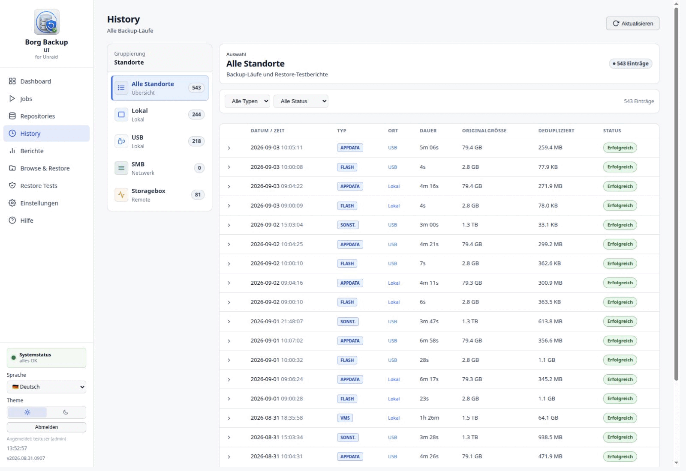

Die Seite **History** zeigt vergangene Backup-Läufe und Restore-Testberichte in chronologischer Form.

### 5.1 Zweck der Seite

History ist die erste Detailseite nach einem Backup-Lauf. Sie zeigt, wann ein Lauf stattgefunden hat, wie lange er dauerte, welche Datenmenge verarbeitet wurde und ob der Lauf erfolgreich war.

### 5.2 Bereiche und Funktionen

- **Standort-Sidebar:** Gruppiert Läufe nach Standort.
- **Typ-Filter:** Filtert nach Backup-Typen.
- **Status-Filter:** Filtert nach Erfolg, Warnung, Fehler oder übersprungenen Läufen.
- **Tabelle:** Zeigt Datum/Zeit, Typ, Ort, Dauer, Originalgröße, deduplizierte Größe und Status.
- **Detailbereich:** Kann pro Lauf aufgeklappt werden und zeigt Archiv, Repository-Daten, Check-Status, Logdatei und Fehlermeldungen.
- **Öffnen:** Öffnet die verknüpfte Logdatei, sofern verfügbar.

### 5.3 Typische Aktionen

1. Öffnen Sie **History**.
2. Filtern Sie bei Bedarf nach Standort oder Status.
3. Klappen Sie einen Lauf auf.
4. Prüfen Sie Archivname, Exit-Code, Check-Status und Logdatei.
5. Öffnen Sie die Logdatei bei Warnungen oder Fehlern.

### 5.4 Statuswerte

- **Erfolgreich:** Der Lauf wurde ohne relevanten Fehler abgeschlossen.
- **Warnung:** Der Lauf wurde abgeschlossen, aber Borg oder die Anwendung meldete auffällige Details.
- **Fehler:** Der Lauf ist fehlgeschlagen.
- **Übersprungen:** Der Lauf wurde bewusst nicht ausgeführt, z. B. wegen Sperren, fehlenden Voraussetzungen oder Konfiguration.

### 5.5 Hinweise

> **Tipp:** Prüfen Sie bei Fehlern immer zuerst den aufgeklappten History-Eintrag und danach die Logdatei. Dort stehen meist die konkreten Borg- oder Zugriffsmeldungen.

## 6. Berichte

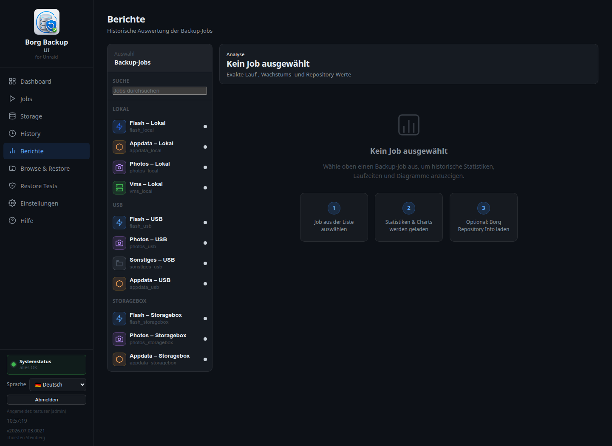

Die Seite **Berichte** fasst Backup- und Repository-Daten über mehrere Läufe zusammen.

### 6.1 Zweck der Seite

Berichte helfen bei der Auswertung von Trends:

- Laufzeiten
- Datenmengen
- Repository-Größe
- Deduplizierung
- wiederkehrende Fehler
- Monats- und Jobvergleiche

### 6.2 Bereiche und Funktionen

- **Job-Sidebar:** Wählt einen oder alle Jobs aus.
- **Suchfeld:** Filtert Jobs.
- **Kennzahlen:** Zeigen zusammengefasste Werte für den gewählten Zeitraum.
- **Trendtabellen und Diagramme:** Zeigen Entwicklungen über Zeit.
- **Borg-Repository-Informationen:** Können geladen werden, wenn verfügbar.
- **Aktualisieren/Laden:** Lädt Daten neu oder ruft Borg-Informationen ab.

### 6.3 Typische Aktionen

1. Öffnen Sie **Berichte**.
2. Wählen Sie einen Job oder **Alle Jobs**.
3. Prüfen Sie Laufzeiten, Größen und Trends.
4. Laden Sie Borg-Repository-Informationen, wenn Sie Details zum Repository benötigen.
5. Vergleichen Sie auffällige Werte mit **History** und den Logs.

### 6.4 Hinweise

> **Hinweis:** Berichte basieren auf vorhandenen Status- und Laufdaten. Wenn alte Läufe keine vollständigen Metriken enthalten, können einzelne Spalten leer oder unvollständig sein.

## 7. Browse & Restore

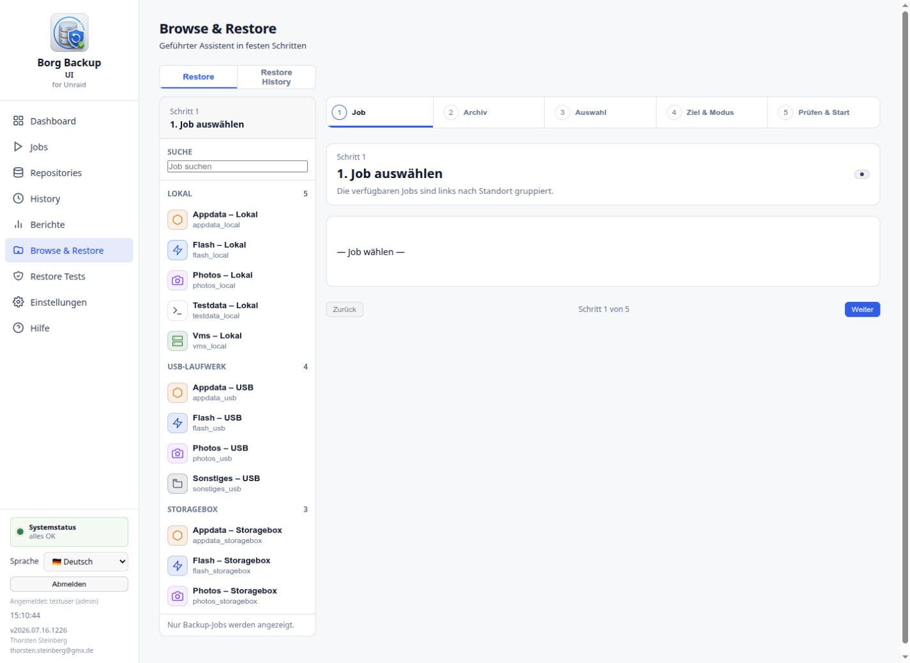

**Browse & Restore** führt durch die Wiederherstellung von Daten aus Borg-Archiven.

### 7.1 Zweck der Seite

Die Seite ermöglicht:

- Auswahl eines Backup-Jobs
- Auswahl eines Borg-Archivs
- Durchsuchen von Archivinhalten
- Auswahl einzelner Dateien oder Verzeichnisse
- Festlegen von Zielordner und Konfliktstrategie
- Starten eines Testlaufs oder echten Restores
- Fortsetzen eines Live-Logs bei aktivem Restore
- Einsicht in abgeschlossene Restore-Läufe

### 7.2 Ansichten

Die Seite hat zwei Reiter:

- **Restore:** Der geführte Restore-Wizard.
- **Restore History:** Abgeschlossene Restore-Läufe mit Details und Löschfunktion.

### 7.3 Restore-Wizard

Der Wizard besteht aus fünf Schritten.

#### Schritt 1: Job auswählen

Wählen Sie den Job, dessen Archiv Sie durchsuchen möchten. Die Sidebar gruppiert Jobs nach Standort und zeigt die konfigurierten Job-Icons.

#### Schritt 2: Archiv auswählen

Wählen Sie ein Archiv aus dem Repository. Wenn keine Archive sichtbar sind, prüfen Sie Repository-Zugriff, Passphrase und Storage-Status.

#### Schritt 3: Auswahl

Durchsuchen Sie das Archiv und wählen Sie Dateien oder Verzeichnisse aus. Die Auswahl bestimmt, was wiederhergestellt wird.

#### Schritt 4: Ziel & Modus

Legen Sie Zielordner und Verhalten bei Konflikten fest.

Konfliktstrategien:

- **Nicht überschreiben:** Existierende Dateien bleiben erhalten.
- **Ersetzen:** Existierende Dateien werden ersetzt.
- **Umbenennen:** Wiederhergestellte Dateien werden umbenannt, wenn Konflikte auftreten.

Der Zielpfad wird gegen erlaubte Restore-Zielbereiche geprüft.

Standardmäßig ist `/mnt/user` erlaubt. Weitere Zielbereiche können Administratoren in **Einstellungen > Restore > Browse & Restore** freigeben.

Nicht erlaubte Beispiele:

- `/`
- `/mnt`
- `/mnt/disks`
- `/mnt/remotes`
- `/boot`
- `/etc`
- `/usr`
- `/var`

Erlaubte Beispiele, wenn bewusst konfiguriert:

- `/mnt/user`
- `/mnt/data`
- `/mnt/disk1`
- `/mnt/disks/<name>`
- `/mnt/remotes/<name>`

> **Warnung:** Stellen Sie niemals direkt in Systempfade wieder her. Ein falscher Restore-Zielpfad kann vorhandene Daten überschreiben oder ein System unbrauchbar machen.

#### Schritt 5: Prüfen & Start

Der letzte Schritt zeigt Zusammenfassung und Systemprüfung. Je nach Auswahl kann die technische Precheck-Ausgabe aufgeklappt werden. Nach Bestätigung startet der Restore.

### 7.4 Aktive Restore-Läufe

Wenn ein Restore noch läuft oder die Browser-Sitzung unterbrochen wurde, zeigt die Seite einen aktiven Restore-Banner. Über **Live-Log fortsetzen** kann die laufende Ausgabe wieder angezeigt werden.

### 7.5 Restore History

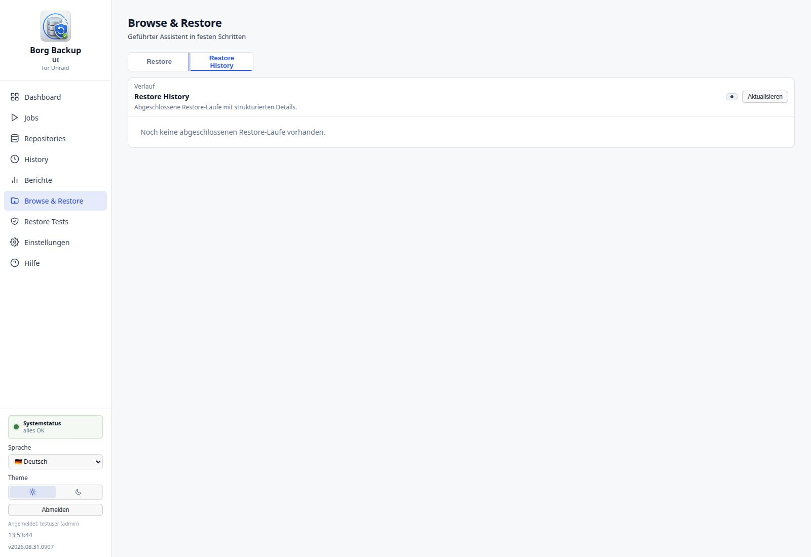

Die Restore History zeigt abgeschlossene Restore-Läufe mit:

- Restore-ID
- Job
- Archiv
- Zielordner
- Start- und Endzeit
- Dauer
- Status
- Detailansicht
- Löschaktion für History-Einträge

Die Detailansicht kann ein- und ausgeklappt werden und zeigt strukturierte Daten sowie das gespeicherte Restore-Log.

### 7.6 Typische Fehlermeldungen

- **Zielpfad muss innerhalb eines erlaubten Restore-Zielbereichs liegen:** Ziel liegt nicht unter einem freigegebenen Root.
- **Archiv nicht sichtbar:** Repository oder Passphrase prüfen.
- **Precheck fehlgeschlagen:** Details aufklappen und technische Meldung lesen.
- **Restore abgebrochen:** In Restore History prüfen, ob ein Server-Neustart oder ein Prozessfehler protokolliert wurde.

## 8. Restore Tests

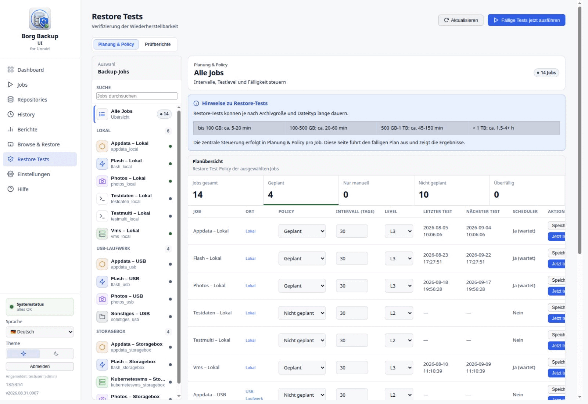

Restore Tests prüfen automatisiert, ob eine Wiederherstellung technisch funktioniert. Sie sind ein wichtiger Nachweis, dass Backups nicht nur geschrieben, sondern auch lesbar sind.

### 8.1 Zweck der Seite

Die Seite verwaltet:

- Restore-Test-Policies pro Job
- Testlevel
- Intervalle und Fälligkeit
- manuelle Teststarts
- fällige geplante Tests
- Prüfberichte

### 8.2 Reiter Planung & Policy

In **Planung & Policy** werden Jobs und ihre Restore-Test-Regeln angezeigt.

Felder und Spalten:

- **Job:** Backup-Job.
- **Ort:** Standort.
- **Policy:** Geplant, nur manuell oder nicht geplant.
- **Intervall (Tage):** Abstand zwischen Tests.
- **Level:** Testtiefe.
- **Letzter Test:** Zeitpunkt des letzten Tests.
- **Nächster Test:** Nächste Fälligkeit.
- **Scheduler:** Ob der Test automatisch fällig ist.
- **Aktionen:** Speichern oder sofort testen.

### 8.3 Testlevel

Die Anwendung zeigt Restore-Testlevel als `L1`, `L2` oder `L3`.

- **L1:** Grundprüfung, ob Repository und Archiv erreichbar sind.
- **L2:** Erweiterte technische Prüfung mit stärkerem Wiederherstellungsnachweis.
- **L3:** Umfangreichste Prüfung mit höherer Laufzeit und I/O-Last.

> **Hinweis:** Höhere Testlevel erhöhen die Aussagekraft, können aber je nach Repository und Datenmenge deutlich länger laufen.

### 8.4 Fällige Tests ausführen

1. Öffnen Sie **Restore Tests**.
2. Prüfen Sie die Planübersicht.
3. Klicken Sie auf **Fällige Tests jetzt ausführen**.
4. Beobachten Sie das Live-Protokoll.
5. Prüfen Sie anschließend die Prüfberichte.

> **Hinweis:** Diese Aktion startet nur fällige geplante Tests, nicht automatisch jeden Job.

### 8.5 Prüfberichte

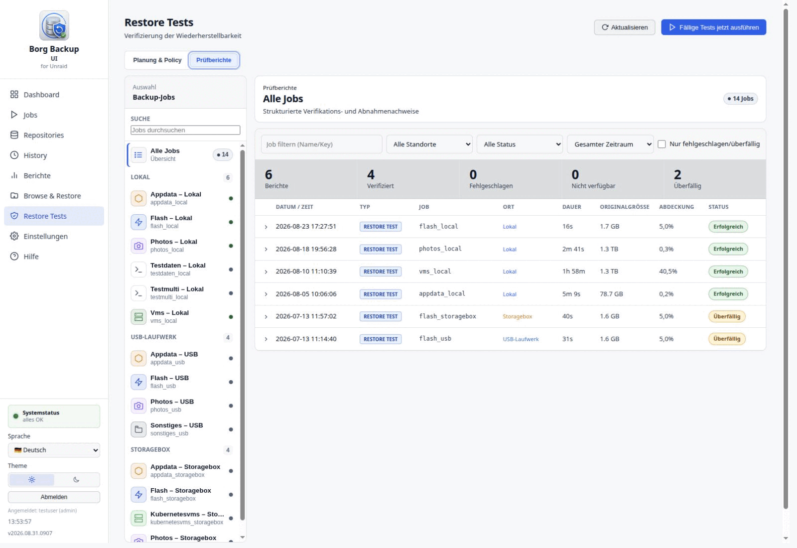

Der Reiter **Prüfberichte** zeigt strukturierte Nachweise abgeschlossener Restore-Tests:

- Gesamtstatus
- Prüfumfang
- Ausführung
- Abdeckung
- einzelne Prüfschritte
- technische Nachweise

Typische Statuswerte:

- **Erfolgreich / Verifiziert**
- **Überfällig**
- **Fehlgeschlagen**
- **Nicht verfügbar**

### 8.6 Best Practices

- Planen Sie Restore Tests für wichtige Jobs regelmäßig.
- Verwenden Sie für große Datenmengen ein angemessenes Level und Intervall.
- Prüfen Sie fehlgeschlagene Tests vor allem bei Offsite- oder USB-Zielen zeitnah.
- Nutzen Sie Benachrichtigungen für überfällige oder fehlgeschlagene Restore Tests.

## 9. Einstellungen

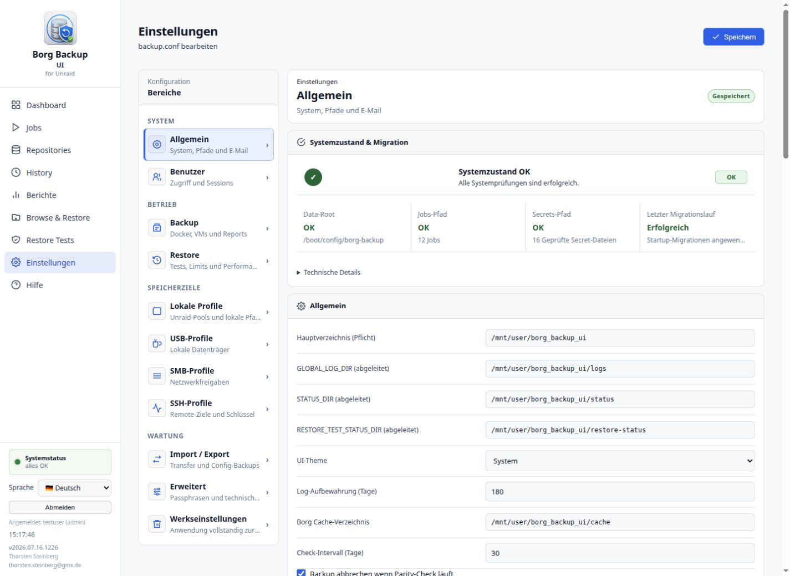

Die Seite **Einstellungen** verwaltet die Anwendungskonfiguration. Sie ist in Gruppen aufgeteilt: System, Betrieb, Speicherziele und Wartung.

> **Warnung:** Änderungen in den Einstellungen können Backup-Ziele, Secrets, Benachrichtigungen, Restore-Sicherheit und Zeitpläne beeinflussen. Speichern Sie nur Änderungen, deren Wirkung Sie verstanden haben.

### 9.1 Allgemein

Der Bereich **Allgemein** enthält grundlegende Pfade und allgemeine Betriebsparameter.

Typische Inhalte:

- `GLOBAL_DATA_DIR` und abgeleitete Laufzeitverzeichnisse
- Standardpfade für Logs, Status und Restore-Status
- allgemeine Systemparameter
- E-Mail-/SMTP-Konfiguration
- Unraid-Benachrichtigungen
- ntfy-Push-Benachrichtigungen
- Wochenbericht

#### Benachrichtigungen

Borg-Backup-UI kann Ereignisse über mehrere Kanäle melden:

- Unraid-Benachrichtigungen
- E-Mail/SMTP
- ntfy

Konfigurierbare Ereignisse können unter anderem sein:

- Backup erfolgreich
- Backup fehlgeschlagen
- Backup übersprungen
- Backup überfällig
- Restore-Test erfolgreich
- Restore-Test fehlgeschlagen
- Restore-Test überfällig

Die Reminder-Einstellungen gelten kanalübergreifend. Das Reminder-Intervall verhindert, dass dieselbe Überfälligkeit ständig erneut gemeldet wird. Die Backup-Überfälligkeits-Toleranz legt fest, ab wann ein geplanter Backup-Lauf nach seiner erwarteten Startzeit als überfällig gilt.

> **Hinweis:** Testnachrichten prüfen nur den Versandkanal. Sie ersetzen keinen echten Backup- oder Restore-Test.

### 9.2 Benutzer

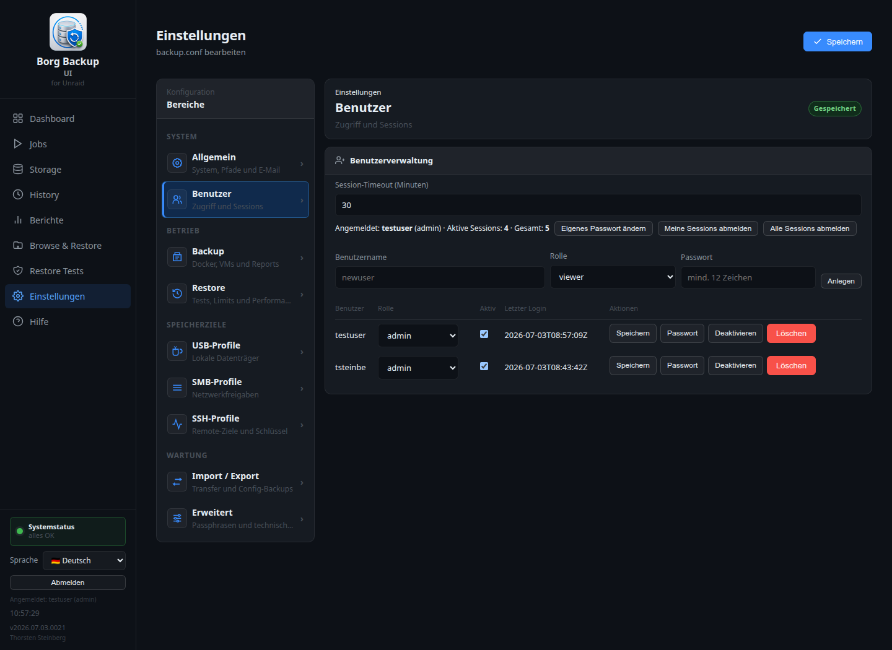

Der Bereich **Benutzer** ist sichtbar, wenn die Anwendung im Benutzer-Modus läuft und der angemeldete Benutzer Administratorrechte besitzt.

Funktionen:

- Benutzer anzeigen
- Rollen ändern
- Benutzer aktivieren oder deaktivieren
- Passwort ändern oder zurücksetzen
- eigene Sessions abmelden
- alle Sessions abmelden
- Benutzer dauerhaft löschen

Rollen:

- **admin:** Vollzugriff auf Einstellungen und Aktionen.
- **viewer:** Lesender Zugriff; schreibende Aktionen sind eingeschränkt.

> **Tipp:** Deaktivieren Sie Benutzer zunächst, statt sie sofort dauerhaft zu löschen. So bleibt der Offboarding-Schritt kontrollierbarer.

### 9.3 Backup

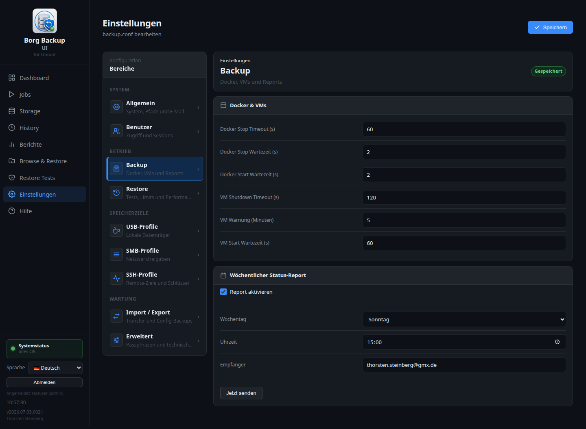

Der Bereich **Backup** enthält Standardwerte und technische Grenzen für Backup-Läufe.

Typische Einstellungen:

- Standard-Kompression
- Retention-Vorgaben
- Docker- und VM-Wartezeiten
- Borg-Timeouts
- Report- und Laufzeitoptionen

Diese Werte beeinflussen neue Jobs oder globale Laufzeitgrenzen. Job-spezifische Einstellungen können im Job-Wizard davon abweichen.

### 9.4 Restore

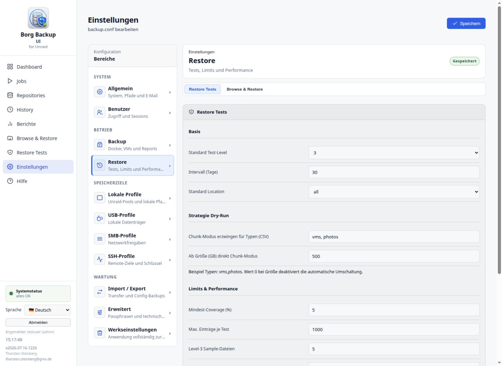

Der Bereich **Restore** enthält zwei Unterbereiche:

- **Restore Tests**
- **Browse & Restore**

#### Restore Tests

Hier werden Standardwerte für Restore Tests gepflegt, z. B. Standard-Testlevel, Intervall, Laufzeitgrenzen und Prüfparameter.

#### Browse & Restore

Hier werden erlaubte Restore-Zielbereiche verwaltet. Standardmäßig ist nur `/mnt/user` erlaubt. Zusätzliche Root-Pfade müssen bewusst hinzugefügt werden.

> **Warnung:** Tragen Sie keine zu breiten Pfade wie `/`, `/mnt`, `/mnt/disks` oder `/mnt/remotes` ein. Verwenden Sie konkrete Ziele wie `/mnt/disks/<name>` oder `/mnt/remotes/<name>`.

### 9.5 USB-Profile

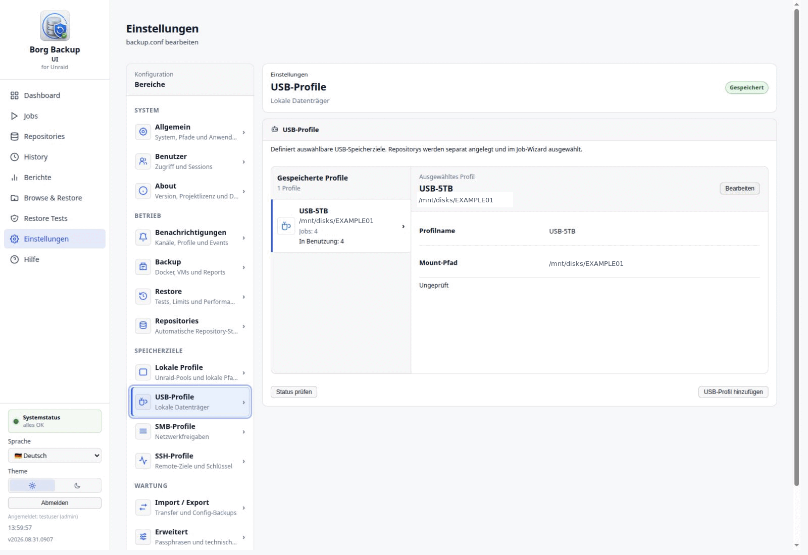

USB-Profile beschreiben lokale Datenträger oder Unassigned-Devices-Ziele. Sie werden im Job-Wizard für USB-Jobs verwendet.

Funktionen:

- Profil hinzufügen
- Profil bearbeiten
- Profil löschen, wenn es nicht mehr von Jobs verwendet wird
- Status prüfen

Wichtige Felder:

- Profilname
- Mount-Pfad

> **Hinweis:** Ein USB-Profil macht ein Gerät nicht automatisch verfügbar. Das Ziel muss auf Unraid gemountet sein, wenn ein Backup läuft.

### 9.6 SMB-Profile

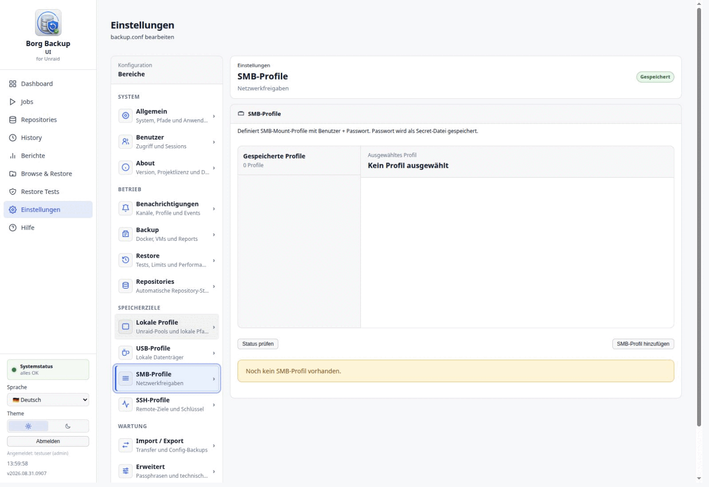

SMB-Profile definieren Netzwerkfreigaben. Passwörter werden als Secrets behandelt.

Wichtige Felder:

- Profilname
- Server
- Share
- Mount-Pfad
- Benutzername
- Passwort
- optionale Mount-Parameter

Typische Aktionen:

1. Profil hinzufügen.
2. Zugangsdaten eintragen.
3. Speichern.
4. Status prüfen.
5. Repository unter **Repositories** öffnen und die Informationen aktualisieren.

### 9.7 SSH-Profile

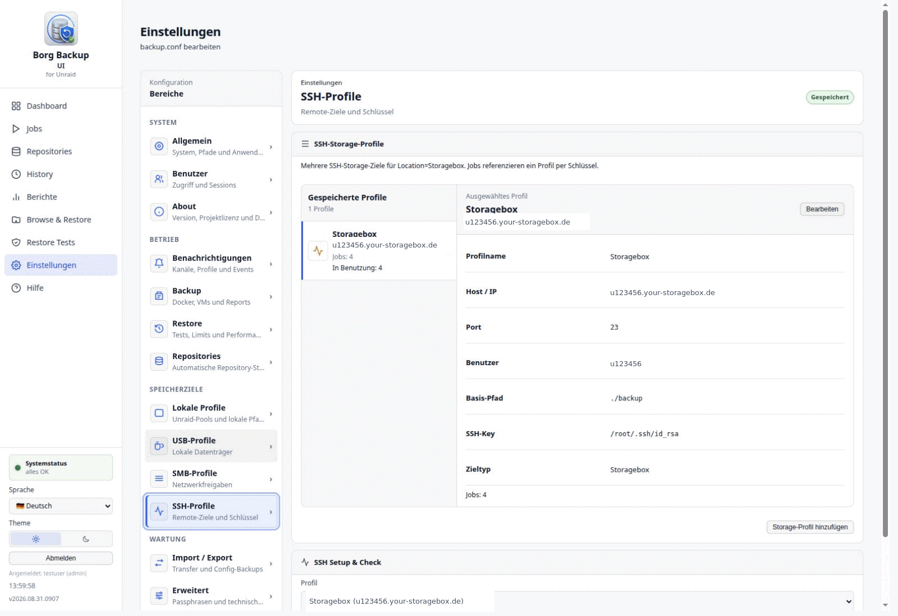

SSH-Profile werden für Storagebox- oder andere SSH-Ziele verwendet.

Wichtige Felder:

- Profilname
- Host
- Port
- Benutzer
- Basispfad
- SSH-Key-Pfad
- Zieltyp

Funktionen:

- SSH-Key erzeugen
- Public Key anzeigen
- Key deployen
- Verbindung testen
- Profil speichern

> **Hinweis:** Für Hetzner Storage Box ist ein relativer Basispfad wie `./backup` typisch. Prüfen Sie den aufgelösten Repository-Pfad auf der Seite **Repositories**.

### 9.8 Import / Export

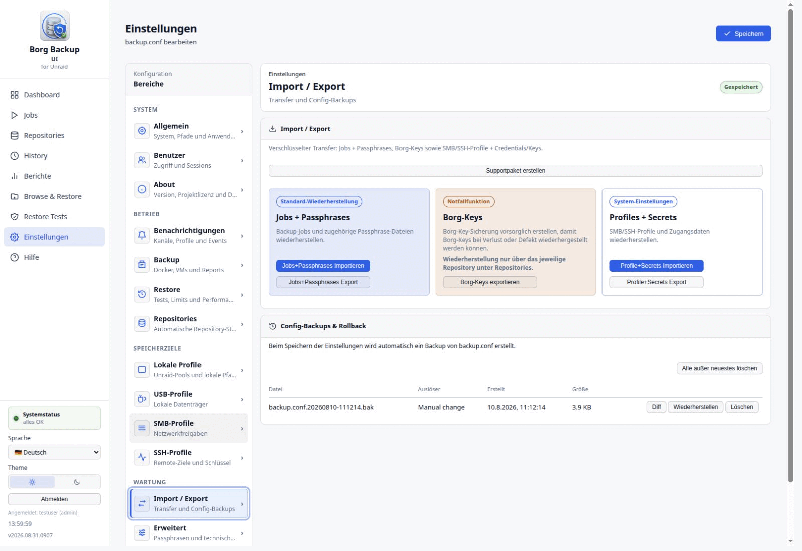

Der Bereich **Import / Export** dient zur Sicherung und Übertragung von Anwendungskonfiguration.

Funktionen:

- Jobs exportieren
- Jobs mit Passphrases exportieren
- Profile und Secrets exportieren
- Importe vorab prüfen
- Konfliktstrategie auswählen
- Config-Backups anzeigen
- Rollback vorbereiten
- Support-Paket erstellen

Importstrategien können je nach Importtyp vorhandene Einträge behalten, ersetzen oder umbenennen.

> **Warnung:** Bewahren Sie Export-Passwörter sicher auf. Ohne passendes Passwort können verschlüsselte Exporte nicht wiederhergestellt werden.

### 9.9 Erweitert

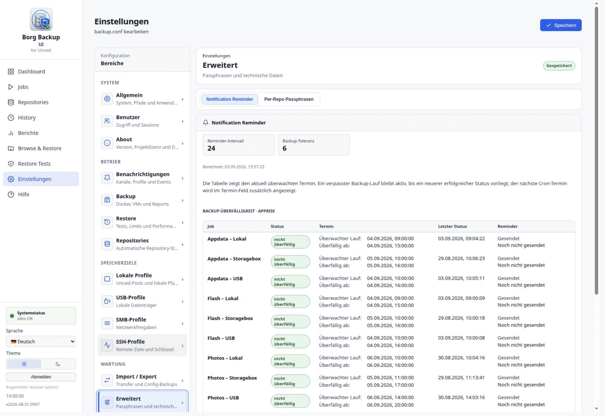

Der Bereich **Erweitert** enthält technische Daten, die normale Anwender nur bei Bedarf prüfen sollten.

Unterbereiche:

- **Notification Reminder:** Diagnose für Backup- und Restore-Test-Überfälligkeitsmeldungen.
- **Per-Repo Passphrasen:** Übersicht über repository-spezifische Passphrase-Zuordnungen.

Die Reminder-Diagnose zeigt, wann ein Lauf erwartet wurde, ab wann er als überfällig gilt, wann zuletzt gesendet wurde und wann der nächste Reminder möglich ist. Diese Ansicht sendet keine Benachrichtigungen; sie ist rein diagnostisch.

### 9.10 Werkseinstellungen

**Werkseinstellungen** ist der letzte Eintrag im Bereich **Wartung**. Die Funktion entfernt die Anwendungskonfiguration und die konfigurierten Betriebsdaten und startet Borg Backup UI anschließend mit der Admin-Erstkonfiguration neu.

Vor dem Zurücksetzen prüft die Anwendung laufende Backups, Restores, Restore-Tests und Repository-Wartungen. Verwaltete Borg-Repositories innerhalb eines zu löschenden Verzeichnisses blockieren den Vorgang. Externe Borg-Repositories und die Plugin-Installation werden nicht gelöscht.

Für die Freigabe sind alle Risikobestätigungen, der Servername, das aktuelle Admin-Passwort und der Bestätigungstext `FACTORY RESET` erforderlich.

> **Warnung:** Benutzer, Jobs, Zeitpläne, Speicherziele, Repository-Zuordnungen, Secrets, Borg-Keyfiles, Logs, Status- und Verlaufsdaten werden dauerhaft entfernt. Erstellen Sie vorher eine Sicherung von `/boot/config/borg-backup`.

### 9.11 Systemstatus und Migration

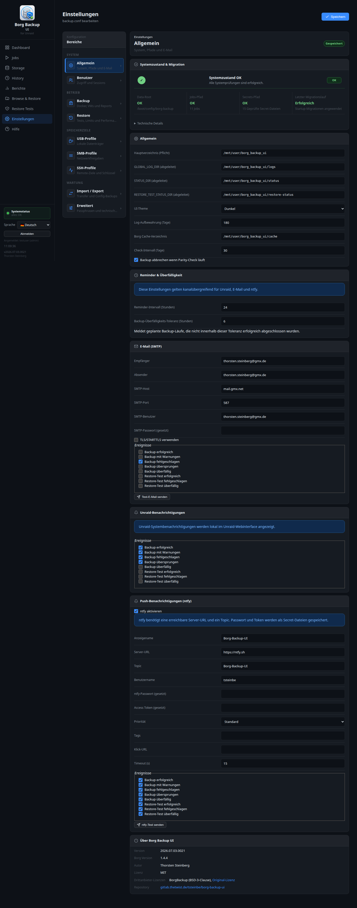

Der Systemstatus ist unten links in der Seitenleiste sichtbar. Ein Klick öffnet den zugehörigen Diagnosebereich innerhalb der Einstellungen.

Der Bereich zeigt unter anderem:

- Systemprüfungen
- Job-Prüfungen
- Migrationsstatus
- ausgeführte Migrationen
- Runtime-Recovery
- Setup- und Wartungshinweise
- Secret-Dateiprüfungen

Runtime-Recovery weist darauf hin, wenn Docker-Container oder VMs während eines Backups gestoppt wurden und nach einem Crash, Abbruch oder Neustart geprüft werden müssen.

> **Warnung:** Markieren Sie Runtime-Recovery-Hinweise nur als erledigt, wenn die betroffenen Container oder VMs tatsächlich geprüft oder manuell gestartet wurden.

## 10. Hilfe

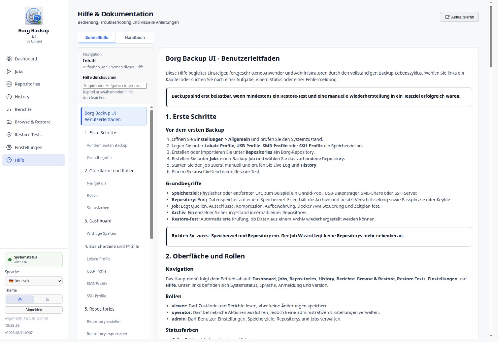

Die Seite **Hilfe** zeigt die integrierte Kurzhilfe der Anwendung.

### 10.1 Zweck der Seite

Die Hilfe liefert schnelle Orientierung direkt in der UI. Sie ist kürzer als dieses Handbuch und eignet sich für:

- Begriffe nachschlagen
- häufige Abläufe prüfen
- typische Fehlerbilder lesen
- Bedienkonzepte auffrischen

### 10.2 Funktionen

- **Aktualisieren:** Lädt das Hilfedokument neu.
- **Inhaltsverzeichnis:** Springt zu Abschnitten.
- **Sprachabhängiger Inhalt:** Die Hilfe folgt der ausgewählten UI-Sprache.

## 11. Typische Aufgaben

### 11.1 Neuen Backup-Job anlegen

1. Öffnen Sie **Jobs**.
2. Klicken Sie auf **Neuer Job**.
3. Tragen Sie Name, Typ-ID, Icon und Standort ein.
4. Wählen Sie Quellpfade.
5. Wählen Sie zuerst das Speicherziel und danach ein vorhandenes Repository.
6. Konfigurieren Sie Docker- oder VM-Steuerung, wenn nötig.
7. Setzen Sie Kompression und Retention. Verschlüsselung und Passphrase gehören zum Repository.
8. Aktivieren Sie optional einen Zeitplan.
9. Prüfen Sie die Flow-Vorschau.
10. Speichern Sie den Job.
11. Starten Sie den Job einmal manuell und prüfen Sie **History**.

### 11.2 Repository prüfen

1. Öffnen Sie **Repositories**.
2. Wählen Sie Speicherziel und Repository.
3. Aktualisieren Sie die Repository-Informationen.
4. Öffnen Sie bei Bedarf **Wartung** und starten Sie die passende Prüfung.
5. Prüfen Sie bei Fehlern Passphrase, Profil, Mount oder SSH-Verbindung.

### 11.3 Dateien wiederherstellen

1. Öffnen Sie **Browse & Restore**.
2. Wählen Sie den Job.
3. Wählen Sie ein Archiv.
4. Markieren Sie Dateien oder Verzeichnisse.
5. Wählen Sie Zielordner und Konfliktstrategie.
6. Prüfen Sie die Zusammenfassung.
7. Starten Sie den Restore.
8. Beobachten Sie das Live-Log.
9. Prüfen Sie den Eintrag in **Restore History**.

### 11.4 Restore-Test planen

1. Öffnen Sie **Restore Tests**.
2. Wählen Sie den gewünschten Job.
3. Setzen Sie Policy auf geplant.
4. Wählen Sie Intervall und Level.
5. Speichern Sie die Policy.
6. Starten Sie optional einen manuellen Test.
7. Prüfen Sie den Prüfbericht.

### 11.5 Benachrichtigungen einrichten

1. Öffnen Sie **Einstellungen > Allgemein**.
2. Konfigurieren Sie Unraid-, E-Mail- oder ntfy-Kanal.
3. Wählen Sie die gewünschten Ereignisse.
4. Setzen Sie Reminder-Intervall und Backup-Toleranz.
5. Senden Sie eine Testnachricht.
6. Prüfen Sie unter **Einstellungen > Erweitert > Notification Reminder** die Diagnose.

## 12. Status, Warnungen und Best Practices

### 12.1 Backup-Betrieb

- Testen Sie neue Jobs manuell, bevor Sie Zeitpläne aktivieren.
- Prüfen Sie regelmäßig Dashboard, History und Restore Tests.
- Planen Sie große Jobs nicht zu dicht hintereinander.
- Prüfen Sie USB- und Netzwerkziele vor produktiven Zeitplänen.
- Halten Sie Borg-Passphrasen und Export-Passwörter sicher.

### 12.2 Restore-Sicherheit

- Stellen Sie zunächst in einen separaten Zielordner wieder her.
- Verwenden Sie **Nicht überschreiben**, wenn Sie unsicher sind.
- Erlauben Sie zusätzliche Restore-Zielbereiche nur bewusst.
- Prüfen Sie Restore History nach jeder Wiederherstellung.

### 12.3 Docker und VMs

- Bei vollständigem Appdata-Backup möglichst alle Docker-Container stoppen.
- Bei vollständigem Domains-Backup möglichst alle VMs herunterfahren.
- Selektive Steuerung nur verwenden, wenn klar ist, welche Dienste Daten schreiben.
- Runtime-Recovery-Hinweise ernst nehmen und erst nach Prüfung erledigen.

### 12.4 Fehleranalyse

Empfohlene Reihenfolge:

1. **Dashboard** für Überblick.
2. **History** für konkreten Lauf.
3. Logdatei aus History öffnen.
4. **Repositories** für Repository-Informationen und Wartungsstatus.
5. **Einstellungen > Systemstatus und Migration** für Konfigurationsprobleme.
6. Support-Paket erstellen, falls der Fehler weitergegeben werden soll.

> **Tipp:** Ein erfolgreiches Backup ist erst dann wirklich belastbar, wenn auch Restore-Tests und mindestens ein manueller Restore in ein Testziel erfolgreich waren.
