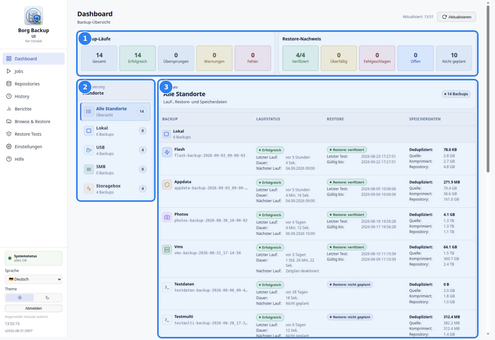
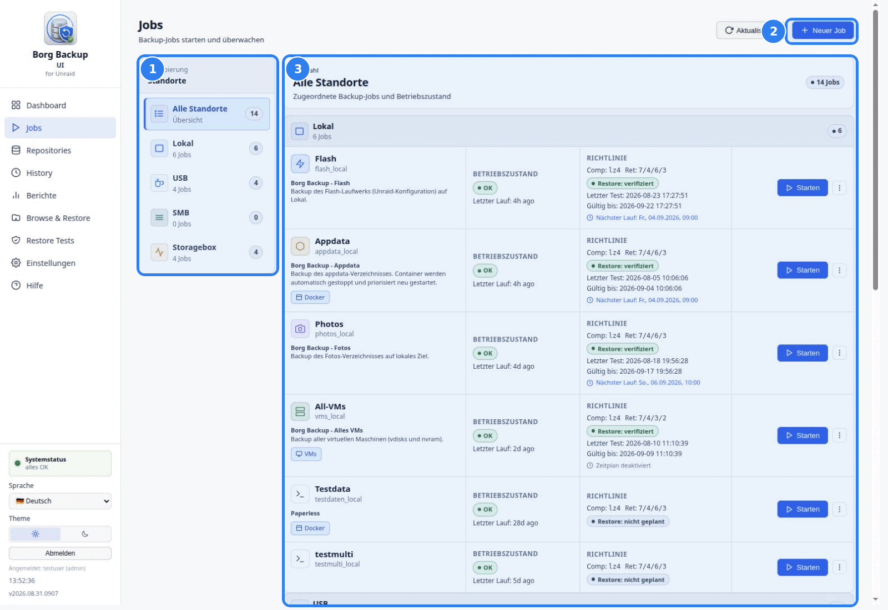
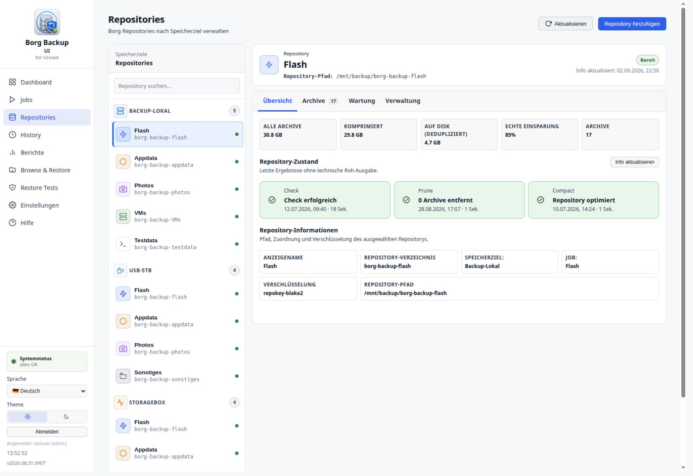
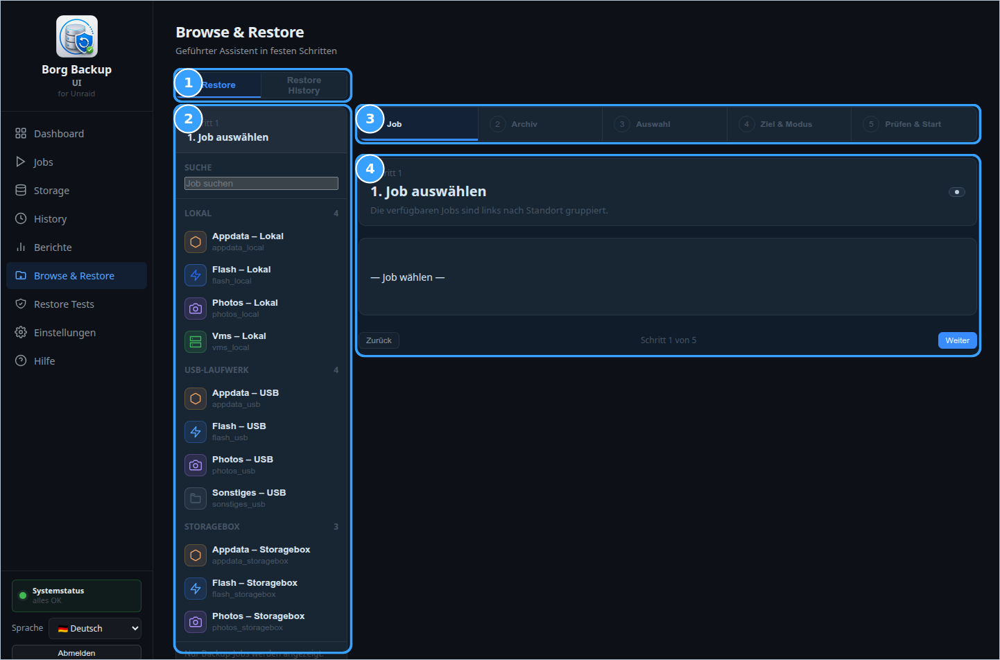
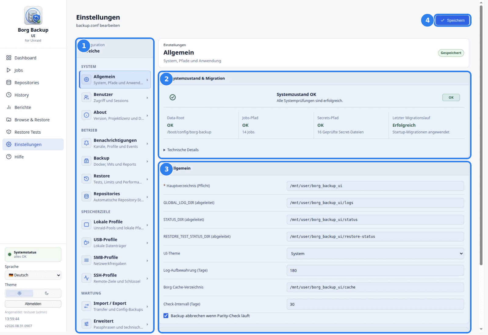

# Borg-Backup-UI Benutzerhandbuch

Stand: 03.09.2026 (Stable 2026.08.31.0907)
Sprache: Deutsch  
Zielgruppe: Einsteiger, fortgeschrittene Anwender und Administratoren eines Unraid-Systems

Dieses Handbuch beschreibt Borg-Backup-UI in der Reihenfolge des Menüs der Anwendung. Es erklärt die sichtbaren Seiten, typische Arbeitsabläufe, wichtige Warnungen und die Auswirkungen der jeweiligen Aktionen.

> **Hinweis:** Dieses Handbuch beschreibt die Anwendung selbst. Es ersetzt keine allgemeine BorgBackup-Dokumentation und keine Unraid-Systemdokumentation. Wenn eine Funktion in der Oberfläche nicht sichtbar ist, ist sie für die aktuell angemeldete Rolle oder die aktuelle Konfiguration möglicherweise nicht verfügbar.

## Inhaltsverzeichnis

1. [Grundlagen](#1-grundlagen)
2. [Dashboard](#2-dashboard)
3. [Jobs](#3-jobs)
4. [Repositories](#4-repositories)
5. [History](#5-history)
6. [Berichte](#6-berichte)
7. [Browse & Restore](#7-browse--restore)
8. [Restore Tests](#8-restore-tests)
9. [Einstellungen](#9-einstellungen)
10. [Hilfe](#10-hilfe)
11. [Typische Aufgaben](#11-typische-aufgaben)
12. [Status, Warnungen und Best Practices](#12-status-warnungen-und-best-practices)
13. [Fehlerbehebung](#13-fehlerbehebung)
14. [FAQ](#14-faq)
15. [Empfohlene Betriebspraxis](#15-empfohlene-betriebspraxis)

## 1. Grundlagen

Borg-Backup-UI ist eine Weboberfläche für BorgBackup auf Unraid. Die Anwendung verwaltet Backup-Jobs, Speicherziele, Zeitpläne, Restore-Funktionen, Restore-Tests, Berichte, Benachrichtigungen und Systemdiagnosen.

### 1.1 Grundbegriffe

- **Job:** Eine Backup-Definition mit zu sichernden Ordnern oder Dateien, Ziel, jobbezogenen Borg-Optionen, Retention und optionalem Zeitplan.
- **Repository:** Das BorgBackup-Ziel, in dem Archive gespeichert werden.
- **Archiv:** Ein einzelner BorgBackup-Snapshot innerhalb eines Repositorys.
- **Standort:** Eine Zielgruppe wie `Lokal`, `USB`, `SMB` oder `Storagebox`.
- **Profil:** Wiederverwendbare Zielkonfiguration, z. B. USB-, SMB- oder SSH-Profil.
- **Restore:** Wiederherstellung von Dateien oder Verzeichnissen aus einem Archiv.
- **Restore Test:** Automatisierte Prüfung, ob eine Wiederherstellung technisch möglich ist.
- **Systemstatus:** Zusammenfassung aus Konfiguration, Migration, Jobs, Secrets, Runtime-Recovery und Wartungshinweisen.

### 1.2 Anmeldung, Sprache und Rolle

Nach der Anmeldung zeigt die linke Seitenleiste das Hauptmenü, den Systemstatus, die Sprachauswahl, die Abmeldung, den angemeldeten Benutzer und die installierte Version.

Beim ersten Aufruf folgt die Oberfläche einer unterstützten deutschen oder englischen Browsersprache; bei anderen oder unbekannten Sprachen wird Englisch verwendet. Danach kann die Sprache unten links zwischen Deutsch und Englisch umgeschaltet werden und bleibt für diesen Browser gespeichert. Die Änderung betrifft die Weboberfläche, nicht die technischen Logdateien. Logs, maschinenlesbare Werte und technische Fehlercodes können weiterhin englische Begriffe enthalten.

Die Anwendung kennt die Rollen `admin`, `operator` und `viewer`:

- **admin:** Vollzugriff auf Benutzer, Einstellungen, Speicherziele, Repositorys und Jobs.
- **operator:** Darf betriebliche Aktionen wie Backup-, Restore- und Wartungsläufe ausführen, jedoch keine administrativen Einstellungen verwalten.
- **viewer:** Lesender Zugriff; schreibende Aktionen werden deaktiviert oder abgelehnt.

> **Warnung:** Bewahren Sie Passwörter, Borg-Passphrasen, SSH-Keys und Export-Passwörter sicher auf. Borg-Backup-UI maskiert Secrets in Diagnoseausgaben, trotzdem sollten Support-Pakete vor einer Weitergabe geprüft werden.

### 1.3 Installation und Erstkonfiguration

Borg Backup UI befindet sich in der **Public Beta** und wird über **Unraid Community Apps** installiert. Voraussetzungen sind **Unraid 7.2.0 oder neuer** sowie **Python 3.10 oder neuer**. Installieren Sie das separate Plugin **Python 3 for Unraid** zuerst über Community Apps. BorgBackup selbst ist im Borg-Backup-UI-Paket enthalten; eine zusätzliche Borg- oder pip-Installation ist nicht erforderlich.

1. Öffnen Sie in Unraid **Apps**.
2. Installieren Sie **Python 3 for Unraid**, falls es noch nicht vorhanden ist.
3. Suchen Sie nach **Borg Backup UI**, lesen Sie den Public-Beta-Hinweis und installieren Sie das Plugin.
4. Öffnen Sie **Einstellungen > Borg Backup UI**, starten Sie den Dienst und rufen Sie die Weboberfläche auf.
5. Legen Sie das erste Administratorkonto mit einem Passwort von mindestens zwölf Zeichen an.
6. Wählen und bestätigen Sie ein konkretes Hauptverzeichnis für Logs, Status- und Restore-Daten.
7. Beginnen Sie mit nicht kritischen Testdaten, führen Sie den ersten Lauf manuell aus und prüfen Sie eine Wiederherstellung in ein separates Testziel.

> **Warnung:** Ein geschriebenes Backup ist noch kein Wiederherstellungsnachweis. Verlassen Sie sich erst auf die Einrichtung, nachdem ein manueller Restore und ein Restore-Test erfolgreich waren.

Das Hauptverzeichnis darf unter einem Unraid-Share, Pool, Array-Datenträger, Unassigned-Devices- oder Remote-Mount liegen. Beim Start wartet Borg Backup UI auf den tatsächlich dahinterliegenden Mount, bevor Migrationen, Scheduler oder Status-Worker darauf schreiben. Ist noch kein Hauptverzeichnis eingerichtet oder der Mount nicht verfügbar, bleiben nur die für Einrichtung und Diagnose notwendigen Funktionen aktiv; die Anwendung erzeugt keine vermeintlichen Laufzeitverzeichnisse auf dem Root-Dateisystem.

Start, Stopp und Autostart des Dienstes werden durch das Plugin verwaltet. Ergänzen Sie dafür keinen eigenen Aufruf in `/boot/config/go`.

## 2. Dashboard



**Abbildung 1 - Dashboard:** (1) Gesamtstatus für Backup-Läufe und Restore-Nachweise, (2) Standortfilter, (3) Detailtabelle der gefilterten Jobs.

Das Dashboard ist die zentrale Übersicht über Backup-Zustand, Restore-Nachweise, Speicherentwicklung und Repository-Prüfungen.

### 2.1 Zweck der Seite

Das Dashboard beantwortet die wichtigsten Betriebsfragen:

- Welche Jobs existieren?
- Welche Backups waren erfolgreich, übersprungen, mit Warnung oder fehlerhaft?
- Wann läuft ein geplanter Job das nächste Mal?
- Welche Restore-Tests sind verifiziert, überfällig, fehlgeschlagen oder nicht geplant?
- Welche Speicher- und Repository-Daten sind zuletzt bekannt?
- Welche Jobs benötigen Aufmerksamkeit?

### 2.2 Bereiche und Anzeigen

Die Seite besteht aus:

- **Backup-Läufe:** Gesamtzahl, erfolgreiche Läufe, übersprungene Läufe, Warnungen und Fehler.
- **Restore-Nachweis:** Anzahl verifizierter, überfälliger, fehlgeschlagener, offener und nicht geplanter Restore-Tests.
- **Standort-Sidebar:** Filtert die Tabelle nach `Alle Standorte`, `Lokal`, `USB`, `SMB` und `Storagebox`.
- **Auswahlkarte:** Zeigt den aktuell gewählten Standort und die Anzahl der Backups.
- **Job-Tabelle:** Zeigt Job, Standort, Laufstatus inklusive nächstem geplanten Lauf, Restore-Status, Speicherdaten und Wachstum/Check.
- **Aktualisieren:** Lädt Dashboard-Daten neu.

### 2.3 Wichtige Spalten

- **Backup:** Name, Schlüssel und Icon des Jobs.
- **Standort:** Speicherziel des Jobs.
- **Laufstatus:** Letzter Lauf, Dauer, Ergebnis und nächster geplanter Lauf.
- **Restore:** Letzter Restore-Test und Gültigkeit, sofern geplant.
- **Speicherdaten:** Deduplizierte Größe, Quelle, komprimierte Größe und Repository-Größe.
- **Wachstum / Check:** Größenänderung und letzter Repository-Check.

### 2.4 Typische Aktionen

1. Öffnen Sie **Dashboard**.
2. Prüfen Sie oben die Zusammenfassungen.
3. Wählen Sie links einen Standort, wenn Sie nur lokale, USB-, SMB- oder Storagebox-Jobs sehen möchten.
4. Lesen Sie pro Job den Laufstatus und Restore-Status.
5. Klicken Sie auf **Aktualisieren**, wenn Sie unmittelbar nach einem Lauf neue Daten erwarten.

### 2.5 Hinweise und Best Practices

> **Tipp:** Nutzen Sie das Dashboard als täglichen Kontrollpunkt. Wenn alle Backup- und Restore-Zähler plausibel sind, können Detailseiten gezielt nur bei Auffälligkeiten geöffnet werden.

> **Hinweis:** Das Dashboard zeigt die zuletzt bekannten Statusdaten. Wenn ein Repository nicht erreichbar ist oder ein Statusfile fehlt, kann die Tabelle veraltete oder unvollständige Werte anzeigen. Prüfen Sie in diesem Fall **History**, **Repositories** und die Logs.

### 2.6 Unraid-Dashboard-Widget

Das Plugin ergänzt das normale Unraid-Dashboard um ein eigenes, ausschließlich lesendes Widget. Es zeigt unter anderem Backup-Zähler, laufende Jobs, den letzten und die nächsten Backups, den Restore-Nachweis sowie die Zahl erreichbarer Repositorys.

Das Widget liest eine vorberechnete Statusdatei auf dem Flash-Laufwerk. Sein Aktualisieren startet weder Borg noch einen Repository-Check und soll keine Array-Datenträger nur für die Anzeige aufwecken. Der Cache wird nach Backup- und Restore-Test-Ereignissen sowie bei passenden Statusaktualisierungen erneuert. Ein Zustand wie **Initial**, **Unbekannt** oder eine sichtbar alte Aktualisierungszeit ist kein aktueller Backup-Nachweis; öffnen Sie dann Borg Backup UI und prüfen Sie Dashboard, History und Systemzustand.

> **Hinweis:** Dieses native Unraid-Widget ist von der optionalen **Homepage**-Integration unter **Einstellungen > Allgemein** zu unterscheiden. Homepage verwendet einen eigenen, eingeschränkten Token.

## 3. Jobs



**Abbildung 2 - Jobs:** (1) Filter nach Speicherziel, (2) Einstieg in den Job-Wizard, (3) Jobkarten mit Zustand, Richtlinie und Startaktion.

Die Seite **Jobs** verwaltet Backup-Jobs. Hier werden Jobs angezeigt, gestartet, bearbeitet, geplant und gelöscht.

### 3.1 Zweck der Seite

Jobs definieren, welche Daten wohin gesichert werden. Ein Job enthält:

- Anzeigename und Typ-ID
- Standort und Repository
- Zu sichernde Ordner oder Dateien
- Docker- und VM-Steuerung
- Borg-Optionen wie Kompression und Retention
- Zeitplan
- Beschreibung und Icon

### 3.2 Bereiche und Funktionen

- **Standort-Sidebar:** Gruppiert Jobs nach Speicherziel.
- **Job-Liste:** Zeigt Name, Beschreibung, Betriebszustand, Richtlinie und nächste Ausführung.
- **Starten:** Startet einen Job manuell.
- **Weitere Aktionen:** Öffnet je nach Job Aktionen wie Bearbeiten, Zeitplan, Logs oder Löschen.
- **Neuer Job:** Öffnet den Job-Wizard.
- **Aktualisieren:** Lädt Jobliste und Status neu.
- **Live-Log:** Während eines laufenden Jobs kann die Ausgabe im Browser verfolgt werden.
- **Job abbrechen:** Fordert einen kontrollierten Abbruch des laufenden Jobs an.

### 3.3 Job manuell starten

1. Öffnen Sie **Jobs**.
2. Suchen Sie den gewünschten Job über die Standortgruppe oder die Suche.
3. Klicken Sie auf **Starten**.
4. Bestätigen Sie den Startdialog.
5. Beobachten Sie das Live-Log.
6. Prüfen Sie anschließend **History** und ggf. **Repositories**.

> **Warnung:** Wenn der Job Docker-Container oder VMs stoppen soll, werden nur die im Job konfigurierten Ziele gesteuert. Prüfen Sie diese Auswahl vor produktiven Läufen.

### 3.4 Laufenden Job abbrechen

1. Klicken Sie beim laufenden Job auf **Job abbrechen**.
2. Bestätigen Sie den kontrollierten Abbruch.
3. Beobachten Sie Status und Live-Log, bis die Wiederherstellung der Laufzeitumgebung abgeschlossen ist.

Ein aktiver Borg-Schritt wird mit einem Interrupt beendet. Wird der Abbruch während des Stoppens von Docker-Containern oder VMs angefordert, beendet die Anwendung zunächst den bereits begonnenen Stoppvorgang vollständig. Danach werden die zuvor laufenden Container beziehungsweise VMs automatisch wieder gestartet. Während dieser Wiederherstellung ist kein weiterer Abbruch möglich. Schlägt der Neustart eines Containers oder einer VM fehl, endet der Lauf als Fehler und **Systemzustand & Migration** zeigt den offenen Runtime-Recovery-Hinweis.

> **Hinweis:** Ein kontrolliert abgebrochener Lauf wird als **Abgebrochen** gespeichert. Die Anwendung startet nach einem Abbruch nicht automatisch `borg check`, entfernt keine Borg-Locks und repariert kein Repository. Prüfen Sie bei auffälligen Borg-Meldungen das Log und verwenden Sie die Repository-Wartung gezielt.

Die Verbindungsanzeige des Live-Logs beschreibt die Browser-Verbindung zum Log-Stream, nicht unmittelbar das Ergebnis des Backup-Prozesses. Bei einem kurzen Übertragungsfehler versucht die Oberfläche erneut zu verbinden. Bewerten Sie den Lauf anhand seines abschließenden Status und des gespeicherten Logs.

### 3.5 Job-Wizard

Der Job-Wizard führt in festen Schritten durch die Erstellung oder Bearbeitung eines Jobs.

#### Schritt 1: Grunddaten

Hier werden Jobname, Typ-ID, Icon, Icon-Farbe und erste Laufzeitoptionen gesetzt.

Wichtige Felder:

- **Job-Name:** Sichtbarer Name in UI, Berichten und Benachrichtigungen.
- **Typ-ID:** Technischer Schlüsselbestandteil. Er sollte kurz, eindeutig und stabil sein.
- **Icon / Icon-Farbe:** Darstellung in Dashboard, Jobs, Restore und Reports.
- **Docker vor dem Backup stoppen:** Aktiviert Docker-Steuerung.
- **VMs vor dem Backup herunterfahren:** Aktiviert VM-Steuerung.

Die Typ-ID bildet zusammen mit dem Standort den technischen Job-Schlüssel, beispielsweise `appdata_local`. Außerdem entsteht daraus das Archivmuster `<typ-id>-backup-*`. Wenn Sie die Typ-ID eines vorhandenen Jobs ändern, erhalten nur zukünftige Archive das neue Präfix. Borg Backup UI speichert die bisherigen Archivpräfixe im Job und zeigt sie im Informations-Popover des Editors; vorhandene Archive werden weder umbenannt noch verschoben.

#### Schritt 2: Quellen & Ziel

Die kompakte Ansicht zeigt links **Zu sichernde Ordner** und **Ausschlüsse** und rechts das **Backup-Ziel**. Links legen Sie fest, welche Ordner oder Dateien in das Backup aufgenommen werden und welche Unterordner oder Dateien ausgelassen werden sollen. Rechts werden Speichertyp, konkretes Speicherziel, ein vorhandenes Repository und die Job-Kompression gewählt. Die Repository-Liste zeigt ausschließlich Repositorys, die zum ausgewählten Speicherziel gehören. Repository-Pfade werden im Job nicht mehr frei eingegeben.

Typische Ordner, die gesichert werden:

- `/boot/`
- `/mnt/user/appdata/`
- `/mnt/user/domains/`
- `/mnt/user/photos/`

> **Hinweis:** Die ausgewählten Ordner oder Dateien müssen auf dem Unraid-System existieren und für den Backup-Prozess lesbar sein. Technisch werden sie als Quellpfade des Jobs gespeichert.

Eine vollständig eingegebene, gültige Quelle kann mit **Enter** übernommen werden, auch wenn die Autovervollständigung weitere Unterordner anzeigt. Share-Wurzeln wie `/mnt/user/appdata` sind erlaubt, sofern sie existieren. Ist die gewählte Quelle selbst ein Symlink oder liegt ein Teil ihres Pfads hinter einem Symlink, löst Borg Backup UI sie erst zur Laufzeit zum tatsächlichen Ziel auf und passt zugehörige Ausschlüsse entsprechend an. Im Job bleibt der vom Benutzer gewählte, verständliche Pfad gespeichert; die Auflösung wird im Laufprotokoll vermerkt.

Ausschlüsse sind konkrete Dateien oder Verzeichnisse unterhalb eines ausgewählten Backup-Ordners. Sie werden nicht in das Borg-Archiv aufgenommen. Bei vielen Einträgen scrollen nur die Pfadlisten innerhalb ihres Bereichs.

Beim Bearbeiten eines Jobs kann ein anderes vorhandenes Repository gewählt werden. Diese Änderung gilt nur für zukünftige Backups. Bestehende Archive werden nicht verschoben und sind danach über diesen Job in **Browse & Restore** nicht mehr erreichbar; der Wizard verlangt dafür eine ausdrückliche Bestätigung.

#### Docker- und VM-Schritte

Wenn Docker- oder VM-Steuerung aktiviert ist, zeigt der Wizard eigene Schritte für die Auswahl.

Optionen:

- **Alle laufenden Container**, **nur ausgewählte Container** oder **alle außer den ausgewählten Containern**
- **Alle laufenden VMs** oder **nur ausgewählte VMs**

Bei `/mnt/user/appdata` empfiehlt die Anwendung, alle Docker-Container zu stoppen. Bei `/mnt/user/domains` empfiehlt sie, alle VMs herunterzufahren. Wenn nur einzelne Dienste gestoppt werden, muss der Hinweis bewusst bestätigt werden.

Ist Docker- beziehungsweise VM-Steuerung deaktiviert, werden die zugehörigen Auswahlschritte übersprungen. Bei geschützten Appdata- oder Domains-Quellen erscheint die erforderliche Risikobestätigung spätestens in der Abschlussprüfung, damit ein bewusstes Backup ohne Stoppen der Dienste möglich bleibt.

> **Warnung:** Appdata- und VM-Backups können Warnungen oder inkonsistente Daten erzeugen, wenn während des Backups Dateien geändert werden. Stoppen Sie bei vollständigen Appdata- oder Domains-Backups möglichst alle betroffenen Dienste.

Das planmäßige Herunterfahren einer VM wird als Information gemeldet. Erst ein fehlgeschlagener Shutdown oder Neustart erzeugt eine Warnung beziehungsweise einen Fehler. Nach jedem Lauf werden nur die Container und VMs wieder gestartet, die vor diesem Lauf tatsächlich aktiv waren.

#### Neustart-Priorität für Docker-Container

Die Priorität bestimmt ausschließlich, in welcher Reihenfolge die von Borg Backup UI gestoppten Container nach einem Job wieder gestartet werden. Sie ändert weder die Stopp-Reihenfolge noch die normale Unraid-Autostart-Reihenfolge.

Konfigurieren Sie das Label für jeden betroffenen Container direkt in Unraid:

1. Öffnen Sie den Unraid-Reiter **Docker**.
2. Bearbeiten Sie den Container.
3. Aktivieren Sie **Advanced View**.
4. Ergänzen Sie unter **Extra Parameters** beispielsweise:

   ```text
   --label backup.start.priority=1
   ```

5. Behalten Sie bereits vorhandene Extra Parameters unverändert bei und fügen Sie das Label zusätzlich hinzu.
6. Übernehmen Sie die Container-Konfiguration.

Unterstützte Werte:

- `1`: kritische Infrastruktur, beispielsweise Datenbanken oder Caches
- `2`: Standardanwendungen, die von Diensten der Priorität 1 abhängen
- `3`: übrige Container

Ein fehlender, leerer, ungültiger oder nicht unterstützter Wert wird als Priorität `3` behandelt. Niedrigere Prioritätsgruppen starten zuerst; zwischen belegten Gruppen wartet Borg Backup UI entsprechend seiner Laufzeitkonfiguration. Das Label gehört zum Container und gilt deshalb bei jedem Job, der diesen Container nach einem Backup neu startet.

Beispiel: Setzen Sie PostgreSQL oder MariaDB auf Priorität `1` und die davon abhängige Anwendung auf Priorität `2`. Führen Sie die erste Prüfung in einem Wartungsfenster aus und kontrollieren Sie im Live-Log die Meldungen **Phase 1**, **Phase 2** und **Phase 3**. Für die Fehlersuche genügt die Prioritätsangabe; veröffentlichen Sie keine vollständige Container-Konfiguration mit Secrets.

> **Hinweis:** Unraids normale Autostart-Reihenfolge wirkt beim Start des Docker-Dienstes. `backup.start.priority` wird nur von Borg Backup UI für die Wiederanlaufphase nach einem Backup verwendet.

#### Retention, Kompression und Beschreibung

Der Wizard setzt jobbezogene Borg-Optionen wie Kompression und Aufbewahrung. Verschlüsselung und Passphrase gehören zum Repository und werden ausschließlich beim Erstellen oder Importieren des Repositorys festgelegt.

Die Retention-Werte zählen Zeiträume und nicht die Anzahl der Archive innerhalb eines Zeitraums:

- **Täglich:** höchstens ein passendes Archiv pro Tag für die angegebene Anzahl täglicher Wiederherstellungspunkte.
- **Wöchentlich:** höchstens ein passendes Archiv pro Woche.
- **Monatlich:** höchstens ein passendes Archiv pro Monat.
- **Jährlich:** höchstens ein passendes Archiv pro Jahr.

Borg verwendet normalerweise das neueste passende Archiv eines Zeitraums. Werden beispielsweise an einem Tag Backups um 08:00 und 08:30 Uhr erstellt, behält die tägliche Regel nur einen Wiederherstellungspunkt für diesen Tag – normalerweise das neuere Archiv von 08:30 Uhr. **Täglich: 20** bedeutet daher nicht, dass 20 Archive desselben Tages erhalten bleiben. Ein Archiv bleibt erhalten, wenn mindestens eine der konfigurierten Regeln es auswählt.

Nach jedem erfolgreich erstellten Backup wendet Borg Backup UI die festgelegten Aufbewahrungsregeln an. Dabei führt das Plugin Prune und anschließend Compact sowie den gegebenenfalls fälligen Repository-Check aus. Archive, die von keiner Aufbewahrungsregel ausgewählt werden, werden durch Prune gelöscht.

Der Wert `0` deaktiviert nur die jeweilige Aufbewahrungsstufe und bedeutet nicht „unbegrenzt“. Bei viermal `0` würde Prune kein passendes Archiv zur Aufbewahrung auswählen und damit alle Archive des Jobs löschen können. Deshalb muss mindestens einer der vier Werte größer als `0` sein; eine Konfiguration mit viermal `0` wird abgelehnt. Eine zukünftige Option zum dauerhaften Behalten aller Archive muss stattdessen Prune für den Job ausdrücklich deaktivieren.

#### Optionale Dateiaktivität im Live-Log

Die Job-Option **Dateiaktivität im Live-Log** befindet sich im Wizard unter **Grunddaten** und ergänzt `borg create` um `--list --filter=AME`. Während eines manuellen oder geplanten Laufs zeigt das Live-Log dadurch Einträge, die Borg als hinzugefügt (`A`), geändert (`M`) oder fehlerhaft (`E`) einstuft. Unveränderte Einträge werden bewusst nicht ausgegeben. Die Einstellung ist standardmäßig deaktiviert und gilt nur für den jeweiligen Job.

Diese Statuswerte beruhen auf Borgs Datei-Cache und dessen Änderungserkennung. Sie sind weder eine Anzeige der tatsächlich übertragenen Byte-Menge noch eine vollständige Liste des Archivinhalts. Derselbe Pfad kann beispielsweise als geändert erscheinen, obwohl Borg vorhandene Datenblöcke dedupliziert und nur Metadaten oder wenige neue Blöcke speichert.

Bei aktivierter Option lädt die Live-Anzeige das vollständige Lauf-Log abschnittsweise. Sie beginnt am aktuellen Ende. Beim Zurückscrollen oder über **Ältere Einträge** werden frühere Abschnitte nachgeladen; **Zum Anfang** und **Zum Ende springen** erlauben direkte Sprünge. Alle ausgegebenen Zeilen bleiben in der Logdatei erhalten. **Leeren** leert nur die Anzeige. Die Suchfunktion im Log durchsucht auch noch nicht geladene Abschnitte und beachtet Groß-/Kleinschreibung; erneutes Suchen springt zum nächsten Treffer. Die normale Browsersuche und Textauswahl erfassen nur den geladenen Abschnitt. **Vollständiges Log herunterladen** liefert sämtliche zum Downloadstart vorhandenen Einträge. Ohne aktivierte Dateiaktivität bleibt die bisherige Live-Anzeige erhalten.

> **Datenschutzhinweis:** Bei aktivierter Option erscheinen Datei- und Verzeichnisnamen im Live-Log und im gespeicherten Lauf-Log. Da Support-Pakete aktuelle Lauf-Logs enthalten können, können diese Namen auch dort enthalten sein. Support-Pakete maskieren Secrets, sind aber nicht anonym; prüfen Sie ein Paket immer vor der Weitergabe.

#### Zeitplan

Der Zeitplan kann direkt im Wizard gesetzt werden. Die UI unterstützt einfache Frequenzen und einen Cron-Ausdruck.

Cron-Format:

```text
Minute Stunde Tag Monat Wochentag
```

Beispiel:

```text
0 3 * * *
```

Dieser Ausdruck startet täglich um 03:00 Uhr.

#### Flow-Vorschau

Der letzte Schritt zeigt eine technische Vorschau des geplanten Ablaufs. Hier werden Repository, zu sichernde Ordner oder Dateien, Docker-/VM-Auswahl und geplante Aktionen zusammengefasst.

Formulare und mehrstufige Assistenten mit ungespeicherten Eingaben werden nicht durch einen Klick auf den Hintergrund geschlossen. **Abbrechen** oder die Schließen-Schaltfläche bleiben verfügbar; bei geänderten Eingaben fragt Borg Backup UI vor dem Verwerfen ausdrücklich nach.

### 3.6 Zeitplanung und Cron

Zeitpläne können im Job-Wizard oder über die Job-Aktionen geändert werden. Beim Speichern wird der Cron-Eintrag für die Anwendung aktualisiert.

Best Practices:

- Neue Jobs zuerst manuell testen.
- Danach Zeitplan aktivieren.
- Zeitpläne mit ausreichend Abstand planen, damit sich große Backups nicht überlappen.
- Bei externen Zielen prüfen, ob Netzwerk und Mounts zur geplanten Zeit verfügbar sind.

### 3.7 Typische Meldungen

- **Vorschau Fehler / ungültige Angaben:** Ein Feld im Wizard ist nicht plausibel. Prüfen Sie die zu sichernden Ordner oder Dateien, Typ-ID, Speicherziel und Repository-Auswahl.
- **Kein Speicherziel oder Repository vorhanden:** Richten Sie das Speicherziel zuerst unter **Einstellungen** ein. Erstellen oder importieren Sie danach das Repository unter **Repositories**.
- **Schedule disabled / Zeitplan deaktiviert:** Der Job läuft nur manuell.

## 4. Repositories

Die Seite **Repositories** verwendet eine Master-Detail-Ansicht. Links werden Borg-Repositorys nach dem exakten Speicherziel gruppiert; rechts bleibt der Arbeitsbereich des ausgewählten Repositorys sichtbar. Über **Repository hinzufügen** können Repositorys auf einem bereits unter **Einstellungen** eingerichteten Speicherziel erstellt oder importiert werden.



Lokale Speicherziele werden unter **Einstellungen > Lokale Profile** angelegt.
Zulässig sind konkrete Verzeichnisse unter `/mnt`, etwa `/mnt/backup` oder
`/mnt/disks/USB-A`. Zu breite Wurzeln, Systempfade und fehlerhafte Eingaben mit
leeren, `.`- oder `..`-Segmenten werden vor dem Speichern abgelehnt.

### 4.1 Zweck der Seite

Die Seite trennt Speicherziele, Borg-Repositorys und Backup-Jobs. Ein Speicherziel beschreibt den physischen oder entfernten Ort. Ein Repository enthält Borg-Archive. Ein Job wählt ein vorhandenes Repository und bestimmt Quellen, Zeitplan, Kompression und Aufbewahrung.

### 4.2 Bereiche und Funktionen

- **Repository-Sidebar:** Gruppiert Repositorys nach dem konkreten Speicherziel und zeigt pro Eintrag Anzeigename, Repository-Verzeichnis und Status.
- **Suche:** Filtert die Einträge der Sidebar nach Namen, Pfad, Job oder Speicherziel.
- **Kopfbereich:** Zeigt das ausgewählte Repository, seinen Pfad und den aktuellen zusammengefassten Zustand.
- **Übersicht:** Zeigt Borg-Kennzahlen, Wartungsstatus sowie verständliche Angaben zu Repository, Speicherziel, Job, Verschlüsselung und Pfad.
- **Archive:** Lädt die aktuelle Archivliste mit Archivname, technischer ID, Startzeit und Dauer direkt aus Borg.
- **Wartung:** Bietet Check, Datenprüfung, Prune und Compact als klar getrennte Aktionen mit dauerhaft sichtbarem Ergebnis.
- **Verwaltung:** Zeigt aktuelle Job-Verknüpfungen, Borg-Key-Export/Import und trennt das nicht-destruktive Entfernen aus der UI von der endgültigen Repository-Löschung.
- **Repository hinzufügen:** Öffnet einen Assistenten zum Auswählen eines vorhandenen Speicherziels und zum Erstellen oder Importieren eines Repositorys.

Die automatische Aktualisierung der Borg-Kennzahlen ist standardmäßig deaktiviert, damit Repositorys und Datenträger nicht unerwartet angesprochen werden. Unter **Einstellungen > Repositories** kann sie bewusst aktiviert und ihr Intervall eingestellt werden; der voreingestellte Aktualisierungsabstand beträgt 24 Stunden, ein fehlgeschlagener Zugriff wird standardmäßig nach einer Stunde erneut versucht. Ergebnisse werden in `repositories.json` zwischengespeichert. Der Repository-Seitenaufruf zeigt den Cache und wartet nicht auf eine Aktualisierung aller lokalen und entfernten Repositorys. **Info aktualisieren** startet die Abfrage für das ausgewählte Repository manuell.

Der Repository-Kopf verwendet den beim Erstellen oder Importieren vergebenen **Anzeigenamen**. Das **Repository-Verzeichnis** ist der letzte Verzeichnisname, der **Repository-Pfad** ist der vollständige lokale oder entfernte Zielpfad und **Pfad im Speicherziel** ist der relative Pfad innerhalb des ausgewählten Speicherziels.

### 4.3 Repository erstellen oder importieren

1. Öffnen Sie **Repositories** und klicken Sie **Repository hinzufügen**.
2. Wählen Sie ein vorhandenes Speicherziel. Neue lokale, USB-, SMB- und SSH-Speicherziele werden ausschließlich unter **Einstellungen** eingerichtet und geprüft.
3. Der Assistent prüft das ausgewählte Speicherziel vor dem Repository-Zugriff erneut.
4. Wählen Sie **Neues Repository erstellen** oder **Vorhandenes Repository importieren**.
5. Geben Sie den Anzeigenamen an. Beim Import können Sie den relativen Repository-Pfad manuell eingeben oder über **Durchsuchen** vorhandene Verzeichnisse innerhalb des gewählten Speicherziels öffnen und auswählen. Bereits verwaltete Repositorys werden gekennzeichnet und können nicht erneut importiert werden.
6. Beim Erstellen wählen Sie Verschlüsselung und Passphrase. Keyfile-Schlüssel werden persistent im geschützten Plugin-Verzeichnis gespeichert.
7. Beim Import wird die Verschlüsselung durch `borg info` erkannt. Für ein Keyfile-Repository fügen Sie bei Bedarf einen zuvor mit `borg key export` erzeugten Borg-Key-Export ein; ein exakt passender vorhandener Schlüssel wird automatisch übernommen.
8. Prüfen Sie die Zusammenfassung und speichern Sie.

> **Warnung:** Ein Import initialisiert oder verändert das Repository nicht. Ein Erstellen führt ausdrücklich `borg init` aus.

> **Hinweis:** Stable `2026.08.31.0907` verwendet das gebündelte BorgBackup `1.4.5`. Prüfen Sie ein importiertes Repository nach dem Import mit **Info aktualisieren**, **Check** und einem Restore-Test. Der Import aktualisiert oder konvertiert das Borg-Repository nicht automatisch.

> **Warnung:** Bei `keyfile` und `keyfile-blake2` benötigen Sie für eine Wiederherstellung sowohl die Passphrase als auch die lokale Schlüsseldatei. Verwenden Sie für einen Systemumzug den verschlüsselten Jobs-/Secrets-Export und bewahren Sie zusätzlich einen unabhängigen `borg key export` auf.

### 4.4 Typische Aktionen

Borg-Key eines Repositorys sichern oder wiederherstellen:

1. Öffnen Sie **Repositories** und wählen Sie das verschlüsselte Repository.
2. Öffnen Sie den Reiter **Verwaltung**.
3. **Key exportieren** lädt einen Borg-Key-Export herunter. Bewahren Sie diese Datei getrennt von Repository und Passphrase auf.
4. **Key importieren** nimmt einen Borg-Key-Export entgegen. Borg Backup UI prüft vor dem Import die Repository-ID, damit kein Schlüssel für ein anderes Repository importiert wird.

> **Hinweis:** Ein Borg-Key-Export ersetzt die Passphrase nicht. Für verschlüsselte Repositorys werden weiterhin Borg-Key und Passphrase benötigt.

Repository prüfen und warten:

1. Öffnen Sie **Repositories**.
2. Wählen Sie das Repository in der nach Speicherziel gruppierten Sidebar.
3. Prüfen Sie unter **Übersicht** die Borg-Kennzahlen und den letzten Zustand.
4. Öffnen Sie **Wartung** und starten Sie bei Bedarf Check, Datenprüfung, Prune oder Compact.
5. Prüfen Sie nach Abschluss den Status. Bei einem Fehler können Sie die maskierten technischen Details im Statusfeld öffnen.

SMB-Ziel prüfen:

1. Prüfen Sie zuerst das SMB-Profil in **Einstellungen > SMB-Profile**.
2. Öffnen Sie **Repositories**.
3. Wählen Sie das Repository. Die Anwendung hängt ein noch nicht eingehängtes verwaltetes SMB-Ziel für den Zugriff temporär ein und anschließend wieder aus.
4. Aktualisieren Sie danach unter **Übersicht** die Repository-Informationen.

Repository aus der Anwendung entfernen oder endgültig löschen:

1. Entfernen oder weisen Sie zuerst alle verknüpften Backup-Jobs einem anderen Repository zu.
2. Öffnen Sie beim Repository den Reiter **Verwaltung** und prüfen Sie, dass keine Job-Verknüpfung oder laufende Aktion mehr gemeldet wird.
3. **Aus Borg-Backup-UI entfernen** löscht nur den Eintrag aus dem Repository-Inventar. Daten und Passphrase-Datei bleiben erhalten.
4. **Repository endgültig löschen** prüft Repository-ID, Pfad und Archivanzahl erneut und verlangt den exakten Anzeigenamen sowie das Sicherheitswort `DELETE`.
5. Erst nach erfolgreichem `borg delete` entfernt die Anwendung den Inventareintrag und eine ausschließlich diesem Repository zugeordnete Passphrase-Datei.

### 4.5 Hinweise

> **Hinweis:** Prune nutzt die Retention eines verknüpften Jobs und beschränkt die Aktion auf dessen Archivmuster `<typ-id>-backup-*`. Verwenden mehrere Jobs dasselbe Repository, muss bei einem manuellen Prune der Job als Retention-Quelle ausdrücklich gewählt werden. Der Bestätigungsdialog zeigt Job, Archivfilter und die periodischen Wiederherstellungspunkte; Archive der anderen Jobs bleiben unberührt. Ohne passende Job-Zuordnung bleibt Prune deaktiviert.

> **Hinweis:** Prune listet entfernte Archive im Ergebnis. Compact zeigt den freigegebenen Speicherplatz nur dann numerisch an, wenn Borg diesen Wert ausgibt.

> **Warnung:** Borg Check kann je nach Repository-Größe und Ziel sehr lange laufen. Starten Sie ihn bewusst und nicht unnötig häufig.

> **Warnung:** Die endgültige Repository-Löschung entfernt alle Archive unwiderruflich. Sie ist gesperrt, solange Jobs verknüpft sind oder Backup, Restore, Restore-Test beziehungsweise Wartung laufen.

## 5. History


Die Seite **History** zeigt vergangene Backup-Läufe und Restore-Testberichte in chronologischer Form.

### 5.1 Zweck der Seite

History ist die erste Detailseite nach einem Backup-Lauf. Sie zeigt, wann ein Lauf stattgefunden hat, wie lange er dauerte, welche Datenmenge verarbeitet wurde und ob der Lauf erfolgreich war.

### 5.2 Bereiche und Funktionen

- **Standort-Sidebar:** Gruppiert Läufe nach Standort.
- **Typ-Filter:** Filtert nach Backup-Typen.
- **Status-Filter:** Filtert nach Erfolg, Warnung, Fehler oder übersprungenen Läufen.
- **Tabelle:** Zeigt Datum/Zeit, Typ, Ort, Dauer, Originalgröße, deduplizierte Größe und Status.
- **Detailbereich:** Kann pro Lauf aufgeklappt werden und zeigt Archiv, Repository-Daten, Check-Status, Logdatei und Fehlermeldungen.
- **Öffnen:** Öffnet die verknüpfte Logdatei, sofern verfügbar.

### 5.3 Typische Aktionen

1. Öffnen Sie **History**.
2. Filtern Sie bei Bedarf nach Standort oder Status.
3. Klappen Sie einen Lauf auf.
4. Prüfen Sie Archivname, Exit-Code, Check-Status und Logdatei.
5. Öffnen Sie die Logdatei bei Warnungen oder Fehlern.

### 5.4 Statuswerte

- **Erfolgreich:** Der Lauf wurde ohne relevanten Fehler abgeschlossen.
- **Warnung:** Der Lauf wurde abgeschlossen, aber Borg oder die Anwendung meldete auffällige Details.
- **Fehler:** Der Lauf ist fehlgeschlagen.
- **Übersprungen:** Der Lauf wurde bewusst nicht ausgeführt, z. B. wegen Sperren, fehlenden Voraussetzungen oder Konfiguration.

### 5.5 Hinweise

> **Tipp:** Prüfen Sie bei Fehlern immer zuerst den aufgeklappten History-Eintrag und danach die Logdatei. Dort stehen meist die konkreten Borg- oder Zugriffsmeldungen.

## 6. Berichte


Die Seite **Berichte** fasst Backup- und Repository-Daten über mehrere Läufe zusammen.

### 6.1 Zweck der Seite

Berichte helfen bei der Auswertung von Trends:

- Laufzeiten
- Datenmengen
- Repository-Größe
- Deduplizierung
- wiederkehrende Fehler
- Monats- und Jobvergleiche

### 6.2 Bereiche und Funktionen

- **Job-Sidebar:** Wählt einen oder alle Jobs aus.
- **Suchfeld:** Filtert Jobs.
- **Kennzahlen:** Zeigen zusammengefasste Werte für den gewählten Zeitraum.
- **Trendtabellen und Diagramme:** Zeigen Entwicklungen über Zeit.
- **Borg-Repository-Informationen:** Können geladen werden, wenn verfügbar.
- **Aktualisieren/Laden:** Lädt Daten neu oder ruft Borg-Informationen ab.

### 6.3 Typische Aktionen

1. Öffnen Sie **Berichte**.
2. Wählen Sie einen Job oder **Alle Jobs**.
3. Prüfen Sie Laufzeiten, Größen und Trends.
4. Laden Sie Borg-Repository-Informationen, wenn Sie Details zum Repository benötigen.
5. Vergleichen Sie auffällige Werte mit **History** und den Logs.

### 6.4 Hinweise

> **Hinweis:** Berichte basieren auf vorhandenen Status- und Laufdaten. Wenn alte Läufe keine vollständigen Metriken enthalten, können einzelne Spalten leer oder unvollständig sein.

## 7. Browse & Restore



**Abbildung 3 - Browse & Restore:** (1) Wechsel zwischen Restore und History, (2) Jobauswahl nach Standort, (3) Fortschritt der fünf Wizard-Schritte, (4) Inhalt des aktuellen Schritts.

**Browse & Restore** führt durch die Wiederherstellung von Daten aus Borg-Archiven.

### 7.1 Zweck der Seite

Die Seite ermöglicht:

- Auswahl eines Backup-Jobs
- Auswahl eines Borg-Archivs
- Durchsuchen von Archivinhalten
- Auswahl einzelner Dateien oder Verzeichnisse
- Festlegen von Zielordner und Konfliktstrategie
- Starten eines Testlaufs oder echten Restores
- Fortsetzen eines Live-Logs bei aktivem Restore
- Einsicht in abgeschlossene Restore-Läufe

### 7.2 Ansichten

Die Seite hat zwei Reiter:

- **Restore:** Der geführte Restore-Wizard.
- **Restore History:** Abgeschlossene Restore-Läufe mit Details und Löschfunktion.

### 7.3 Restore-Wizard

Der Wizard besteht aus fünf Schritten.

#### Schritt 1: Job auswählen

Wählen Sie den Job, dessen Archiv Sie durchsuchen möchten. Die Sidebar gruppiert Jobs nach Standort und zeigt die konfigurierten Job-Icons.

#### Schritt 2: Archiv auswählen

Wählen Sie ein Archiv aus dem Repository. Die Liste wird auf die zum Job gehörenden Archivpräfixe begrenzt. Das aktuelle Muster, beispielsweise `testdaten-backup-*`, steht oberhalb der Liste. Wurde die Typ-ID des Jobs früher geändert, zeigt ein kompaktes Informations-Popover zusätzlich die gespeicherten historischen Muster. So bleiben ältere Archive innerhalb des aktuell zugeordneten Repositorys erreichbar, ohne Archive anderer Jobs in einem gemeinsam genutzten Repository anzubieten.

Wenn keine Archive sichtbar sind, prüfen Sie Repository-Zugriff, Passphrase, Storage-Status und das angezeigte Archivmuster. Nach einem Wechsel des Job-Repositorys bleiben frühere Archive im alten Repository und erscheinen hier nicht; sie werden durch die Änderung weder verschoben noch kopiert.

#### Schritt 3: Auswahl

Durchsuchen Sie das Archiv und wählen Sie Dateien oder Verzeichnisse aus. Die Auswahl bestimmt, was wiederhergestellt wird.

#### Schritt 4: Ziel & Modus

Prüfen Sie den schreibgeschützten **Archiv-Pfad** und legen Sie Zielordner sowie Verhalten bei Konflikten fest. Repository und Archiv werden unter dem Archiv-Pfad separat angezeigt, damit die Herkunft der Auswahl eindeutig bleibt.

Konfliktstrategien:

- **Nicht überschreiben:** Existierende Dateien bleiben erhalten.
- **Ersetzen:** Existierende Dateien werden ersetzt.
- **Umbenennen:** Wiederhergestellte Dateien werden umbenannt, wenn Konflikte auftreten.

Der Zielpfad wird gegen erlaubte Restore-Zielbereiche geprüft.

Standardmäßig ist `/mnt/user` erlaubt. Weitere Zielbereiche können Administratoren in **Einstellungen > Restore > Browse & Restore** freigeben.

Nicht erlaubte Beispiele:

- `/`
- `/mnt`
- `/mnt/disks`
- `/mnt/remotes`
- `/boot`
- `/etc`
- `/usr`
- `/var`

Erlaubte Beispiele, wenn bewusst konfiguriert:

- `/mnt/user`
- `/mnt/data`
- `/mnt/disk1`
- `/mnt/disks/<name>`
- `/mnt/remotes/<name>`

> **Warnung:** Stellen Sie niemals direkt in Systempfade wieder her. Ein falscher Restore-Zielpfad kann vorhandene Daten überschreiben oder ein System unbrauchbar machen.

#### Schritt 5: Prüfen & Start

Der letzte Schritt zeigt Zusammenfassung und Systemprüfung. Je nach Auswahl kann die technische Precheck-Ausgabe aufgeklappt werden. Validierungsfehler nennen den konkreten Grund, beispielsweise ein fehlendes oder nicht beschreibbares Ziel, ein Ziel außerhalb der erlaubten Restore-Wurzeln oder eine fehlende Archivauswahl. Mit **Abbrechen** wird der Startdialog ohne Restore geschlossen; nach der ausdrücklichen Bestätigung startet der Restore.

Vor dem Start prüft Borg Backup UI den Repository-Lock. Ein gleichzeitig laufendes Backup, ein anderer Restore, Restore-Test oder eine Wartungsaktion auf demselben Repository blockiert den neuen Restore, statt parallele Schreib- oder Lesevorgänge zu riskieren.

### 7.4 Aktive Restore-Läufe

Wenn ein Restore noch läuft oder die Browser-Sitzung unterbrochen wurde, zeigt die Seite einen aktiven Restore-Banner. Über **Live-Log fortsetzen** kann die laufende Ausgabe wieder angezeigt werden.

### 7.5 Restore History


Die Restore History zeigt abgeschlossene Restore-Läufe mit:

- Restore-ID
- Job
- Archiv
- Zielordner
- Start- und Endzeit
- Dauer
- Status
- Detailansicht
- Löschaktion für History-Einträge

Die Detailansicht kann ein- und ausgeklappt werden und zeigt strukturierte Daten sowie das gespeicherte Restore-Log.

### 7.6 Typische Fehlermeldungen

- **Zielpfad muss innerhalb eines erlaubten Restore-Zielbereichs liegen:** Ziel liegt nicht unter einem freigegebenen Root.
- **Archiv nicht sichtbar:** Repository oder Passphrase prüfen.
- **Precheck fehlgeschlagen:** Details aufklappen und technische Meldung lesen.
- **Restore abgebrochen:** In Restore History prüfen, ob ein Server-Neustart oder ein Prozessfehler protokolliert wurde.

## 8. Restore Tests


Restore Tests prüfen automatisiert, ob eine Wiederherstellung technisch funktioniert. Sie sind ein wichtiger Nachweis, dass Backups nicht nur geschrieben, sondern auch lesbar sind.

### 8.1 Zweck der Seite

Die Seite verwaltet:

- Restore-Test-Policies pro Job
- Testlevel
- Intervalle und Fälligkeit
- manuelle Teststarts
- fällige geplante Tests
- Prüfberichte

### 8.2 Reiter Planung & Policy

In **Planung & Policy** werden Jobs und ihre Restore-Test-Regeln angezeigt.

Felder und Spalten:

- **Job:** Backup-Job.
- **Ort:** Standort.
- **Policy:** Geplant, nur manuell oder nicht geplant.
- **Intervall (Tage):** Abstand zwischen Tests.
- **Level:** Testtiefe.
- **Letzter Test:** Zeitpunkt des letzten Tests.
- **Nächster Test:** Nächste Fälligkeit.
- **Scheduler:** Ob der Test automatisch fällig ist.
- **Aktionen:** Speichern oder sofort testen.

### 8.3 Testlevel

Die Anwendung zeigt Restore-Testlevel als `L1`, `L2` oder `L3`.

- **L1:** Grundprüfung, ob Repository und Archiv erreichbar sind.
- **L2:** Erweiterte technische Prüfung mit stärkerem Wiederherstellungsnachweis.
- **L3:** Umfangreichste Prüfung mit höherer Laufzeit und I/O-Last.

> **Hinweis:** Höhere Testlevel erhöhen die Aussagekraft, können aber je nach Repository und Datenmenge deutlich länger laufen.

### 8.4 Fällige Tests ausführen

1. Öffnen Sie **Restore Tests**.
2. Prüfen Sie die Planübersicht.
3. Klicken Sie auf **Fällige Tests jetzt ausführen**.
4. Beobachten Sie das Live-Protokoll.
5. Prüfen Sie anschließend die Prüfberichte.

> **Hinweis:** Diese Aktion startet nur fällige geplante Tests, nicht automatisch jeden Job.

Läuft bereits ein Restore-Test, startet Borg Backup UI keinen zweiten parallelen Lauf. Stattdessen erscheint ein Konflikthinweis und das vorhandene Live-Protokoll wird geöffnet.

### 8.5 Prüfberichte


Der Reiter **Prüfberichte** zeigt strukturierte Nachweise abgeschlossener Restore-Tests:

- Gesamtstatus
- Prüfumfang
- Ausführung
- Abdeckung
- einzelne Prüfschritte
- technische Nachweise

Typische Statuswerte:

- **Erfolgreich / Verifiziert**
- **Überfällig**
- **Fehlgeschlagen**
- **Nicht verfügbar**

### 8.6 Best Practices

- Planen Sie Restore Tests für wichtige Jobs regelmäßig.
- Verwenden Sie für große Datenmengen ein angemessenes Level und Intervall.
- Prüfen Sie fehlgeschlagene Tests vor allem bei Offsite- oder USB-Zielen zeitnah.
- Nutzen Sie Benachrichtigungen für überfällige oder fehlgeschlagene Restore Tests.

## 9. Einstellungen



**Abbildung 4 - Einstellungen:** (1) Bereichsnavigation, (2) Systemzustand und Migration, (3) Einstellungen des gewählten Bereichs, (4) zentrale Speicheraktion.

Die Seite **Einstellungen** verwaltet die Anwendungskonfiguration. Sie ist in Gruppen aufgeteilt: System, Betrieb, Speicherziele und Wartung.

> **Warnung:** Änderungen in den Einstellungen können Backup-Ziele, Secrets, Benachrichtigungen, Restore-Sicherheit und Zeitpläne beeinflussen. Speichern Sie nur Änderungen, deren Wirkung Sie verstanden haben.

### 9.1 Allgemein

Der Bereich **Allgemein** enthält grundlegende Pfade und allgemeine Betriebsparameter.

Typische Inhalte:

- `GLOBAL_DATA_DIR` und abgeleitete Laufzeitverzeichnisse
- Standardpfade für Logs, Status und Restore-Status
- allgemeine Systemparameter
- Wochenbericht
- Homepage-Widget für externe Dashboards

#### Benachrichtigungen

Borg Backup UI verwaltet Benachrichtigungskanäle in **Einstellungen > Benachrichtigungen**. Es gibt drei getrennte Versandwege:

- Unraid-Benachrichtigungen
- E-Mail/SMTP
- Apprise-Benachrichtigungsprofile

Apprise-Profile können angelegt, bearbeitet, dupliziert, aktiviert/deaktiviert, getestet und entfernt werden. Stable `2026.08.31.0907` bündelt Apprise `1.12.0`; Borg Backup UI bietet die 137 von dieser Version erkannten Provider an. Dazu gehören beispielsweise ntfy, Rocket.Chat, Discord und E-Mail-fähige Apprise-Dienste. Provider-URL-Formate werden aus Apprise-Metadaten erzeugt, und gespeicherte Apprise-URLs werden als Secret gespeichert und nie zurück in die Seite gerendert. Eine spätere Apprise-Version kann Zahl, Namen oder Parameter der Provider ändern.

Für direkte E-Mail-Benachrichtigungen wird die gespeicherte globale Empfängeradresse verwendet; ist sie leer, dient der Empfänger des Wochenberichts als Rückfall. Speichern Sie geänderte SMTP- und E-Mail-Felder vor einer Testmail. Port `465` verwendet implizites TLS, während TLS auf Port `587` per STARTTLS aufgebaut wird.

Echte Backup-, Restore-Test- und Reminder-Ereignisse werden für Apprise im Hintergrund zugestellt. Der auslösende Job legt einen Queue-Eintrag ab und wartet nicht auf den externen Provider. Der UI-Dienst verarbeitet die Queue regelmäßig, beachtet Timeout, Versuche und Backoff des Profils und setzt nach einem Neustart mit noch offenen Einträgen fort. Bereinigte Zustellstände stehen im Systemzustand und im Support-Paket; die Queue mit Nachrichtentexten und die Apprise-Secret-URLs werden nicht in Support-Pakete exportiert.

Konfigurierbare Ereignisse koennen unter anderem sein:

- Backup erfolgreich
- Backup fehlgeschlagen
- Backup übersprungen
- Backup mit Warnung
- Backup überfällig
- Restore-Test erfolgreich
- Restore-Test fehlgeschlagen
- Restore-Test überfällig

Die Reminder-Einstellungen gelten kanalübergreifend. Das Reminder-Intervall verhindert, dass dieselbe Überfälligkeit ständig erneut gemeldet wird. Die Backup-Überfälligkeits-Toleranz legt fest, ab wann ein geplanter Backup-Lauf nach seiner erwarteten Startzeit als überfällig gilt.

> **Hinweis:** Testnachrichten prüfen nur den Versandkanal. Sie ersetzen keinen echten Backup- oder Restore-Test.

#### Homepage-Widget

Das Homepage-Widget stellt eine kompakte, token-geschützte Statusübersicht für das Projekt **Homepage** bereit. Die Oberfläche erzeugt eine YAML-Vorlage mit Status, erfolgreichen Backups, Restore-Tests und aktiven Läufen. Behandeln Sie den Widget-Token wie ein Passwort und geben Sie ihn nicht in Screenshots oder Support-Paketen weiter.

### 9.2 About

Der Bereich **About** zeigt die installierte Borg-Backup-UI-Version, die gebündelte BorgBackup-Version, Projekt- und Lizenzangaben sowie die Hinweise zu mitgelieferten Drittanbieter-Komponenten. Verwenden Sie diese Versionsangaben bei Supportanfragen. Primärer öffentlicher Supportkanal ist der Unraid-Forum-Thread; GitHub Issues eignen sich ergänzend für nachvollziehbare Fehlerberichte.

### 9.3 Benutzer


Der Bereich **Benutzer** ist sichtbar, wenn die Anwendung im Benutzer-Modus läuft und der angemeldete Benutzer Administratorrechte besitzt.

Funktionen:

- Benutzer anzeigen
- Rollen ändern
- Benutzer aktivieren oder deaktivieren
- Passwort ändern oder zurücksetzen
- eigene Sessions abmelden
- alle Sessions abmelden
- Benutzer dauerhaft löschen

Rollen:

- **admin:** Vollzugriff auf Einstellungen und Aktionen.
- **operator:** Betriebliche Aktionen ohne administrative Konfigurationsrechte.
- **viewer:** Lesender Zugriff; schreibende Aktionen sind eingeschränkt.

> **Tipp:** Deaktivieren Sie Benutzer zunächst, statt sie sofort dauerhaft zu löschen. So bleibt der Offboarding-Schritt kontrollierbarer.

Wenn ein Administrator das Passwort vergessen hat, erfolgt die Wiederherstellung
nicht über die Login-Seite. Öffnen Sie stattdessen in Unraid
**Einstellungen > Borg Backup UI** und nutzen Sie **Admin Access Recovery** auf
der Plugin-Control-Page. Dort kann ein Unraid-Administrator ein vorhandenes
Admin-Konto auswählen und dessen Passwort zurücksetzen. Dabei werden alle
Borg-Backup-UI-Sessions abgemeldet; Jobs, Repositorys, Secrets, Einstellungen
und Logs bleiben unverändert.

### 9.4 Backup


Der Bereich **Backup** enthält Standardwerte und technische Grenzen für Backup-Läufe.

Typische Einstellungen:

- Standard-Kompression
- Retention-Vorgaben
- Docker- und VM-Wartezeiten
- Borg-Timeouts
- Report- und Laufzeitoptionen

Diese Werte beeinflussen neue Jobs oder globale Laufzeitgrenzen. Job-spezifische Einstellungen können im Job-Wizard davon abweichen.

### 9.5 Restore


Der Bereich **Restore** enthält zwei Unterbereiche:

- **Restore Tests**
- **Browse & Restore**

#### Restore Tests

Hier werden Standardwerte für Restore Tests gepflegt, z. B. Standard-Testlevel, Intervall, Laufzeitgrenzen und Prüfparameter.

#### Browse & Restore

Hier werden erlaubte Restore-Zielbereiche verwaltet. Standardmäßig ist nur `/mnt/user` erlaubt. Zusätzliche Root-Pfade müssen bewusst hinzugefügt werden.

> **Warnung:** Tragen Sie keine zu breiten Pfade wie `/`, `/mnt`, `/mnt/disks` oder `/mnt/remotes` ein. Verwenden Sie konkrete Ziele wie `/mnt/disks/<name>` oder `/mnt/remotes/<name>`.

### 9.6 Lokale Profile

Lokale Profile definieren konkrete Speicherziele unter `/mnt`, beispielsweise `/mnt/backup`, `/mnt/cache/backups` oder einen eigenen Pool. Der Repository-Assistent bietet nur zuvor angelegte und geprüfte Speicherziele an.

Funktionen:

- Profil mit eindeutigem Anzeigenamen anlegen
- konkreten Basispfad auswählen oder eingeben
- Erreichbarkeit und Schreibbarkeit prüfen
- Profil bearbeiten
- ungenutztes Profil löschen

Zu breite oder gefährliche Ziele wie `/`, `/mnt` und Systemverzeichnisse werden abgelehnt. Ein Profil kann nicht gelöscht werden, solange Repositorys oder Jobs darauf verweisen.

> **Empfehlung:** Verwenden Sie pro physischem Pool oder Mount ein eigenes Profil mit einem verständlichen Namen, zum Beispiel `Backup-Lokal` oder `USB-5TB`.

### 9.7 USB-Profile


USB-Profile beschreiben lokale Datenträger oder Unassigned-Devices-Ziele. Sie werden im Job-Wizard für USB-Jobs verwendet.

Funktionen:

- Profil hinzufügen
- Profil bearbeiten
- Profil löschen, wenn es nicht mehr von Jobs verwendet wird
- Status prüfen

Wichtige Felder:

- Profilname
- Mount-Pfad

> **Hinweis:** Ein USB-Profil macht ein Gerät nicht automatisch verfügbar. Das Ziel muss auf Unraid gemountet sein, wenn ein Backup läuft.

### 9.8 SMB-Profile


SMB-Profile definieren Netzwerkfreigaben. Passwörter werden als Secrets behandelt.

Wichtige Felder:

- Profilname
- Server
- Share
- Mount-Pfad
- Benutzername
- Passwort
- SMB-Version: standardmäßig **Automatisch (SMB 2/3)**; eine feste moderne Version kann bei Bedarf ausgewählt werden
- optionale Security-Einstellung für besondere Servervorgaben
- optionale Mount-Parameter

Der Status-Test prüft TCP-Port 445, Zugangsdaten, temporären Mount, Freigabe, Schreibzugriff und sauberen Unmount. Fehler unterscheiden Netzwerk, Freigabename, Authentifizierung/Berechtigung und Protokoll-/Mount-Optionen. SMB1 wird nicht unterstützt und nicht automatisch als Fallback verwendet.

> **Tipp:** Verwenden Sie zuerst die automatische SMB-2/3-Aushandlung. Wählen Sie eine feste Version nur, wenn die Serverdokumentation dies ausdrücklich verlangt.

Typische Aktionen:

1. Profil hinzufügen.
2. Zugangsdaten eintragen.
3. Speichern.
4. Status prüfen.
5. Repository unter **Repositories** öffnen und die Informationen aktualisieren.

### 9.9 SSH-Profile


SSH-Profile werden für Storagebox- oder andere SSH-Ziele verwendet.

Wichtige Felder:

- Profilname
- Host
- Port
- Benutzer
- Basispfad
- SSH-Key-Pfad
- Zieltyp

Funktionen:

- SSH-Key erzeugen
- Public Key anzeigen
- Key deployen
- Verbindung testen
- Profil speichern

Beim Erzeugen eines SSH-Keys werden vorhandene Schlüsseldateien nicht überschrieben. Ist am konfigurierten Pfad bereits ein Schlüssel vorhanden, zeigt die Oberfläche eine Warnung und verwendet den bestehenden Schlüssel weiter.

> **Hinweis:** Für Hetzner Storage Box ist ein relativer Basispfad wie `./backup` typisch. Prüfen Sie den aufgelösten Repository-Pfad auf der Seite **Repositories**.

Der Zieltyp **Borg Server** ist für eingeschränkte SSH-Zugänge vorgesehen, die nach der Anmeldung direkt `borg serve` starten und keine normale Remote-Shell bereitstellen. Bei diesem Typ überspringt der Profiltest deshalb shellbasierte Pfad-, Borg-Binary- und Schreibtests. Die eigentliche Repository-Erreichbarkeit wird beim Erstellen oder Importieren geprüft. Weil kein Verzeichnislisting per Shell möglich ist, ist der Repository-Verzeichnisbrowser deaktiviert; geben Sie den relativen Repository-Pfad manuell ein.

Die Zieltypen **Storagebox**, **Synology** und **Generic SSH** verwenden weiterhin den normalen Shell-Modus. Wählen Sie **Borg Server** nur, wenn das Zielkonto tatsächlich auf `borg serve` beschränkt ist.

### 9.10 Import / Export


Der Bereich **Import / Export** dient zur Sicherung und Übertragung von Anwendungskonfiguration.

Funktionen:

- Jobs exportieren
- Jobs mit Passphrases exportieren
- Profile und Secrets exportieren
- Importe vorab prüfen
- Konfliktstrategie auswählen
- Config-Backups anzeigen
- Rollback vorbereiten
- Support-Paket erstellen

Importstrategien können je nach Importtyp vorhandene Einträge behalten, ersetzen oder umbenennen.

> **Warnung:** Bewahren Sie Export-Passwörter sicher auf. Ohne passendes Passwort können verschlüsselte Exporte nicht wiederhergestellt werden.

Neue verschlüsselte Exporte verwenden eine versionierte, authentifizierte Hülle. Ein falsches Passwort sowie beschädigte, abgeschnittene oder manipulierte Dateien werden geprüft, bevor Importdaten geschrieben werden. Ältere AES-CBC-Exporte bleiben importierbar, erscheinen in der Vorschau jedoch mit einem Legacy-Hinweis. Erstellen Sie nach einem Legacy-Import einen neuen Export im aktuellen Format.

### 9.11 Erweitert


Der Bereich **Erweitert** enthält technische Daten, die normale Anwender nur bei Bedarf prüfen sollten.

Unterbereiche:

- **Notification Reminder:** Diagnose für Backup- und Restore-Test-Überfälligkeitsmeldungen.
- **Per-Repo Passphrasen:** Übersicht über repository-spezifische Passphrase-Zuordnungen.

Die Reminder-Diagnose zeigt, wann ein Lauf erwartet wurde, ab wann er als überfällig gilt, wann zuletzt gesendet wurde und wann der nächste Reminder möglich ist. Diese Ansicht sendet keine Benachrichtigungen; sie ist rein diagnostisch.

### 9.12 Werkseinstellungen

**Werkseinstellungen** ist der letzte Eintrag im Bereich **Wartung**. Die Funktion entfernt die Anwendungskonfiguration und die konfigurierten Betriebsdaten und startet Borg Backup UI anschließend mit der Admin-Erstkonfiguration neu.

Vor dem Zurücksetzen prüft die Anwendung laufende Backups, Restores, Restore-Tests und Repository-Wartungen. Verwaltete Borg-Repositories innerhalb eines zu löschenden Verzeichnisses blockieren den Vorgang. Externe Borg-Repositories und die Plugin-Installation werden nicht gelöscht.

Für die Freigabe sind alle Risikobestätigungen, der Servername, das aktuelle Admin-Passwort und der Bestätigungstext `FACTORY RESET` erforderlich.

> **Warnung:** Benutzer, Jobs, Zeitpläne, Speicherziele, Repository-Zuordnungen, Secrets, Borg-Keyfiles, Logs, Status- und Verlaufsdaten werden dauerhaft entfernt. Erstellen Sie vorher eine Sicherung von `/boot/config/borg-backup`.

### 9.13 Systemstatus und Migration


Der Systemstatus ist unten links in der Seitenleiste sichtbar. Ein Klick öffnet den zugehörigen Diagnosebereich innerhalb der Einstellungen.

Der Bereich zeigt unter anderem:

- Systemprüfungen
- Job-Prüfungen
- Migrationsstatus
- ausgeführte Migrationen
- Runtime-Recovery
- Setup- und Wartungshinweise
- Secret-Dateiprüfungen

Bei ausgeführten Migrationen zeigt **Ausgeführt** den unveränderlichen
Zeitpunkt der tatsächlichen Datenänderung. **Zuletzt geprüft** zeigt dagegen,
wann der Migrationsstatus beim letzten Pluginstart kontrolliert wurde. Ein
neuer Prüfzeitpunkt bedeutet daher nicht, dass die Migration erneut ausgeführt
wurde. Über **Audit-Details** lassen sich protokollierte Aktionen, geänderte
Schlüssel, betroffene Dateien und vorhandene Migrationssicherungen lesbar
einsehen.

Bei älteren Installationen kann der historische Ausführungszeitpunkt fehlen,
wenn frühere Versionen ihn nicht getrennt protokolliert haben und kein
erfolgreicher Audit-Eintrag vorhanden ist. Die Anwendung weist dann darauf hin,
statt das aktuelle Startdatum als Ausführungszeitpunkt auszugeben.

Beim Pluginstart laufen erforderliche Datenmigrationen vor dem Normalbetrieb. Sie sind idempotent, schreiben einen strukturierten Audit-Eintrag und sichern betroffene Konfigurationsdaten in einem Migrationssnapshot. Schlägt eine Pflichtmigration fehl, werden nachfolgende Migrationen und schreibende Funktionen blockiert; Anmeldung, Systemstatus, Migrationsdetails und Supportpaket bleiben für die Diagnose erreichbar.

> **Warnung:** Sichern Sie vor einem Plugin-Update mindestens `/boot/config/borg-backup` unabhängig vom Server. Ein automatisch erzeugter Migrationssnapshot schützt die betroffenen Daten, ist aber weder ein vollständiges Systembackup noch ein automatisches Plugin-Downgrade. Unraid installiert regulär nur die aktuelle Plugin-Version. Eine Reparatur oder manuelle Wiederherstellung muss deshalb mit der installierten beziehungsweise einer korrigierten Version nachvollziehbar durchgeführt werden.

Runtime-Recovery weist darauf hin, wenn Docker-Container oder VMs während eines Backups gestoppt wurden und nach einem Crash, Abbruch oder Neustart geprüft werden müssen.

> **Warnung:** Markieren Sie Runtime-Recovery-Hinweise nur als erledigt, wenn die betroffenen Container oder VMs tatsächlich geprüft oder manuell gestartet wurden.

## 10. Hilfe


Die Seite **Hilfe** zeigt die integrierte Kurzhilfe der Anwendung.

### 10.1 Zweck der Seite

Die Hilfe liefert schnelle Orientierung direkt in der UI. Sie ist kürzer als dieses Handbuch und eignet sich für:

- Begriffe nachschlagen
- häufige Abläufe prüfen
- typische Fehlerbilder lesen
- Bedienkonzepte auffrischen

### 10.2 Funktionen

- **Aktualisieren:** Lädt das Hilfedokument neu.
- **Inhaltsverzeichnis:** Springt zu Abschnitten.
- **Suche:** Filtert Inhaltsverzeichnis und Kapitel nach Begriffen wie `Restore`, `SMB` oder `Passphrase`.
- **Hinweisboxen:** Heben Empfehlungen, Warnungen und sicherheitsrelevante Informationen hervor.
- **Sprachabhängiger Inhalt:** Die Hilfe folgt der ausgewählten UI-Sprache.

## 11. Typische Aufgaben

### 11.1 Neuen Backup-Job anlegen

1. Öffnen Sie **Jobs**.
2. Klicken Sie auf **Neuer Job**.
3. Tragen Sie Name, Typ-ID, Icon und Standort ein.
4. Wählen Sie die Ordner oder Dateien, die gesichert werden sollen.
5. Wählen Sie zuerst das Speicherziel und danach ein vorhandenes Repository.
6. Konfigurieren Sie Docker- oder VM-Steuerung, wenn nötig.
7. Setzen Sie Kompression und Retention. Verschlüsselung und Passphrase gehören zum Repository.
8. Aktivieren Sie optional einen Zeitplan.
9. Prüfen Sie die Flow-Vorschau.
10. Speichern Sie den Job.
11. Starten Sie den Job einmal manuell und prüfen Sie **History**.

### 11.2 Repository prüfen

1. Öffnen Sie **Repositories**.
2. Wählen Sie Speicherziel und Repository.
3. Aktualisieren Sie die Repository-Informationen.
4. Öffnen Sie bei Bedarf **Wartung** und starten Sie die passende Prüfung.
5. Prüfen Sie bei Fehlern Passphrase, Profil, Mount oder SSH-Verbindung.

### 11.3 Dateien wiederherstellen

1. Öffnen Sie **Browse & Restore**.
2. Wählen Sie den Job.
3. Wählen Sie ein Archiv.
4. Markieren Sie Dateien oder Verzeichnisse.
5. Wählen Sie Zielordner und Konfliktstrategie.
6. Prüfen Sie die Zusammenfassung.
7. Starten Sie den Restore.
8. Beobachten Sie das Live-Log.
9. Prüfen Sie den Eintrag in **Restore History**.

### 11.4 Restore-Test planen

1. Öffnen Sie **Restore Tests**.
2. Wählen Sie den gewünschten Job.
3. Setzen Sie Policy auf geplant.
4. Wählen Sie Intervall und Level.
5. Speichern Sie die Policy.
6. Starten Sie optional einen manuellen Test.
7. Prüfen Sie den Prüfbericht.

### 11.5 Benachrichtigungen einrichten

1. Öffnen Sie **Einstellungen > Allgemein**.
2. Öffnen Sie die Rubrik **Benachrichtigungen**.
3. Konfigurieren Sie Unraid-, E-Mail- oder Apprise-Profil.
4. Wählen Sie die gewünschten Ereignisse.
5. Setzen Sie Reminder-Intervall und Backup-Toleranz.
6. Senden Sie eine Testnachricht.
7. Prüfen Sie unter **Einstellungen > Erweitert > Notification Reminder** die Diagnose.

## 12. Status, Warnungen und Best Practices

### 12.1 Backup-Betrieb

- Testen Sie neue Jobs manuell, bevor Sie Zeitpläne aktivieren.
- Prüfen Sie regelmäßig Dashboard, History und Restore Tests.
- Planen Sie große Jobs nicht zu dicht hintereinander.
- Prüfen Sie USB- und Netzwerkziele vor produktiven Zeitplänen.
- Halten Sie Borg-Passphrasen und Export-Passwörter sicher.

### 12.2 Restore-Sicherheit

- Stellen Sie zunächst in einen separaten Zielordner wieder her.
- Verwenden Sie **Nicht überschreiben**, wenn Sie unsicher sind.
- Erlauben Sie zusätzliche Restore-Zielbereiche nur bewusst.
- Prüfen Sie Restore History nach jeder Wiederherstellung.

### 12.3 Docker und VMs

- Bei vollständigem Appdata-Backup möglichst alle Docker-Container stoppen.
- Bei vollständigem Domains-Backup möglichst alle VMs herunterfahren.
- Selektive Steuerung nur verwenden, wenn klar ist, welche Dienste Daten schreiben.
- Runtime-Recovery-Hinweise ernst nehmen und erst nach Prüfung erledigen.

### 12.4 Fehleranalyse

Empfohlene Reihenfolge:

1. **Dashboard** für Überblick.
2. **History** für konkreten Lauf.
3. Logdatei aus History öffnen.
4. **Repositories** für Repository-Informationen und Wartungsstatus.
5. **Einstellungen > Systemstatus und Migration** für Konfigurationsprobleme.
6. Support-Paket erstellen, falls der Fehler weitergegeben werden soll.

> **Tipp:** Ein erfolgreiches Backup ist erst dann wirklich belastbar, wenn auch Restore-Tests und mindestens ein manueller Restore in ein Testziel erfolgreich waren.

## 13. Fehlerbehebung

### 13.1 Backup ist erfolgreich, enthält aber keine Daten

Ein vorhandenes, aber leeres Quellverzeichnis ist technisch gültig. Prüfen Sie deshalb nicht nur den Exit-Code:

1. Öffnen Sie den Job und vergleichen Sie den Quellpfad Zeichen für Zeichen mit dem Unraid-Pfad. Linux unterscheidet Groß- und Kleinschreibung.
2. Prüfen Sie, ob Dateien unter dem Pfad vorhanden und lesbar sind.
3. Prüfen Sie Ausschlusspfade. Ein zu breiter Ausschluss kann den gesamten Inhalt entfernen.
4. Starten Sie den Job erneut und kontrollieren Sie Dateianzahl und Originalgröße in History oder Report.

Fehlt ein konfigurierter Quellpfad, bricht Borg-Backup-UI den Lauf ab. Dadurch wird kein scheinbar erfolgreiches, aber unvollständiges Archiv erzeugt.

### 13.2 Repository-Lock oder SSH-Verbindungsabbruch

Ein Lock bedeutet meistens, dass ein anderer Borg-Prozess das Repository verwendet oder eine vorherige Verbindung nicht sauber beendet wurde. Borg-Backup-UI wartet begrenzt auf den Lock. Prüfen Sie vor jeder manuellen Lock-Entfernung:

- Läuft noch ein Backup, Restore, Restore-Test oder Check?
- Besteht noch eine aktive SSH-Verbindung?
- Ist das Repository über einen anderen Rechner geöffnet?

Bei `Connection reset by peer` oder `Broken pipe` wurde die SSH-Verbindung unterbrochen. Prüfen Sie WAN, Zielserver und SSH-Keepalive und starten Sie die Aktion anschließend neu. Ein unterbrochener vollständiger Check wird von Borg nicht an der alten Stelle fortgesetzt.

### 13.3 Speicherziel ist nicht verfügbar

- **USB:** Kontrollieren Sie, ob der konfigurierte Mount-Pfad tatsächlich eingehängt ist.
- **SMB:** Prüfen Sie Port 445, Share, Benutzer, Passwort und SMB-2/3-Kompatibilität im Profiltest.
- **SSH/Storagebox:** Prüfen Sie Host, Port, Public Key und Basispfad.
- **Lokal:** Prüfen Sie, ob Pool oder Laufwerk gestartet und beschreibbar ist.

Ein nicht verfügbares verwaltetes Speicherziel führt je nach Schutzregel zu **Übersprungen** oder **Fehler**. Die Ursache steht im Laufprotokoll.

### 13.4 E-Mail, ntfy oder Apprise wird nicht gesendet

1. Senden Sie eine Testnachricht.
2. Prüfen Sie, ob das konkrete Ereignis für den Kanal aktiviert ist.
3. Prüfen Sie Empfänger, Server, Topic, Provider-URL und Authentifizierung.
4. Prüfen Sie unter **Einstellungen > Erweitert > Notification Reminder**, ob bereits ein Reminder gesendet wurde und wann der nächste möglich ist.
5. Lesen Sie bei SMTP- oder Apprise-Fehlern das Anwendungslog. `WRONG_VERSION_NUMBER` weist meist auf eine falsche Kombination aus Port und TLS-Modus hin.

### 13.5 Migration oder Systemprüfung ist fehlgeschlagen

Eine fehlgeschlagene Pflichtmigration versetzt die Anwendung in einen eingeschränkten Wartungsmodus. Öffnen Sie **Einstellungen > Systemstatus & Migration**, lesen Sie Grund und betroffene Datei und verwenden Sie das angegebene Migrationsbackup. Normale Schreiboperationen bleiben blockiert, bis der Fehler behoben ist.

> **Warnung:** Bearbeiten Sie JSON-Dateien nicht ohne vorherige Sicherung. Verwenden Sie für Support ein Support-Paket und das strukturierte Migrationslog.

## 14. FAQ

### Muss ich BorgBackup kennen?

Nein. Die Assistenten führen durch die üblichen Abläufe. Grundbegriffe wie Repository, Archiv, Retention und Restore sollten Sie dennoch verstehen; dieses Handbuch erklärt sie im jeweiligen Kontext.

### Legt ein Backup-Job sein Repository automatisch an?

Nein. Speicherziele werden unter **Einstellungen** verwaltet, Repositorys unter **Repositories** erstellt oder importiert und anschließend im Job ausgewählt. Diese Trennung verhindert versehentlich doppelte oder falsch verschlüsselte Repositorys.

### Wo wird die Verschlüsselung festgelegt?

Beim Erstellen des Repositorys. Ein Job bestimmt Quellen, Kompression, Retention und Zeitplan, ändert aber nicht die Verschlüsselung eines vorhandenen Repositorys.

### Kann ich mehrere Jobs auf dasselbe Repository schreiben lassen?

Die Anwendung bildet eine eindeutige Repository-Zuordnung ab. Planen Sie keine überlappenden Zugriffe. Für klar getrennte Datenbestände und Retention ist ein eigenes Repository pro Backup-Zweck meist leichter zu betreiben.

### Warum werden nur vorher laufende Container oder VMs neu gestartet?

Damit Borg-Backup-UI keine Dienste startet, die der Administrator bewusst ausgeschaltet hatte. Der Runtime-Recovery-Status speichert die tatsächlich gestoppten Ziele und unterstützt die Prüfung nach einem Abbruch oder Neustart.

### Ist ein erfolgreiches Backup ausreichend?

Nein. Prüfen Sie zusätzlich Repository-Zustand, Benachrichtigungen, Restore-Tests und regelmäßig einen echten Restore in ein separates Testziel.

### Ist ein Support-Paket anonym?

Nein. Es ist **sanitized**, aber nicht vollständig anonym. Secrets werden maskiert, technische Pfade, Namen oder Infrastrukturbezüge können trotzdem Rückschlüsse erlauben. Prüfen Sie das Paket vor jeder Weitergabe.

### Was wird beim Deinstallieren des Plugins entfernt?

Die Deinstallation stoppt den Dienst und entfernt den plugin-eigenen Programmumfang unter `/boot/config/plugins/borg-backup-ui` sowie verbliebene alte Start- und Laufzeiteinträge. Nutzerdaten außerhalb dieses Plugin-Verzeichnisses bleiben erhalten, insbesondere Jobs, Historien, konfigurierte Datenpfade und Borg-Repositories. Eine Deinstallation ersetzt trotzdem kein geprüftes Konfigurations- und Repository-Backup.

## 15. Empfohlene Betriebspraxis

### 15.1 Backup-Strategie

Orientieren Sie sich an 3-2-1-0-0:

- drei Datenkopien einschließlich Original
- zwei unterschiedliche Medien oder Speicherorte
- eine Offsite-Kopie
- null unbemerkte Backup-Fehler
- null ungeprüfte Backups durch regelmäßige Restore-Tests

Ein typisches Unraid-Setup kombiniert Originaldaten auf dem Array mit einem lokalen oder USB-Repository und einem SSH-/Storagebox-Repository.

### 15.2 Repository-Aufbau und Secrets

- Verwenden Sie sprechende Anzeigenamen.
- Trennen Sie wichtige Datenbereiche in nachvollziehbare Repositorys.
- Sichern Sie Passphrasen und Keyfiles außerhalb des Unraid-Servers.
- Exportieren Sie Konfiguration und Secrets verschlüsselt und testen Sie die Importvorschau.
- Löschen Sie Repositorys nur über die abgesicherte Verwaltung und nur nach Prüfung aller Job-Zuordnungen.

### 15.3 Zeitpläne und Leistung

- Starten Sie große Jobs mit ausreichend Abstand.
- Vermeiden Sie parallele Wartungsaktionen auf demselben Repository.
- Planen Sie vollständige Datenchecks seltener als normale Checks.
- Wählen Sie Kompression passend zur Hardware und zu den Daten; hohe Kompression kostet CPU-Zeit.
- Prüfen Sie Offsite-Ziele nicht während bekannter WAN-Wartungsfenster.

### 15.4 Restore-Bereitschaft

- Planen Sie L3-Tests für besonders wichtige Jobs in angemessenen Abständen.
- Führen Sie nach wesentlichen Änderungen einen manuellen Restore in ein Testverzeichnis durch.
- Dokumentieren Sie, wo Passphrase, Keyfile und Export-Passwort sicher hinterlegt sind.
- Prüfen Sie nach Updates Migration, Jobs, Repository-Zuordnung und mindestens einen repräsentativen Backup-Lauf.
