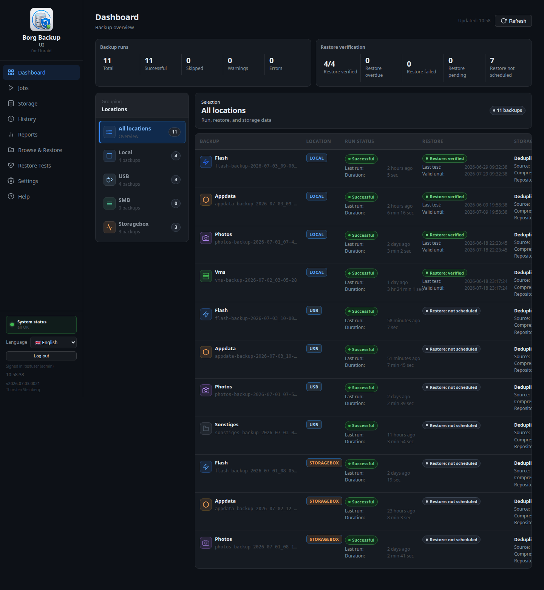
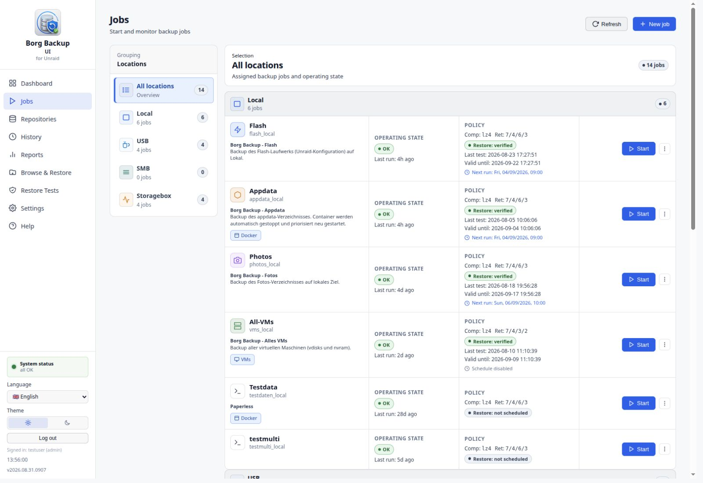
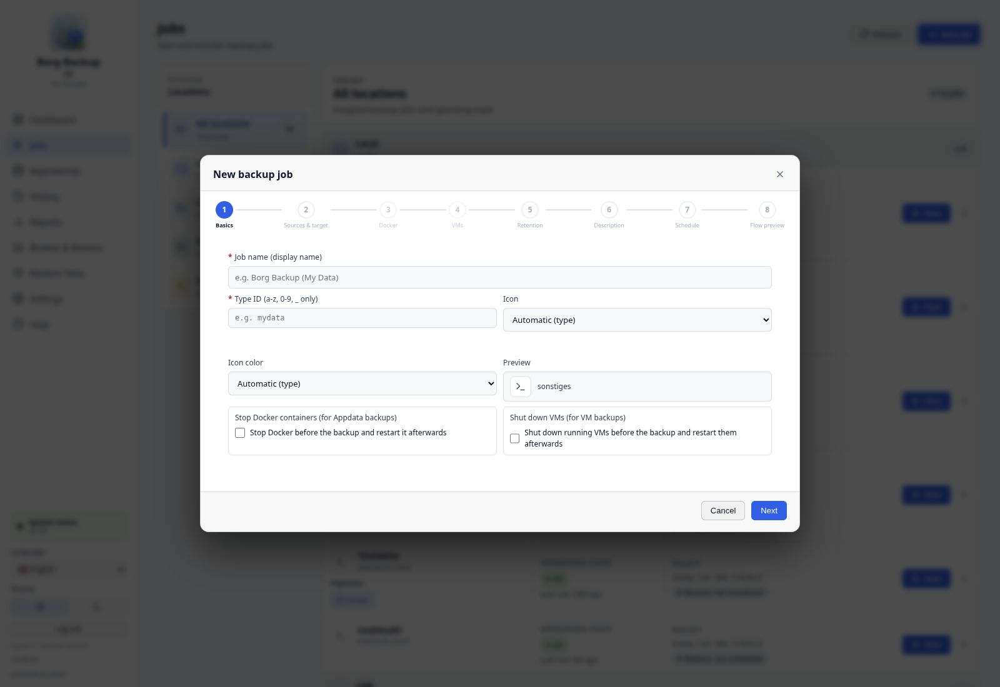
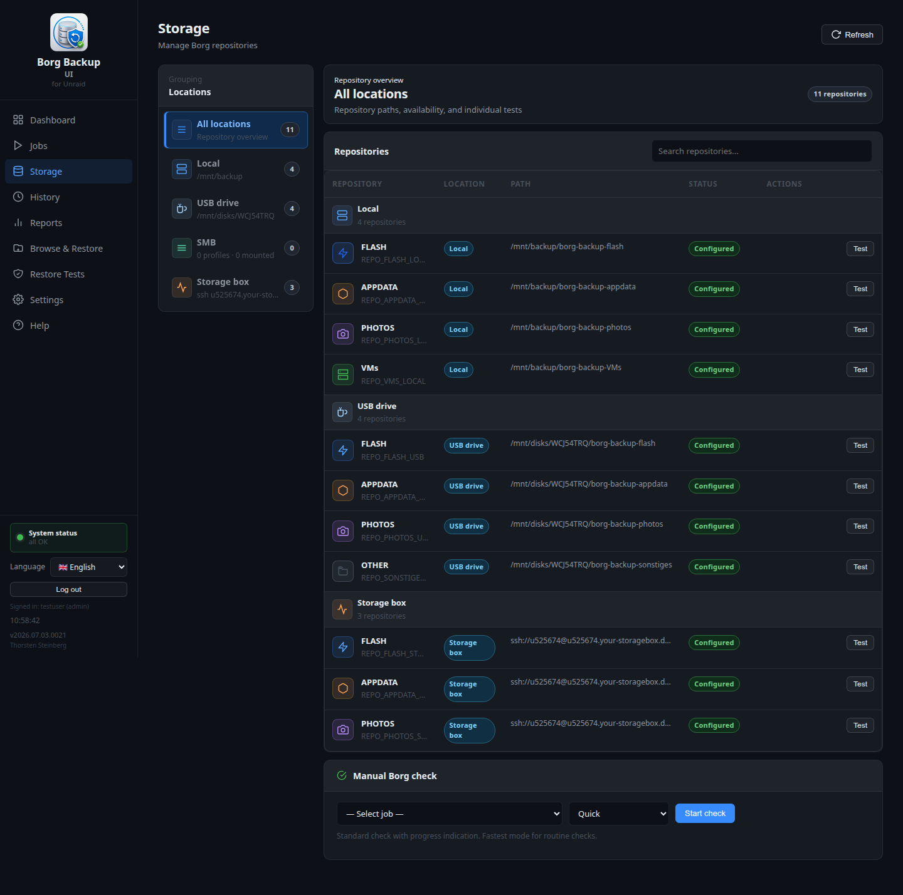
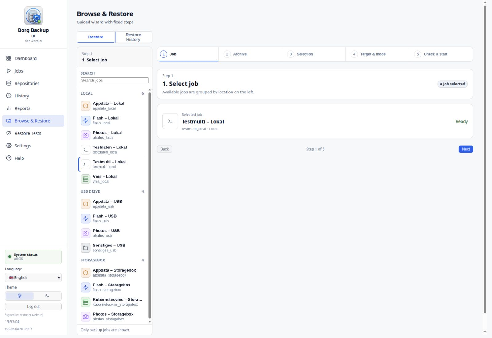
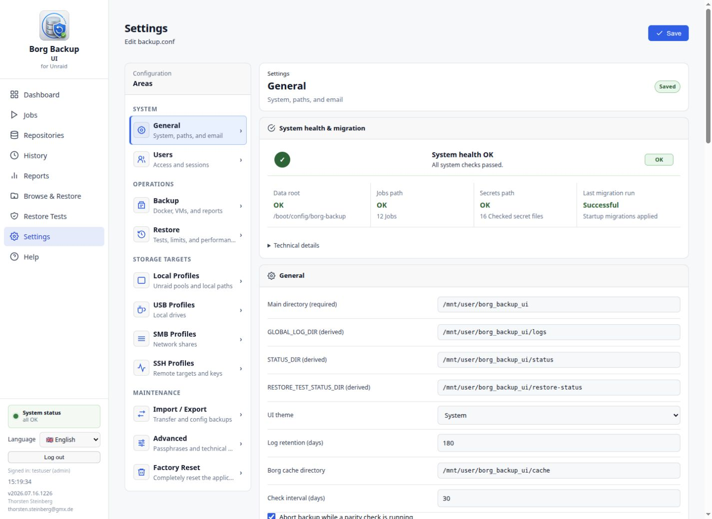

# Borg-Backup-UI User Manual

Date: 2026-07-03  
Language: English  
Audience: Users and administrators of an Unraid system

This manual describes Borg-Backup-UI in the same order as the application's menu. It explains the visible pages, typical workflows, important warnings, and the effects of user actions.

> **Note:** This manual describes the application itself. It does not replace the general BorgBackup documentation or the Unraid system documentation. If a function is not visible in the interface, it may not be available for the currently signed-in role or current configuration.

## Table of Contents

1. [Basics](#1-basics)
2. [Dashboard](#2-dashboard)
3. [Jobs](#3-jobs)
4. [Repositories](#4-repositories)
5. [History](#5-history)
6. [Reports](#6-reports)
7. [Browse & Restore](#7-browse--restore)
8. [Restore Tests](#8-restore-tests)
9. [Settings](#9-settings)
10. [Help](#10-help)
11. [Typical Tasks](#11-typical-tasks)
12. [Status, Warnings, and Best Practices](#12-status-warnings-and-best-practices)

## 1. Basics

Borg-Backup-UI is a web interface for BorgBackup on Unraid. The application manages backup jobs, storage targets, schedules, restore functions, restore tests, reports, notifications, and system diagnostics.

### 1.1 Key Terms

- **Job:** A backup definition with source paths, target, Borg options, retention, passphrase, and optional schedule.
- **Repository:** The BorgBackup target where archives are stored.
- **Archive:** A single BorgBackup snapshot inside a repository.
- **Location:** A target group such as `Local`, `USB`, `SMB`, or `Storagebox`.
- **Profile:** A reusable target configuration, for example a USB, SMB, or SSH profile.
- **Restore:** Recovery of files or directories from an archive.
- **Restore test:** Automated verification that a restore is technically possible.
- **System status:** Combined status of configuration, migration, jobs, secrets, runtime recovery, and maintenance notes.

### 1.2 Sign-in, Language, and Role

After signing in, the left sidebar shows the main menu, system status, language selection, log-out action, signed-in user, and installed version.

The language can be switched between German and English at the bottom left. This affects the web interface, not the technical log files. Logs, machine-readable values, and technical error codes may still contain English terms.

The application supports at least the roles `admin` and `viewer`. Administrators can change settings, manage jobs, and execute user actions. A viewer role is read-only; write actions may be disabled or rejected.

> **Warning:** Keep passwords, Borg passphrases, SSH keys, and export passwords secure. Borg-Backup-UI masks secrets in diagnostic output, but support bundles should still be reviewed before sharing.

## 2. Dashboard



The Dashboard is the central overview of backup state, restore evidence, storage growth, and repository checks.

### 2.1 Purpose of the Page

The Dashboard answers the most important operational questions:

- Which jobs exist?
- Which backups were successful, skipped, completed with warnings, or failed?
- Which restore tests are verified, overdue, failed, open, or not scheduled?
- Which storage and repository data was last recorded?
- Which jobs need attention?

### 2.2 Areas and Indicators

The page consists of:

- **Backup runs:** Total runs, successful runs, skipped runs, warnings, and errors.
- **Restore evidence:** Number of verified, overdue, failed, open, and not scheduled restore tests.
- **Location sidebar:** Filters the table by `All locations`, `Local`, `USB`, `SMB`, and `Storagebox`.
- **Selection card:** Shows the currently selected location and number of backups.
- **Job table:** Shows job, location, run status, restore status, storage data, and growth/check information.
- **Refresh:** Reloads dashboard data.

### 2.3 Important Columns

- **Backup:** Job name, key, and icon.
- **Location:** Job storage target.
- **Run status:** Last run, duration, and result.
- **Restore:** Last restore test and validity, if scheduled.
- **Storage data:** Deduplicated size, source, compressed size, and repository size.
- **Growth / Check:** Size change and last repository check.

### 2.4 Typical Actions

1. Open **Dashboard**.
2. Check the summaries at the top.
3. Select a location on the left if you only want to see local, USB, SMB, or Storagebox jobs.
4. Read the run status and restore status for each job.
5. Click **Refresh** if you expect new data immediately after a run.

### 2.5 Notes and Best Practices

> **Tip:** Use the Dashboard as the daily control point. If all backup and restore counters look plausible, detailed pages only need to be opened when something stands out.

> **Note:** The Dashboard shows the most recently known status data. If a repository is not reachable or a status file is missing, the table may show stale or incomplete values. In that case, check **History**, **Storage**, and the logs.

## 3. Jobs



The **Jobs** page manages backup jobs. Jobs can be viewed, started, edited, scheduled, and deleted here.

### 3.1 Purpose of the Page

Jobs define which data is backed up and where it is stored. A job contains:

- Display name and type ID
- Location and repository
- Source paths
- Docker and VM control
- Borg options such as compression, retention, and passphrase
- Schedule
- Description and icon

### 3.2 Areas and Functions

- **Location sidebar:** Groups jobs by storage target.
- **Job list:** Shows name, description, operating state, policy, and next run.
- **Start:** Starts a job manually.
- **More actions:** Opens actions such as edit, schedule, logs, or delete depending on the job.
- **New job:** Opens the job wizard.
- **Refresh:** Reloads job list and status.
- **Live log:** During a running job, output can be followed in the browser.

### 3.3 Start a Job Manually

1. Open **Jobs**.
2. Find the desired job by location group or search.
3. Click **Start**.
4. Confirm the start dialog.
5. Watch the live log.
6. Afterwards, check **History** and optionally **Storage**.

> **Warning:** If the job is configured to stop Docker containers or VMs, only the targets configured in the job are controlled. Review this selection before production runs.

### 3.4 Job Wizard



The job wizard guides creation or editing of a job through fixed steps.

#### Step 1: Basics

This step sets job name, type ID, icon, icon color, and initial runtime options.

Important fields:

- **Job name:** Visible name in the UI, reports, and notifications.
- **Type ID:** Technical key component. It should be short, unique, and stable.
- **Icon / icon color:** Representation in Dashboard, Jobs, Restore, and Reports.
- **Stop Docker before backup:** Enables Docker control.
- **Shut down VMs before backup:** Enables VM control.

#### Step 2: Sources & Target

The compact view shows **Sources and exclusions** on the left and the **Backup target** on the right. This step selects source paths, optional exclusion paths, storage type, the exact storage target, an existing repository, and job compression. The repository list only shows repositories belonging to the selected storage target. Repository paths are no longer entered freely in a job.

Typical source paths:

- `/boot/`
- `/mnt/user/appdata/`
- `/mnt/user/domains/`
- `/mnt/user/photos/`

> **Note:** Source paths must exist on the Unraid system and must be readable by the backup process.

Exclusion paths are concrete files or directories below a selected source path. They are omitted from the Borg archive. With many entries, only the path lists scroll inside their section.

#### Docker and VM Steps

If Docker or VM control is enabled, the wizard shows dedicated selection steps.

Options:

- **All running containers** or **selected containers only**
- **All running VMs** or **selected VMs only**

When `/mnt/user/appdata` is backed up, the application recommends stopping all Docker containers. When `/mnt/user/domains` is backed up, it recommends shutting down all VMs. If only selected services are stopped, the warning must be acknowledged deliberately.

> **Warning:** Appdata and VM backups can produce warnings or inconsistent data if files change during the backup. For full appdata or domains backups, stop all affected services where possible.

#### Retention, Compression, and Description

The wizard configures job-specific Borg options such as compression and retention. Encryption and passphrase belong to the repository and are only set when that repository is created or imported.

#### Schedule

The schedule can be set directly in the wizard. The UI supports simple frequencies and a cron expression.

Cron format:

```text
minute hour day month weekday
```

Example:

```text
0 3 * * *
```

This expression starts the job daily at 03:00.

#### Flow Preview

The final step shows a technical preview of the planned flow. It summarizes repository, source paths, Docker/VM selection, and planned actions.

### 3.5 Scheduling and Cron

Schedules can be changed in the job wizard or through job actions. When saved, the application's cron entry is updated.

Best practices:

- Test new jobs manually first.
- Enable the schedule afterwards.
- Leave enough time between scheduled jobs so large backups do not overlap.
- For external targets, verify that network and mounts are available at the scheduled time.

### 3.6 Typical Messages

- **Preview error / invalid data:** A wizard field is not plausible. Check source paths, type ID, storage target, and repository selection.
- **No storage target or repository available:** Open **Repositories** and first set up a storage target and repository, or import an existing repository.
- **Schedule disabled:** The job only runs manually.

## 4. Repositories



The **Repositories** page uses a master-detail workspace. Borg repositories are grouped by their exact storage target on the left, while the selected repository remains visible in the workspace on the right. **Add repository** guides users through storage-target setup and repository creation or import.

Local storage targets are created under **Settings > Local Profiles**. A
concrete directory below `/mnt`, such as `/mnt/backup` or `/mnt/disks/USB-A`,
is allowed. Broad roots, system paths, and malformed input containing empty,
`.` or `..` segments are rejected before saving.

### 4.1 Purpose of the Page

The page separates storage targets, Borg repositories, and backup jobs. A storage target describes the physical or remote location. A repository contains Borg archives. A job selects an existing repository and defines sources, schedule, compression, and retention.

### 4.2 Areas and Functions

- **Repository sidebar:** Groups repositories by the exact storage target and shows display name, repository directory, and status for each entry.
- **Search:** Filters sidebar entries by name, path, job, or storage target.
- **Workspace header:** Shows the selected repository, its path, and the summarized current state.
- **Overview:** Shows Borg statistics, maintenance state, and human-readable repository, storage target, job, encryption, and path details.
- **Archives:** Loads the current Borg archive inventory with archive name, technical ID, start time, and duration.
- **Maintenance:** Provides Check, Verify Data, Prune, and Compact as separate actions with persistent results.
- **Management:** Shows current job links and separates non-destructive removal from the UI from permanent repository deletion.
- **Add repository:** Opens a wizard for existing or new storage targets and for creating or importing a repository.

Borg statistics are refreshed in the background every 24 hours and cached in `repositories.json`. Missing or stale information is loaded during the next hourly scan. Failed refreshes are retried after one hour. Opening the page therefore does not wait for every local and remote repository.

The repository header uses the **display name** assigned during creation or import. **Repository directory** is the final directory name, **repository path** is the complete local or remote target path, and **path in storage target** is the relative path below the selected storage target.

### 4.3 Create or Import a Repository

1. Open **Repositories** and select **Add repository**.
2. Select an existing storage target or set up Local, USB, SMB, or Storagebox/SSH.
3. The wizard validates connectivity and write access. For SMB, the technical mount path is managed automatically.
4. Select **Create new repository** or **Import existing repository**.
5. Enter a display name and relative repository path.
6. For creation, select encryption and passphrase. Keyfile keys are stored persistently in the protected plugin directory.
7. For import, encryption is detected through `borg info`. For a keyfile repository, provide a Borg key export previously created with `borg key export` when required; an exact matching key already present on the system is adopted automatically.
8. Review the summary and save.

> **Warning:** Import does not initialize or modify the repository. Creation explicitly runs `borg init`.

> **Warning:** With `keyfile` and `keyfile-blake2`, recovery requires both the passphrase and the local key file. Use the encrypted jobs/secrets export for system migration and keep an additional independent `borg key export` backup.

### 4.4 Typical Actions

Check and maintain a repository:

1. Open **Repositories**.
2. Select the repository in the sidebar grouped by storage target.
3. Review Borg statistics and the latest state under **Overview**.
4. Open **Maintenance** and start Check, Verify Data, Prune, or Compact as required.
5. Review the status after completion. For failures, expand the secret-masked technical details in the status card.

Check an SMB target:

1. First check the SMB profile in **Settings > SMB Profiles**.
2. Open **Repositories**.
3. Select the repository. The application temporarily mounts a managed SMB target when access is needed and unmounts it afterwards if it mounted it.
4. Then refresh repository information under **Overview**.

Remove a repository from the application or delete it permanently:

1. Remove every linked backup job or assign those jobs to another repository first.
2. Open the repository's **Management** tab and verify that no job link or running operation remains.
3. **Remove from Borg Backup UI** only deletes the repository inventory entry. Repository data and the passphrase file remain intact.
4. **Permanently delete repository** revalidates repository ID, path, and archive count and requires the exact display name plus the safety word `DELETE`.
5. Only after `borg delete` succeeds does the application remove the inventory entry and a passphrase file used exclusively by that repository.

### 4.5 Notes

> **Note:** Prune uses the linked job's retention policy. Prune remains disabled without a linked job.

> **Note:** Prune lists deleted archives in its result. Compact only shows a numeric reclaimed-space value when Borg reports it.

> **Warning:** Borg Check can take a long time depending on repository size and target. Start it deliberately and not too frequently.

> **Warning:** Permanent repository deletion irreversibly removes every archive. It is blocked while jobs are linked or a backup, restore, restore test, or maintenance operation is running.

## 5. History


The **History** page shows past backup runs and restore test reports in chronological form.

### 5.1 Purpose of the Page

History is the first detail page after a backup run. It shows when a run happened, how long it took, how much data was processed, and whether the run was successful.

### 5.2 Areas and Functions

- **Location sidebar:** Groups runs by location.
- **Type filter:** Filters by backup types.
- **Status filter:** Filters by success, warning, error, or skipped runs.
- **Table:** Shows date/time, type, location, duration, original size, deduplicated size, and status.
- **Detail area:** Can be expanded per run and shows archive, repository data, check status, log file, and error messages.
- **Open:** Opens the linked log file if available.

### 5.3 Typical Actions

1. Open **History**.
2. Filter by location or status if needed.
3. Expand a run.
4. Check archive name, exit code, check status, and log file.
5. Open the log file for warnings or errors.

### 5.4 Status Values

- **Successful:** The run completed without a relevant error.
- **Warning:** The run completed, but Borg or the application reported notable details.
- **Error:** The run failed.
- **Skipped:** The run was intentionally not executed, for example because of locks, missing prerequisites, or configuration.

### 5.5 Notes

> **Tip:** For failures, start with the expanded History entry and then read the log file. It usually contains the concrete Borg or access message.

## 6. Reports


The **Reports** page summarizes backup and repository data across multiple runs.

### 6.1 Purpose of the Page

Reports help analyze trends:

- runtimes
- data volumes
- repository size
- deduplication
- recurring errors
- monthly and job comparisons

### 6.2 Areas and Functions

- **Job sidebar:** Selects one job or all jobs.
- **Search field:** Filters jobs.
- **Metrics:** Show aggregated values for the selected period.
- **Trend tables and charts:** Show development over time.
- **Borg repository information:** Can be loaded if available.
- **Refresh/Load:** Reloads data or fetches Borg information.

### 6.3 Typical Actions

1. Open **Reports**.
2. Select a job or **All jobs**.
3. Review runtimes, sizes, and trends.
4. Load Borg repository information if repository details are needed.
5. Compare suspicious values with **History** and logs.

### 6.4 Notes

> **Note:** Reports are based on available status and run data. If older runs do not contain complete metrics, some columns may be empty or incomplete.

## 7. Browse & Restore



**Browse & Restore** guides recovery of data from Borg archives.

### 7.1 Purpose of the Page

The page allows users to:

- select a backup job
- select a Borg archive
- browse archive contents
- select individual files or directories
- define target directory and conflict strategy
- start a dry run or real restore
- resume a live log for an active restore
- inspect completed restore runs

### 7.2 Views

The page has two tabs:

- **Restore:** The guided restore wizard.
- **Restore History:** Completed restore runs with details and delete action.

### 7.3 Restore Wizard

The wizard consists of five steps.

#### Step 1: Select Job

Select the job whose archive you want to browse. The sidebar groups jobs by location and shows the configured job icons.

#### Step 2: Select Archive

Select an archive from the repository. If no archives are visible, check repository access, passphrase, and storage status.

#### Step 3: Selection

Browse the archive and select files or directories. The selection determines what will be restored.

#### Step 4: Target & Mode

Set target directory and conflict behavior.

Conflict strategies:

- **Do not overwrite:** Existing files are kept.
- **Replace:** Existing files are replaced.
- **Rename:** Restored files are renamed if conflicts occur.

The target path is checked against allowed restore target roots.

By default, `/mnt/user` is allowed. Administrators can allow additional target roots in **Settings > Restore > Browse & Restore**.

Blocked examples:

- `/`
- `/mnt`
- `/mnt/disks`
- `/mnt/remotes`
- `/boot`
- `/etc`
- `/usr`
- `/var`

Allowed examples when deliberately configured:

- `/mnt/user`
- `/mnt/data`
- `/mnt/disk1`
- `/mnt/disks/<name>`
- `/mnt/remotes/<name>`

> **Warning:** Never restore directly into system paths. A wrong restore target path can overwrite existing data or make a system unusable.

#### Step 5: Review & Start

The final step shows summary and system check. Depending on the selection, the technical precheck output can be expanded. After confirmation, the restore starts.

### 7.4 Active Restore Runs

If a restore is still running or the browser session was interrupted, the page shows an active restore banner. **Continue live log** reopens the running output.

### 7.5 Restore History


Restore History shows completed restore runs with:

- restore ID
- job
- archive
- target directory
- start and end time
- duration
- status
- detail view
- delete action for history entries

The detail view can be expanded and collapsed. It shows structured data and the retained restore log.

### 7.6 Typical Error Messages

- **Target path must be inside an allowed restore target root:** The target is not below an allowed root.
- **Archive not visible:** Check repository and passphrase.
- **Precheck failed:** Expand details and read the technical message.
- **Restore aborted:** Check Restore History for a recorded server restart or process error.

## 8. Restore Tests


Restore Tests automatically verify that a restore is technically possible. They are important evidence that backups are not only written but also readable.

### 8.1 Purpose of the Page

The page manages:

- restore test policies per job
- test levels
- intervals and due state
- manual test starts
- due scheduled tests
- verification reports

### 8.2 Planning & Policy Tab

**Planning & Policy** shows jobs and their restore test rules.

Fields and columns:

- **Job:** Backup job.
- **Location:** Location.
- **Policy:** Scheduled, manual only, or not scheduled.
- **Interval (days):** Distance between tests.
- **Level:** Test depth.
- **Last test:** Time of the last test.
- **Next test:** Next due time.
- **Scheduler:** Whether the test is automatically due.
- **Actions:** Save or test now.

### 8.3 Test Levels

The application shows restore test levels as `L1`, `L2`, or `L3`.

- **L1:** Basic check that repository and archive are reachable.
- **L2:** Extended technical check with stronger restore evidence.
- **L3:** Most extensive check with higher runtime and I/O load.

> **Note:** Higher test levels improve confidence but can take significantly longer depending on repository and data volume.

### 8.4 Run Due Tests

1. Open **Restore Tests**.
2. Review the plan overview.
3. Click **Run due tests now**.
4. Watch the live protocol.
5. Review the reports afterwards.

> **Note:** This action starts only due scheduled tests, not every job automatically.

### 8.5 Reports


The **Reports** tab shows structured evidence for completed restore tests:

- overall status
- verification scope
- execution
- coverage
- individual check steps
- technical evidence

Typical status values:

- **Successful / Verified**
- **Overdue**
- **Failed**
- **Not available**

### 8.6 Best Practices

- Schedule restore tests regularly for important jobs.
- Use a suitable level and interval for large data volumes.
- Investigate failed tests promptly, especially for offsite or USB targets.
- Use notifications for overdue or failed restore tests.

## 9. Settings



The **Settings** page manages the application configuration. It is grouped into System, Operations, Storage Targets, and Maintenance.

> **Warning:** Settings changes can affect backup targets, secrets, notifications, restore safety, and schedules. Save only changes whose impact you understand.

### 9.1 General

The **General** section contains basic paths and general runtime parameters.

Typical contents:

- `GLOBAL_DATA_DIR` and derived runtime directories
- default paths for logs, status, and restore status
- general system parameters
- email/SMTP configuration
- Unraid notifications
- ntfy push notifications
- weekly report

#### Notifications

Borg-Backup-UI can report events through several channels:

- Unraid notifications
- email/SMTP
- ntfy

Configurable events can include:

- backup successful
- backup failed
- backup skipped
- backup overdue
- restore test successful
- restore test failed
- restore test overdue

Reminder settings apply across channels. The reminder interval prevents the same overdue condition from being reported repeatedly. The backup overdue tolerance defines when a scheduled backup run is considered overdue after its expected start time.

> **Note:** Test messages verify only the delivery channel. They do not replace a real backup or restore test.

### 9.2 Users


The **Users** section is visible when the application runs in user mode and the signed-in user has administrator rights.

Functions:

- view users
- change roles
- enable or disable users
- change or reset password
- sign out own sessions
- sign out all sessions
- permanently delete users

Roles:

- **admin:** Full access to settings and actions.
- **viewer:** Read access; write actions are restricted.

> **Tip:** Disable users first instead of immediately deleting them permanently. This makes offboarding easier to control.

### 9.3 Backup


The **Backup** section contains defaults and technical limits for backup runs.

Typical settings:

- default compression
- retention defaults
- Docker and VM wait times
- Borg timeouts
- report and runtime options

These values affect new jobs or global runtime limits. Job-specific settings in the job wizard may override them.

### 9.4 Restore


The **Restore** section contains two subsections:

- **Restore Tests**
- **Browse & Restore**

#### Restore Tests

This area manages defaults for restore tests, such as default test level, interval, runtime limits, and verification parameters.

#### Browse & Restore

This area manages allowed restore target roots. By default, only `/mnt/user` is allowed. Additional root paths must be added deliberately.

> **Warning:** Do not add overly broad paths such as `/`, `/mnt`, `/mnt/disks`, or `/mnt/remotes`. Use concrete targets such as `/mnt/disks/<name>` or `/mnt/remotes/<name>`.

### 9.5 USB Profiles


USB profiles describe local disks or Unassigned Devices targets. They are used by the job wizard for USB jobs.

Functions:

- add profile
- edit profile
- delete profile if it is no longer used by jobs
- check status

Important fields:

- profile name
- mount path

> **Note:** A USB profile does not automatically make a device available. The target must be mounted on Unraid when a backup runs.

### 9.6 SMB Profiles


SMB profiles define network shares. Passwords are treated as secrets.

Important fields:

- profile name
- server
- share
- mount path
- username
- password
- optional mount parameters

Typical actions:

1. Add profile.
2. Enter credentials.
3. Save.
4. Check status.
5. Open the repository under **Repositories** and refresh its information.

### 9.7 SSH Profiles


SSH profiles are used for Storagebox or other SSH targets.

Important fields:

- profile name
- host
- port
- user
- base path
- SSH key path
- target type

Functions:

- generate SSH key
- show public key
- deploy key
- test connection
- save profile

> **Note:** For Hetzner Storage Box, a relative base path such as `./backup` is typical. Check the resolved repository path on the **Repositories** page.

### 9.8 Import / Export


The **Import / Export** section is used to back up and transfer application configuration.

Functions:

- export jobs
- export jobs with passphrases
- export profiles and secrets
- preview imports before applying them
- choose conflict strategy
- view config backups
- prepare rollback
- create support bundle

Import strategies can keep, replace, or rename existing entries depending on the import type.

> **Warning:** Store export passwords securely. Encrypted exports cannot be restored without the matching password.

### 9.9 Advanced


The **Advanced** section contains technical data that regular users should only inspect when needed.

Subsections:

- **Notification reminders:** Diagnostics for backup and restore test overdue notifications.
- **Per-repository passphrases:** Overview of repository-specific passphrase assignments.

Reminder diagnostics show when a run was expected, when it becomes overdue, when it was last sent, and when the next reminder is allowed. This view does not send notifications; it is diagnostic only.

### 9.10 Factory Reset

**Factory Reset** is the final entry in the **Maintenance** group. It removes the application configuration and configured operational data, then restarts Borg Backup UI at the administrator first-setup page.

Before resetting, the application checks for running backups, restores, restore tests, and repository maintenance. Managed Borg repositories inside a directory scheduled for deletion block the operation. External Borg repositories and the plugin installation are not deleted.

Approval requires every risk acknowledgment, the server name, the current administrator password, and the confirmation text `FACTORY RESET`.

> **Warning:** Users, jobs, schedules, storage targets, repository assignments, secrets, Borg keyfiles, logs, status, and history data are permanently removed. Back up `/boot/config/borg-backup` first.

### 9.11 System Status and Migration


The system status is visible at the bottom left of the sidebar. Clicking it opens the related diagnostics area inside Settings.

The area shows, among other things:

- system checks
- job checks
- migration status
- executed migrations
- runtime recovery
- setup and maintenance notes
- secret file checks

Runtime recovery indicates that Docker containers or VMs were stopped during a backup and must be checked after a crash, abort, or restart.

> **Warning:** Mark runtime recovery notes as resolved only after the affected containers or VMs have actually been checked or started manually.

## 10. Help


The **Help** page shows the application's integrated quick help.

### 10.1 Purpose of the Page

The help page provides quick orientation directly in the UI. It is shorter than this manual and is useful for:

- looking up terms
- checking common workflows
- reading typical error cases
- refreshing UI concepts

### 10.2 Functions

- **Refresh:** Reloads the help document.
- **Table of contents:** Jumps to sections.
- **Language-dependent content:** Help follows the selected UI language.

## 11. Typical Tasks

### 11.1 Create a New Backup Job

1. Open **Jobs**.
2. Click **New job**.
3. Enter name, type ID, icon, and location.
4. Select source paths.
5. Select the storage target first and then an existing repository.
6. Configure Docker or VM control if needed.
7. Set compression and retention. Encryption and passphrase belong to the repository.
8. Optionally enable a schedule.
9. Review the flow preview.
10. Save the job.
11. Start the job manually once and check **History**.

### 11.2 Check a Repository

1. Open **Repositories**.
2. Select the storage target and repository.
3. Refresh the repository information.
4. Open **Maintenance** and start the required check if needed.
5. Check passphrase, profile, mount, or SSH connection when an error occurs.

### 11.3 Restore Files

1. Open **Browse & Restore**.
2. Select the job.
3. Select an archive.
4. Mark files or directories.
5. Select target directory and conflict strategy.
6. Review the summary.
7. Start the restore.
8. Watch the live log.
9. Check the entry in **Restore History**.

### 11.4 Schedule a Restore Test

1. Open **Restore Tests**.
2. Select the desired job.
3. Set policy to scheduled.
4. Choose interval and level.
5. Save the policy.
6. Optionally start a manual test.
7. Review the verification report.

### 11.5 Configure Notifications

1. Open **Settings > General**.
2. Configure Unraid, email, or ntfy channel.
3. Select the desired events.
4. Set reminder interval and backup tolerance.
5. Send a test message.
6. Check diagnostics under **Settings > Advanced > Notification reminders**.

## 12. Status, Warnings, and Best Practices

### 12.1 Backup Operation

- Test new jobs manually before enabling schedules.
- Check Dashboard, History, and Restore Tests regularly.
- Do not schedule large jobs too close together.
- Verify USB and network targets before production schedules.
- Keep Borg passphrases and export passwords secure.

### 12.2 Restore Safety

- Restore to a separate target directory first.
- Use **Do not overwrite** if you are unsure.
- Allow additional restore target roots only deliberately.
- Check Restore History after every restore.

### 12.3 Docker and VMs

- For a full appdata backup, stop all Docker containers where possible.
- For a full domains backup, shut down all VMs where possible.
- Use selective control only if it is clear which services write data.
- Treat runtime recovery notes seriously and resolve them only after checking.

### 12.4 Failure Analysis

Recommended order:

1. **Dashboard** for overview.
2. **History** for the concrete run.
3. Open the log file from History.
4. **Repositories** for repository information and maintenance status.
5. **Settings > System status and migration** for configuration problems.
6. Create a support bundle if the error needs to be shared.

> **Tip:** A successful backup is truly reliable only after restore tests and at least one manual restore into a test target have also succeeded.
