# Borg-Backup-UI User Manual

Date: 2026-09-06 (integration candidate for issue #447; no new stable release approval)
Language: English  
Audience: Beginners, advanced users, and administrators of an Unraid system

This manual describes Borg-Backup-UI in the same order as the application's menu. It explains the visible pages, typical workflows, important warnings, and the effects of user actions.

> **Note:** This manual describes the application itself. It does not replace the general BorgBackup documentation or the Unraid system documentation. If a function is not visible in the interface, it may not be available for the currently signed-in role or current configuration.

> **Before testing this update:** Create and check a separate backup of the Unraid flash configuration and plugin data. The integration candidate needs testing on different installations before stable release approval. The migration backup does not replace a complete system backup.

Conversion to permanent job identities begins explicitly with **Prepare migration**. The automatically verified backup is followed by a mandatory pause: **Download protected backup**, save and check an independent copy, then **Confirm saved copy**. Only the separate **Run migration now** action authorizes conversion. Opening the page, downloading and acknowledging the backup do not start it. A snapshot is not an automatic plugin downgrade. See the [migration guide](migration-guide.md) for details.

The illustrations show an earlier version and serve as orientation. Older type ID and job key labels in images have been replaced by job name, complete archive prefix and a permanent internal job ID.

## Table of Contents

1. [Basics](#1-basics)
2. [Dashboard](#2-dashboard)
3. [Jobs](#3-jobs)
4. [Repositories](#4-repositories)
5. [History](#5-history)
6. [Reports](#6-reports)
7. [Browse & Restore](#7-browse--restore)
8. [Restore Tests](#8-restore-tests)
9. [Settings](#9-settings)
10. [Help](#10-help)
11. [Typical Tasks](#11-typical-tasks)
12. [Status, Warnings, and Best Practices](#12-status-warnings-and-best-practices)
13. [Troubleshooting](#13-troubleshooting)
14. [FAQ](#14-faq)
15. [Recommended Operating Practices](#15-recommended-operating-practices)

## 1. Basics

Borg-Backup-UI is a web interface for BorgBackup on Unraid. The application manages backup jobs, storage targets, schedules, restore functions, restore tests, reports, notifications, and system diagnostics.

### 1.1 Key Terms

- **Job:** A backup definition with folders or files to back up, target, job-specific Borg options, retention, and optional schedule.
- **Repository:** The BorgBackup target where archives are stored.
- **Archive:** A single BorgBackup snapshot inside a repository.
- **Location:** A target group such as `Local`, `USB`, `SMB`, or `Storagebox`.
- **Profile:** A reusable target configuration, for example a USB, SMB, or SSH profile.
- **Restore:** Recovery of files or directories from an archive.
- **Restore test:** Automated verification that a restore is technically possible.
- **System status:** Combined status of configuration, migration, jobs, secrets, runtime recovery, and maintenance notes.

### 1.2 Sign-in, Language, and Role

After signing in, the left sidebar shows the main menu, system status, language selection, log-out action, signed-in user, and installed version.

On first use, the interface follows a supported German or English browser language; other or unknown languages default to English. Afterwards, the language can be switched between German and English at the bottom left and remains stored for that browser. This affects the web interface, not the technical log files. Logs, machine-readable values, and technical error codes may still contain English terms.

The application supports the `admin`, `operator`, and `viewer` roles:

- **admin:** Full access to users, settings, storage targets, repositories, and jobs.
- **operator:** May run operational actions such as backups, restores, and maintenance, but cannot manage administrative settings.
- **viewer:** Read-only access; write actions are disabled or rejected.

> **Warning:** Keep passwords, Borg passphrases, SSH keys, and export passwords secure. Borg-Backup-UI masks secrets in diagnostic output, but support bundles should still be reviewed before sharing.

### 1.3 Installation and Initial Setup

Borg Backup UI is in **public beta** and is installed through **Unraid Community Apps**. It requires **Unraid 7.2.0 or newer** and **Python 3.10 or newer**. Install the separate **Python 3 for Unraid** plugin from Community Apps first. BorgBackup itself is bundled with Borg Backup UI; no separate Borg or pip installation is required.

1. Open **Apps** in Unraid.
2. Install **Python 3 for Unraid** if it is not already present.
3. Search for **Borg Backup UI**, read the public-beta notice, and install the plugin.
4. Open **Settings > Borg Backup UI**, start the service, and open the web interface.
5. Create the first administrator account with a password of at least twelve characters.
6. Select and confirm a concrete main directory for logs, status, and restore data.
7. Start with non-critical test data, run the first backup manually, and verify a restore into a separate test target.

> **Warning:** A written backup is not yet proof that recovery works. Do not rely on the setup until a manual restore and a restore test have succeeded.

The main directory may live below an Unraid share, pool, array disk, Unassigned Devices mount, or remote mount. During startup Borg Backup UI waits for the actual backing mount before migrations, the scheduler, or status workers write to it. If no main directory is configured yet or its mount is unavailable, only the functions needed for setup and diagnostics remain active; the application does not create misleading runtime directories on the root filesystem.

Service start, stop, and autostart are managed by the plugin. Do not add a separate launch command to `/boot/config/go`.

## 2. Dashboard

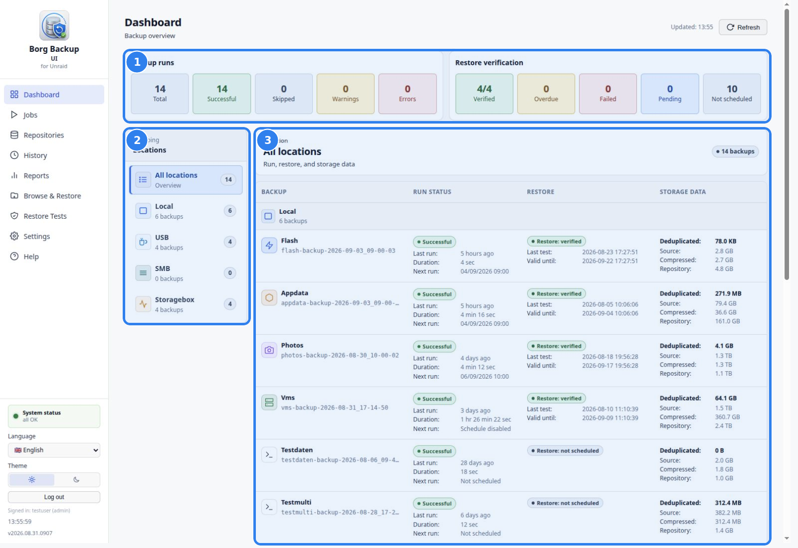

**Figure 1 - Dashboard:** (1) overall backup-run and restore-evidence status, (2) location filter, (3) detailed table for the filtered jobs.

The Dashboard is the central overview of backup state, restore evidence, storage growth, and repository checks.

### 2.1 Purpose of the Page

The Dashboard answers the most important operational questions:

- Which jobs exist?
- Which backups were successful, skipped, completed with warnings, or failed?
- When will a scheduled job run next?
- Which restore tests are verified, overdue, failed, open, or not scheduled?
- Which storage and repository data was last recorded?
- Which jobs need attention?

### 2.2 Areas and Indicators

The page consists of:

- **Backup runs:** Total runs, successful runs, skipped runs, warnings, and errors.
- **Restore evidence:** Number of verified, overdue, failed, open, and not scheduled restore tests.
- **Location sidebar:** Filters the table by `All locations`, `Local`, `USB`, `SMB`, and `Storagebox`.
- **Selection card:** Shows the currently selected location and number of backups.
- **Job table:** Shows job, location, run status including the next scheduled run, restore status, storage data, and growth/check information.
- **Refresh:** Reloads dashboard data.

### 2.3 Important Columns

- **Backup:** Job display name and icon. Records are linked by the permanent internal job ID.
- **Location:** Job storage target.
- **Run status:** Last run, duration, result, and next scheduled run.
- **Restore:** Last restore test and validity, if scheduled.
- **Storage data:** Deduplicated size, source, compressed size, and repository size.
- **Growth / Check:** Size change and last repository check.

### 2.4 Typical Actions

1. Open **Dashboard**.
2. Check the summaries at the top.
3. Select a location on the left if you only want to see local, USB, SMB, or Storagebox jobs.
4. Read the run status and restore status for each job.
5. Click **Refresh** if you expect new data immediately after a run.

### 2.5 Notes and Best Practices

> **Tip:** Use the Dashboard as the daily control point. If all backup and restore counters look plausible, detailed pages only need to be opened when something stands out.

> **Note:** The Dashboard shows the most recently known status data. If a repository is not reachable or a status file is missing, the table may show stale or incomplete values. In that case, check **History**, **Repositories**, and the logs.

### 2.6 Unraid Dashboard Widget

The plugin adds a read-only widget to the normal Unraid Dashboard. It shows backup counters, running jobs, the latest and next backups, restore proof, and the number of reachable repositories.

The widget reads a precomputed status file on the flash drive. Refreshing it does not start Borg or a repository check and should not wake array disks only to render the display. The cache is updated after backup and restore-test events and during suitable status refreshes. A state such as **Initial**, **Unknown**, or a visibly old update time is not current backup evidence; open Borg Backup UI and check the Dashboard, History, and System Health.

> **Note:** This native Unraid widget is different from the optional **Homepage** integration under **Settings > General**. Homepage uses its own restricted token.

## 3. Jobs

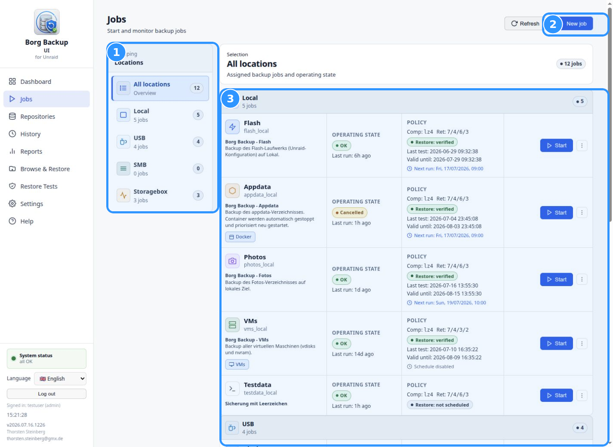

**Figure 2 - Jobs:** (1) filter by storage target, (2) entry point to the job wizard, (3) job cards with state, policy, and start action.

The **Jobs** page manages backup jobs. Jobs can be viewed, started, edited, scheduled, and deleted here.

### 3.1 Purpose of the Page

Jobs define which data is backed up and where it is stored. A job contains:

- Display name and complete archive prefix; the internal job ID remains permanent
- Location and repository
- Folders or files to back up
- Docker and VM control
- Borg options such as compression and retention
- Schedule
- Description and icon

### 3.2 Areas and Functions

- **Location sidebar:** Groups jobs by storage target.
- **Job list:** Shows name, description, operating state, policy, and next run.
- **Start:** Starts a job manually.
- **More actions:** Opens actions such as edit, schedule, logs, or delete depending on the job.
- **New job:** Opens the job wizard.
- **Refresh:** Reloads job list and status.
- **Live log:** During a running job, output can be followed in the browser.
- **Cancel job:** Requests a controlled cancellation of the running job.

### 3.3 Start a Job Manually

1. Open **Jobs**.
2. Find the desired job by location group or search.
3. Click **Start**.
4. Confirm the start dialog.
5. Watch the live log.
6. Afterwards, check **History** and optionally **Repositories**.

> **Warning:** If the job is configured to stop Docker containers or VMs, only the targets configured in the job are controlled. Review this selection before production runs.

### 3.4 Cancel a Running Job

1. Click **Cancel job** on the running job.
2. Confirm the controlled cancellation.
3. Watch the status and live log until runtime recovery is complete.

An active Borg step is interrupted with SIGINT. If cancellation is requested while Docker containers or VMs are being stopped, the application first completes the stop operation already in progress. It then automatically restarts the containers or VMs that were running before the backup. Cancellation is no longer available during this recovery. If a container or VM cannot be restarted, the run ends as an error and **System Health & Migration** shows the pending runtime recovery item.

> **Note:** A controlled cancellation is stored as **Cancelled**. The application does not automatically run `borg check`, remove Borg locks, or repair a repository after cancellation. Review the log when Borg reports anything unusual and use repository maintenance deliberately.

The live-log connection indicator describes the browser connection to the log stream, not the backup process result itself. After a short transport error the interface attempts to reconnect. Judge the run by its final status and stored log.

### 3.5 Job Wizard

The job wizard guides creation or editing of a job through fixed steps.

#### Step 1: Basics

This step sets job name, complete archive prefix, icon, icon color, and initial runtime options.

Important fields:

- **Job name:** Visible name in the UI, reports, and notifications.
- **Archive prefix:** Complete beginning of future archive names. Letters, digits, dots, underscores and hyphens are allowed. The preview shows the exact name with its timestamp.
- **Icon / icon color:** Representation in Dashboard, Jobs, Restore, and Reports.
- **Stop Docker before backup:** Enables Docker control.
- **Shut down VMs before backup:** Enables VM control.

Each job receives a permanent internal ID. Changes to job name, archive prefix or repository preserve that ID and its links to schedules, status and history. The display name can be changed freely. The complete archive prefix is used: for example, `photos` produces `photos-2026-09-06_03-00-00`; `-backup` is not added automatically.

Changing the archive prefix affects only future archives. Borg Backup UI keeps an ordered prefix history with the current prefix first and displays previous prefixes in the editor's information popover. Existing archives are neither renamed nor moved. Archive discovery uses these prefixes in the currently assigned repository. Changing repositories does not move archives or make earlier restore evidence prove the new target.

#### Step 2: Sources & Target

The compact view shows **Folders to back up** and **Exclusions** on the left and the **Backup target** on the right. The left side defines which folders or files are included in the backup and which child folders or files are skipped. The right side selects storage type, the exact storage target, an existing repository, and job compression. The repository list only shows repositories belonging to the selected storage target. Repository paths are no longer entered freely in a job.

Typical folders to back up:

- `/boot/`
- `/mnt/user/appdata/`
- `/mnt/user/domains/`
- `/mnt/user/photos/`

> **Note:** The selected folders or files must exist on the Unraid system and must be readable by the backup process. Technically, they are stored as the job's source paths.

A complete and valid source can be accepted with **Enter** even while autocomplete shows child-directory suggestions. Share roots such as `/mnt/user/appdata` are allowed when they exist. If the selected source itself is a symlink, or a parent path passes through a symlink, Borg Backup UI resolves it to the real target only at run time and remaps related exclusions. The readable path selected by the user remains stored in the job; the resolution is recorded in the run log.

Exclusions are concrete files or directories below a selected backup folder. They are omitted from the Borg archive. With many entries, only the path lists scroll inside their section.

When editing a job, a different existing repository can be selected. The change affects future backups only. Existing archives are not moved and are no longer reachable through this job in **Browse & Restore**; the wizard requires explicit confirmation.

#### Docker and VM Steps

If Docker or VM control is enabled, the wizard shows dedicated selection steps.

Options:

- **All running containers**, **selected containers only**, or **all except selected containers**
- **All running VMs** or **selected VMs only**

When `/mnt/user/appdata` is backed up, the application recommends stopping all Docker containers. When `/mnt/user/domains` is backed up, it recommends shutting down all VMs. If only selected services are stopped, the warning must be acknowledged deliberately.

When Docker or VM control is disabled, the related selection step is skipped. For protected appdata or domains sources, the required risk acknowledgement appears no later than the final review so an intentional backup without stopping services remains possible.

> **Warning:** Appdata and VM backups can produce warnings or inconsistent data if files change during the backup. For full appdata or domains backups, stop all affected services where possible.

A planned VM shutdown is reported as informational. Only a failed shutdown or restart produces a warning or error. After every run, only the containers and VMs that were actually running before that run are started again.

#### Docker Container Restart Priority

The priority controls only the order in which containers stopped by Borg Backup UI are started again after a job. It does not control the stop order or Unraid's normal autostart order.

Configure the label on each affected container in Unraid:

1. Open the Unraid **Docker** tab.
2. Edit the container.
3. Enable **Advanced View**.
4. Under **Extra Parameters**, add for example:

   ```text
   --label backup.start.priority=1
   ```

5. Preserve any existing extra parameters and add the label alongside them.
6. Apply the container configuration.

Supported values:

- `1`: critical infrastructure, such as databases or caches
- `2`: standard applications that depend on priority-1 services
- `3`: remaining containers

A missing, empty, invalid, or unsupported value falls back to priority `3`. Lower-numbered groups start first; Borg Backup UI waits between populated groups according to its runtime configuration. The label belongs to the container and therefore applies whenever any job restarts that container after a backup.

Example: assign PostgreSQL or MariaDB priority `1` and its dependent application priority `2`. Perform the first verification in a maintenance window and check the live log for **Phase 1**, **Phase 2**, and **Phase 3**. The priority value is sufficient for troubleshooting; do not publish a complete container configuration containing secrets.

> **Note:** Unraid's normal autostart order applies when the Docker service starts. `backup.start.priority` is used only by Borg Backup UI during post-backup recovery.

#### Retention, Compression, and Description

The wizard configures job-specific Borg options such as compression and retention. Encryption and passphrase belong to the repository and are only set when that repository is created or imported.

Retention values count time periods, not the number of archives within a period:

- **Daily:** up to one qualifying archive per day for the configured number of daily restore points.
- **Weekly:** up to one qualifying archive per week.
- **Monthly:** up to one qualifying archive per month.
- **Yearly:** up to one qualifying archive per year.

Borg normally uses the newest qualifying archive from a period. For example, if backups are created at 08:00 and 08:30 on the same day, the daily rule keeps only one restore point for that day—normally the newer 08:30 archive. **Daily: 20** therefore does not keep 20 archives from the same day. An archive survives when at least one configured rule selects it.

After each successfully created backup, Borg Backup UI applies the configured retention rules. The plugin runs prune, followed by compact and the repository check when it is due. Prune deletes archives that are not selected by any retention rule.

A value of `0` disables only that retention tier and does not mean unlimited. With four zero values, prune would select no matching archive for retention and could therefore delete all archives belonging to the job. At least one of the four values must consequently be greater than `0`; a configuration containing four zero values is rejected. A future option to keep every archive must instead explicitly disable prune for the job.

#### Optional File Activity in the Live Log

The per-job **File activity in the live log** option is located under **Basics** in the wizard and adds `--list --filter=AME` to `borg create`. During a manual or scheduled run, the live log then shows entries that Borg classifies as added (`A`), modified (`M`), or errored (`E`). Unchanged entries are intentionally omitted. The option is disabled by default and applies only to the selected job.

These status values are based on Borg's files cache and its change detection. They are neither a report of the bytes actually transferred nor a complete listing of archive contents. For example, a path can appear as modified while Borg deduplicates existing data chunks and stores only metadata or a small number of new chunks.

When this option is enabled, the live viewer loads the complete run log in sections, starting at the current end. It follows new lines through completion until you scroll back or use section navigation. **↑ Previous section** and **↓ Next section** move backward or forward through the log; scrolling loads adjacent sections automatically. **Go to beginning** and **Jump to end** provide direct navigation. **Jump to end** resumes following. Every emitted line is retained in the log file. **Clear** only clears the view. Browser search and text selection cover only the loaded section. **Download complete log** includes every entry present when the download starts. Jobs without file activity keep the existing live viewer.

With file activity enabled, the active log is initially stored in RAM under `/run/borg-backup-ui/activity-logs`. After the backup process exits, including cleanup and service recovery, the complete log is copied to the configured log directory and the RAM is released. The current log therefore does not modify a file inside the backed-up log directory and is not included in that backup. This also applies to failed and cooperatively cancelled runs. Restarting the WebUI process does not interrupt final log persistence. History and reports reference the final location. Required RAM is approximately the log size. A server restart or power loss before persistence loses the volatile log. If saving fails, the log remains in RAM and the live viewer asks you to download it before restarting the server.

> **Privacy note:** When this option is enabled, file and directory names appear in both the live log and the stored run log. Because support bundles can contain recent run logs, those names can also be included there. Support bundles mask secrets but are not anonymous; always review a bundle before sharing it.

#### Schedule

The schedule can be set directly in the wizard. The UI supports simple frequencies and a cron expression.

Cron format:

```text
minute hour day month weekday
```

Example:

```text
0 3 * * *
```

This expression starts the job daily at 03:00.

#### Flow Preview

The final step shows a technical preview of the planned flow. It summarizes repository, folders or files to back up, Docker/VM selection, and planned actions.

Forms and multi-step wizards with unsaved input do not close when the backdrop is clicked. **Cancel** and the close button remain available; when values have changed, Borg Backup UI asks explicitly before discarding them.

### 3.6 Scheduling and Cron

Schedules can be changed in the job wizard or through job actions. When saved, the application's cron entry is updated.

Best practices:

- Test new jobs manually first.
- Enable the schedule afterwards.
- Leave enough time between scheduled jobs so large backups do not overlap.
- For external targets, verify that network and mounts are available at the scheduled time.

### 3.7 Typical Messages

- **Preview error / invalid data:** A wizard field is not plausible. Check the folders or files to back up, archive prefix, storage target, and repository selection.
- **No storage target or repository available:** Configure the storage target under **Settings** first. Then create or import the repository under **Repositories**.
- **Schedule disabled:** The job only runs manually.

## 4. Repositories

The **Repositories** page uses a master-detail workspace. Borg repositories are grouped by their exact storage target on the left, while the selected repository remains visible in the workspace on the right. **Add repository** creates or imports a repository on a storage target that has already been configured under **Settings**.

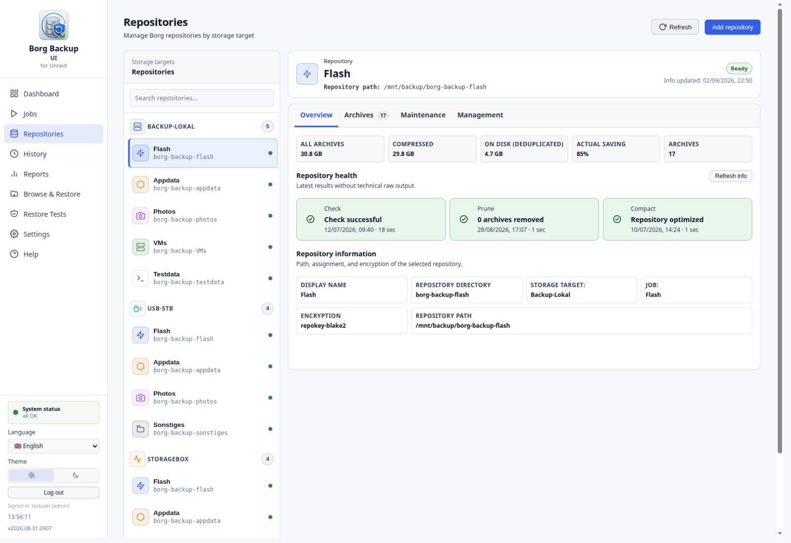

Local storage targets are created under **Settings > Local Profiles**. A
concrete directory below `/mnt`, such as `/mnt/backup` or `/mnt/disks/USB-A`,
is allowed. Broad roots, system paths, and malformed input containing empty,
`.` or `..` segments are rejected before saving.

### 4.1 Purpose of the Page

The page separates storage targets, Borg repositories, and backup jobs. A storage target describes the physical or remote location. A repository contains Borg archives. A job selects an existing repository and defines sources, schedule, compression, and retention.

### 4.2 Areas and Functions

- **Repository sidebar:** Groups repositories by the exact storage target and shows display name, repository directory, and status for each entry.
- **Search:** Filters sidebar entries by name, path, job, or storage target.
- **Workspace header:** Shows the selected repository, its path, and the summarized current state.
- **Overview:** Shows Borg statistics, maintenance state, and human-readable repository, storage target, job, encryption, and path details.
- **Archives:** Loads the current Borg archive inventory with archive name, technical ID, start time, and duration.
- **Maintenance:** Provides Check, Verify Data, Prune, and Compact as separate actions with persistent results.
- **Management:** Shows current job links, Borg key export/import, and separates non-destructive removal from the UI from permanent repository deletion.
- **Add repository:** Opens a wizard for selecting an existing storage target and creating or importing a repository.

Automatic Borg-statistics refresh is disabled by default so repositories and disks are not contacted unexpectedly. It can be enabled deliberately under **Settings > Repositories**, where its interval is configurable; the default refresh interval is 24 hours and a failed access attempt is retried after one hour by default. Results are cached in `repositories.json`. Opening the Repositories page displays that cache and does not wait for every local and remote repository to refresh. **Refresh info** starts the query manually for the selected repository.

The repository header uses the **display name** assigned during creation or import. **Repository directory** is the final directory name, **repository path** is the complete local or remote target path, and **path in storage target** is the relative path below the selected storage target.

### 4.3 Create or Import a Repository

1. Open **Repositories** and select **Add repository**.
2. Select an existing storage target. New Local, USB, SMB, and SSH storage targets are configured and tested exclusively under **Settings**.
3. The wizard validates the selected storage target again before accessing the repository.
4. Select **Create new repository** or **Import existing repository**.
5. Enter the display name. For imports, enter the relative repository path manually or use **Browse** to open and select existing directories inside the chosen storage target. Repositories that are already managed are identified and cannot be imported again.
6. For creation, select encryption and passphrase. Keyfile keys are stored persistently in the protected plugin directory.
7. For import, encryption is detected through `borg info`. For a keyfile repository, provide a Borg key export previously created with `borg key export` when required; an exact matching key already present on the system is adopted automatically.
8. Review the summary and save.

> **Warning:** Import does not initialize or modify the repository. Creation explicitly runs `borg init`.

> **Note:** Stable `2026.08.31.0907` uses bundled BorgBackup `1.4.5`. After importing a repository, verify it with **Refresh info**, **Check**, and a restore test. Import does not automatically update or convert the Borg repository.

> **Warning:** With `keyfile` and `keyfile-blake2`, recovery requires both the passphrase and the local key file. Use the encrypted jobs/secrets export for system migration and keep an additional independent `borg key export` backup.

### 4.4 Typical Actions

Back up or restore a repository Borg key:

1. Open **Repositories** and select the encrypted repository.
2. Open the **Management** tab.
3. **Export key** downloads a Borg key export. Keep this file separate from the repository and passphrase.
4. **Import key** accepts a Borg key export. Borg Backup UI checks the repository ID before import so a key for another repository cannot be imported.

> **Note:** A Borg key export does not replace the passphrase. Encrypted repositories still require both the Borg key and passphrase.

Check and maintain a repository:

1. Open **Repositories**.
2. Select the repository in the sidebar grouped by storage target.
3. Review Borg statistics and the latest state under **Overview**.
4. Open **Maintenance** and start Check, Verify Data, Prune, or Compact as required.
5. Review the status after completion. For failures, expand the secret-masked technical details in the status card.

Check an SMB target:

1. First check the SMB profile in **Settings > SMB Profiles**.
2. Open **Repositories**.
3. Select the repository. The application temporarily mounts a managed SMB target when access is needed and unmounts it afterwards if it mounted it.
4. Then refresh repository information under **Overview**.

Remove a repository from the application or delete it permanently:

1. Remove every linked backup job or assign those jobs to another repository first.
2. Open the repository's **Management** tab and verify that no job link or running operation remains.
3. **Remove from Borg Backup UI** only deletes the repository inventory entry. Repository data and the passphrase file remain intact.
4. **Permanently delete repository** revalidates repository ID, path, and archive count and requires the exact display name plus the safety word `DELETE`.
5. Only after `borg delete` succeeds does the application remove the inventory entry and a passphrase file used exclusively by that repository.

### 4.5 Notes

> **Note:** Prune applies a linked job's retention policy to the combined selection of its current and stored earlier archive prefixes, each as `<archive-prefix>-*`. If several jobs use the same repository, a manual prune requires an explicit job as the retention source. The confirmation shows the job, archive filter, and periodic restore points; archives belonging to other jobs remain untouched. Prune remains disabled without a matching job link.

> **Note:** Prune lists deleted archives in its result. Compact only shows a numeric reclaimed-space value when Borg reports it.

> **Warning:** Borg Check can take a long time depending on repository size and target. Start it deliberately and not too frequently.

> **Warning:** Permanent repository deletion irreversibly removes every archive. It is blocked while jobs are linked or a backup, restore, restore test, or maintenance operation is running.

## 5. History

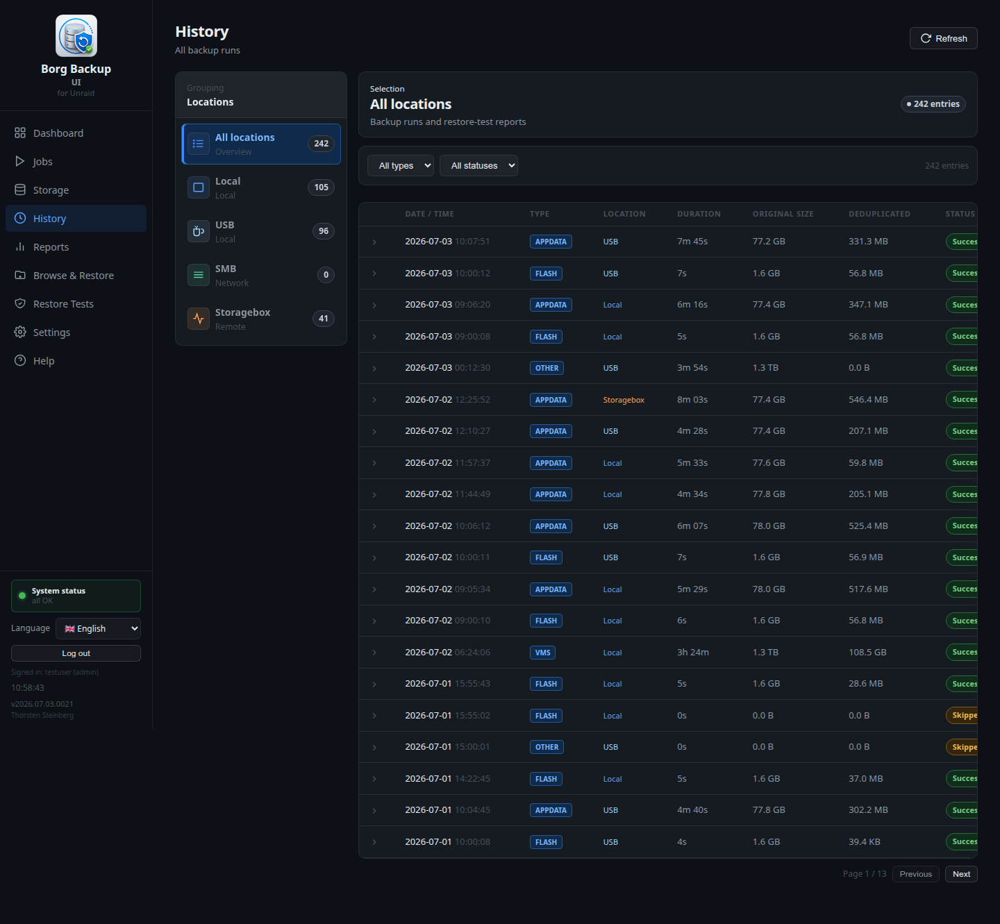

The **History** page shows past backup runs and restore test reports in chronological form.

### 5.1 Purpose of the Page

History is the first detail page after a backup run. It shows when a run happened, how long it took, how much data was processed, and whether the run was successful.

### 5.2 Areas and Functions

- **Location sidebar:** Groups runs by location.
- **Job filter:** Filters jobs by their permanent IDs. Deleted jobs and unassigned historical entries remain separately accessible.
- **Status filter:** Filters by success, warning, error, or skipped runs.
- **Table:** Shows date/time, job, location, duration, original size, deduplicated size, and status. Historical runs retain the descriptions captured at their start.
- **Detail area:** Can be expanded per run and shows archive, repository data, check status, log file, and error messages.
- **Open:** Opens the linked log file if available.

### 5.3 Typical Actions

1. Open **History**.
2. Filter by location or status if needed.
3. Expand a run.
4. Check archive name, exit code, check status, and log file.
5. Open the log file for warnings or errors.

### 5.4 Status Values

- **Successful:** The run completed without a relevant error.
- **Warning:** The run completed, but Borg or the application reported notable details.
- **Error:** The run failed.
- **Skipped:** The run was intentionally not executed, for example because of locks, missing prerequisites, or configuration.

### 5.5 Notes

> **Tip:** For failures, start with the expanded History entry and then read the log file. It usually contains the concrete Borg or access message.

## 6. Reports

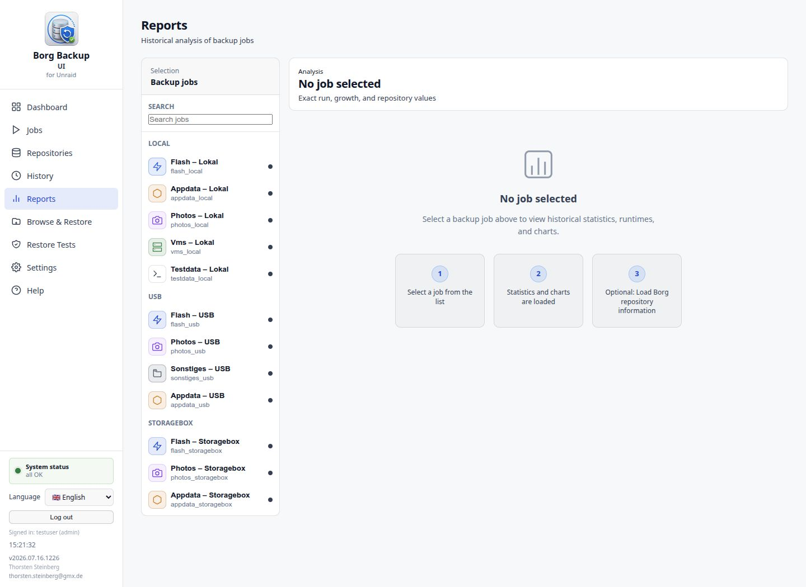

The **Reports** page summarizes backup and repository data across multiple runs.

### 6.1 Purpose of the Page

Reports help analyze trends:

- runtimes
- data volumes
- repository size
- deduplication
- recurring errors
- monthly and job comparisons

### 6.2 Areas and Functions

- **Job sidebar:** Selects one job or all jobs.
- **Search field:** Filters jobs.
- **Metrics:** Show aggregated values for the selected period.
- **Trend tables and charts:** Show development over time.
- **Borg repository information:** Can be loaded if available.
- **Refresh/Load:** Reloads data or fetches Borg information.

### 6.3 Typical Actions

1. Open **Reports**.
2. Select a job or **All jobs**.
3. Review runtimes, sizes, and trends.
4. Load Borg repository information if repository details are needed.
5. Compare suspicious values with **History** and logs.

### 6.4 Notes

> **Note:** Reports are based on available status and run data. If older runs do not contain complete metrics, some columns may be empty or incomplete.

## 7. Browse & Restore

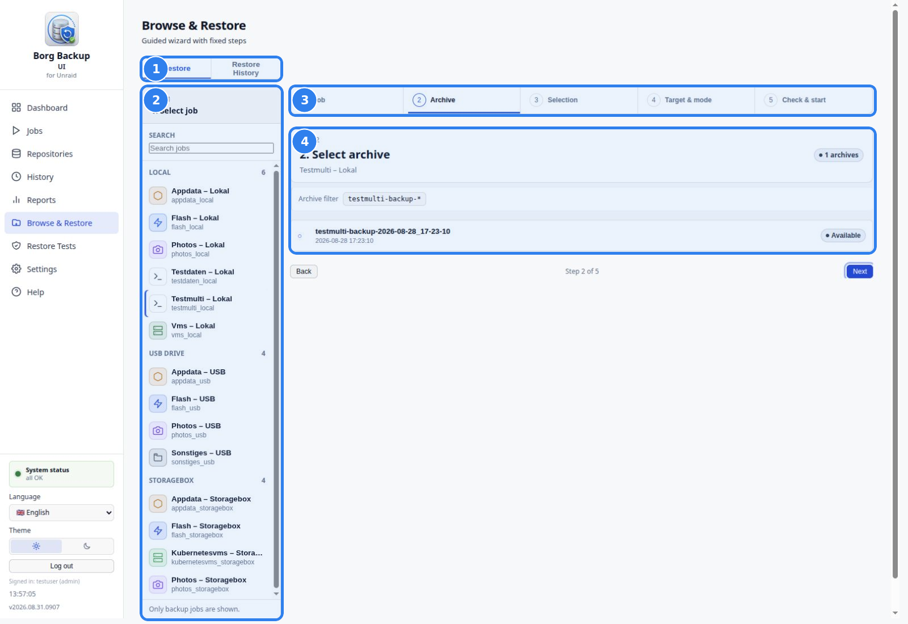

**Figure 3 - Browse & Restore:** (1) switch between Restore and History, (2) job selection by location, (3) progress through the five wizard steps, (4) content of the current step.

**Browse & Restore** guides recovery of data from Borg archives.

### 7.1 Purpose of the Page

The page allows users to:

- select a backup job
- select a Borg archive
- browse archive contents
- select individual files or directories
- define target directory and conflict strategy
- start a dry run or real restore
- resume a live log for an active restore
- inspect completed restore runs

### 7.2 Views

The page has two tabs:

- **Restore:** The guided restore wizard.
- **Restore History:** Completed restore runs with details and delete action.

### 7.3 Restore Wizard

The wizard consists of five steps.

#### Step 1: Select Job

Select the job whose archive you want to browse. The sidebar groups jobs by location and shows the configured job icons.

#### Step 2: Select Archive

Select an archive from the repository. The list is limited to archive prefixes belonging to the job. The current pattern, for example `testdata-backup-*`, is shown above the list. If the job's complete archive prefix was changed previously, a compact information popover also shows the ordered stored historical patterns. This keeps older archives in the currently assigned repository available without offering archives from other jobs in a shared repository.

If no archives are visible, check repository access, passphrase, storage status, and the displayed archive pattern. After a job repository change, older archives remain in the previous repository and do not appear here; the change neither moves nor copies them.

#### Step 3: Selection

Browse the archive and select files or directories. The selection determines what will be restored.

#### Step 4: Target & Mode

Review the read-only **Archive path**, then set the target directory and conflict behavior. The repository and archive are shown separately below the archive path so the origin of the selection remains clear.

Conflict strategies:

- **Do not overwrite:** Existing files are kept.
- **Replace:** Existing files are replaced.
- **Rename:** Restored files are renamed if conflicts occur.

The target path is checked against allowed restore target roots.

By default, `/mnt/user` is allowed. Administrators can allow additional target roots in **Settings > Restore > Browse & Restore**.

Blocked examples:

- `/`
- `/mnt`
- `/mnt/disks`
- `/mnt/remotes`
- `/boot`
- `/etc`
- `/usr`
- `/var`

Allowed examples when deliberately configured:

- `/mnt/user`
- `/mnt/data`
- `/mnt/disk1`
- `/mnt/disks/<name>`
- `/mnt/remotes/<name>`

> **Warning:** Never restore directly into system paths. A wrong restore target path can overwrite existing data or make a system unusable.

#### Step 5: Review & Start

The final step shows summary and system check. Depending on the selection, the technical precheck output can be expanded. Validation errors state the concrete reason, such as a missing or unwritable target, a target outside the allowed restore roots, or a missing archive selection. **Cancel** closes the start dialog without restoring; after explicit confirmation, the restore starts.

Before starting, Borg Backup UI checks the repository lock. A backup, another restore, a restore test, or maintenance running on the same repository blocks the new restore instead of risking concurrent read or write operations.

### 7.4 Active Restore Runs

If a restore is still running or the browser session was interrupted, the page shows an active restore banner. **Continue live log** reopens the running output.

### 7.5 Restore History

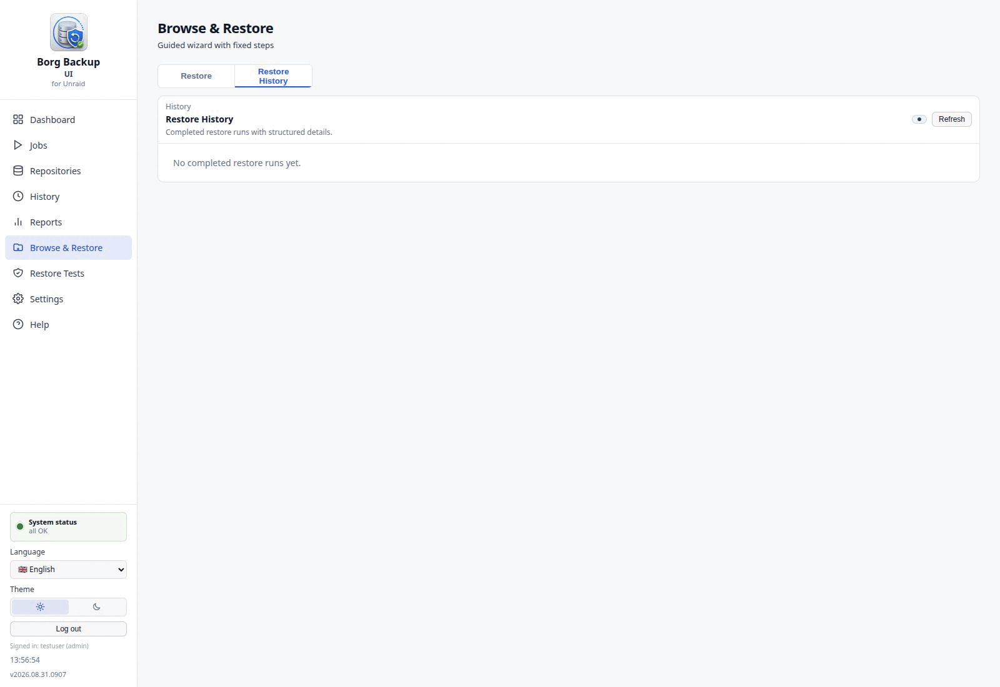

Restore History shows completed restore runs with:

- restore ID
- job
- archive
- target directory
- start and end time
- duration
- status
- detail view
- delete action for history entries

The detail view can be expanded and collapsed. It shows structured data and the retained restore log.

### 7.6 Typical Error Messages

- **Target path must be inside an allowed restore target root:** The target is not below an allowed root.
- **Archive not visible:** Check repository and passphrase.
- **Precheck failed:** Expand details and read the technical message.
- **Restore aborted:** Check Restore History for a recorded server restart or process error.

## 8. Restore Tests

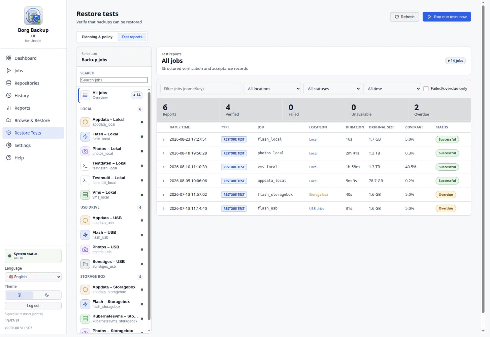

Restore Tests automatically verify that a restore is technically possible. They are important evidence that backups are not only written but also readable.

### 8.1 Purpose of the Page

The page manages:

- restore test policies per job
- test levels
- intervals and due state
- manual test starts
- due scheduled tests
- verification reports

### 8.2 Planning & Policy Tab

**Planning & Policy** shows jobs and their restore test rules.

Fields and columns:

- **Job:** Backup job.
- **Location:** Location.
- **Policy:** Scheduled, manual only, or not scheduled.
- **Interval (days):** Distance between tests.
- **Level:** Test depth.
- **Last test:** Time of the last test.
- **Next test:** Next due time.
- **Scheduler:** Whether the test is automatically due.
- **Actions:** Save or test now.

### 8.3 Test Levels

The application shows restore test levels as `L1`, `L2`, or `L3`.

- **L1:** Basic check that repository and archive are reachable.
- **L2:** Extended technical check with stronger restore evidence.
- **L3:** Most extensive check with higher runtime and I/O load.

> **Note:** Higher test levels improve confidence but can take significantly longer depending on repository and data volume.

### 8.4 Run Due Tests

1. Open **Restore Tests**.
2. Review the plan overview.
3. Click **Run due tests now**.
4. Watch the live protocol.
5. Review the reports afterwards.

> **Note:** This action starts only due scheduled tests, not every job automatically.

If a restore test is already running, Borg Backup UI does not start a second parallel run. Instead, it shows a conflict message and opens the existing live log.

### 8.5 Reports

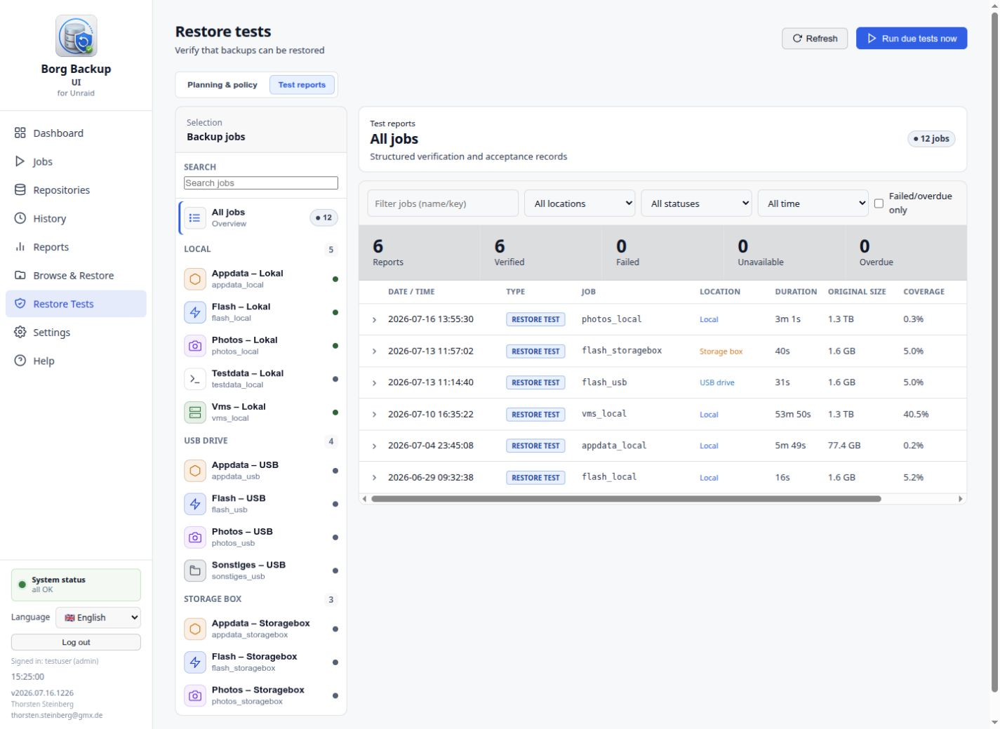

The **Reports** tab shows structured evidence for completed restore tests:

- overall status
- verification scope
- execution
- coverage
- individual check steps
- technical evidence

Typical status values:

- **Successful / Verified**
- **Overdue**
- **Failed**
- **Not available**

### 8.6 Best Practices

- Schedule restore tests regularly for important jobs.
- Use a suitable level and interval for large data volumes.
- Investigate failed tests promptly, especially for offsite or USB targets.
- Use notifications for overdue or failed restore tests.

## 9. Settings

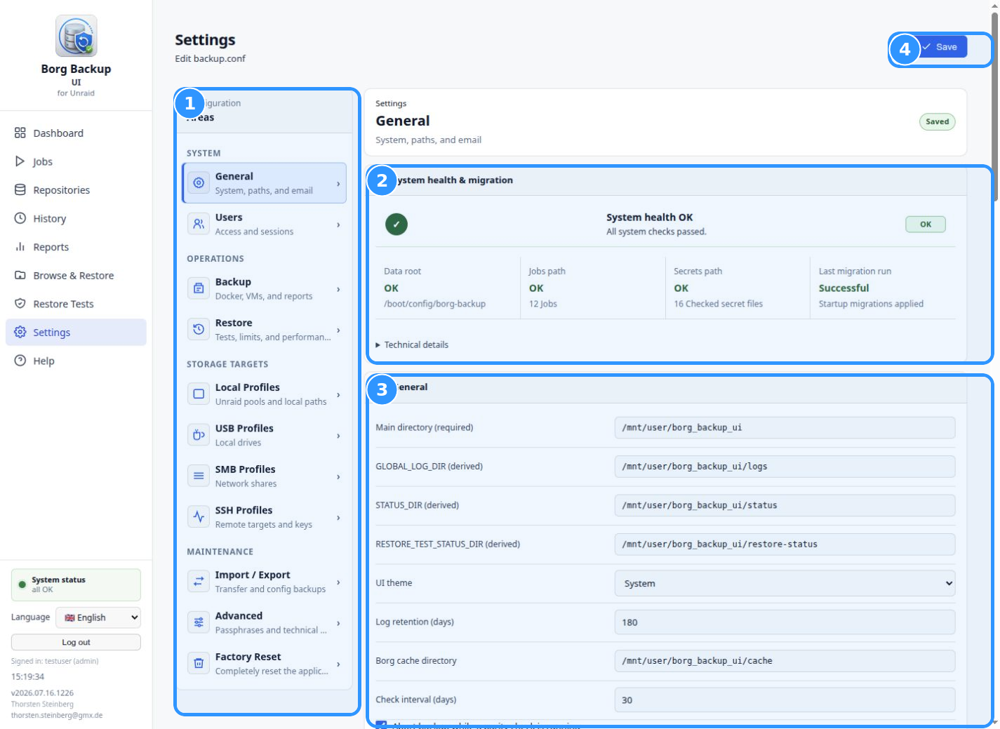

**Figure 4 - Settings:** (1) section navigation, (2) system health and migration, (3) settings for the selected section, (4) central save action.

The **Settings** page manages the application configuration. It is grouped into System, Operations, Storage Targets, and Maintenance.

> **Warning:** Settings changes can affect backup targets, secrets, notifications, restore safety, and schedules. Save only changes whose impact you understand.

### 9.1 General

The **General** section contains basic paths and general runtime parameters.

Typical contents:

- `GLOBAL_DATA_DIR` and derived runtime directories
- default paths for logs, status, and restore status
- general system parameters
- weekly report
- Homepage widget for external dashboards

#### Notifications

Borg Backup UI manages notification channels under **Settings > Notifications**. There are three separate delivery paths:

- Unraid notifications
- email/SMTP
- Apprise notification profiles

Apprise profiles can be created, edited, duplicated, enabled/disabled, tested, and removed. Stable `2026.08.31.0907` bundles Apprise `1.12.0`; Borg Backup UI offers the 137 providers detected by that version. Examples include ntfy, Rocket.Chat, Discord, and email-capable Apprise services. Provider URL formats are generated from Apprise metadata, and saved Apprise URLs are stored as secrets that are never rendered back into the page. A later Apprise release may change the number, names, or parameters of providers.

Direct email notifications use the saved global recipient; when it is empty, the weekly-report recipient is used as the fallback. Save changed SMTP and email fields before sending a test message. Port `465` uses implicit TLS, while TLS on port `587` is established with STARTTLS.

Real backup, restore-test and reminder events are delivered through Apprise in the background. The originating job writes a queue entry and does not wait for the external provider. The UI service processes the queue regularly, honors the profile timeout, attempts and backoff settings, and continues with pending entries after a restart. Sanitized delivery status is available through System Health and support bundles; queued message bodies and Apprise secret URLs are not exported in support bundles.

Configurable events can include:

- backup successful
- backup failed
- backup skipped
- backup warning
- backup overdue
- restore test successful
- restore test failed
- restore test overdue

Reminder settings apply across channels. The reminder interval prevents the same overdue condition from being reported repeatedly. The backup overdue tolerance defines when a scheduled backup run is considered overdue after its expected start time.

> **Note:** Test messages verify only the delivery channel. They do not replace a real backup or restore test.

#### Homepage Widget

The Homepage widget provides a compact, token-protected status summary for the **Homepage** project. The UI generates a YAML template containing health, successful backups, restore tests, and active runs. Treat the widget token like a password and do not expose it in screenshots or support bundles.

### 9.2 About

The **About** section shows the installed Borg Backup UI version, bundled BorgBackup version, project and license information, and notices for bundled third-party components. Include these version details in support requests. The Unraid forum thread is the primary public support channel; GitHub Issues are an additional place for reproducible bug reports.

### 9.3 Users

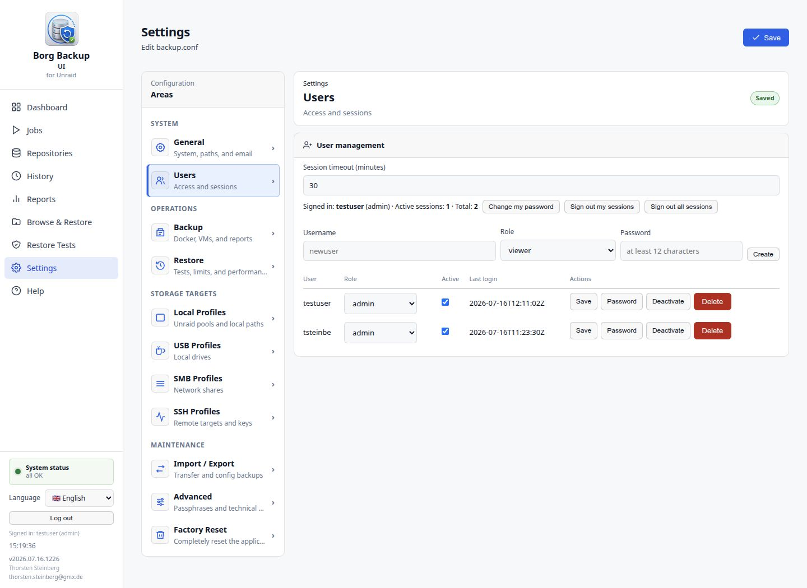

The **Users** section is visible when the application runs in user mode and the signed-in user has administrator rights.

Functions:

- view users
- change roles
- enable or disable users
- change or reset password
- sign out own sessions
- sign out all sessions
- permanently delete users

Roles:

- **admin:** Full access to settings and actions.
- **operator:** Operational actions without administrative configuration rights.
- **viewer:** Read access; write actions are restricted.

> **Tip:** Disable users first instead of immediately deleting them permanently. This makes offboarding easier to control.

If an administrator forgot the password, recovery is not handled on the login
page. Open **Unraid WebUI > Settings > Borg Backup UI** and use
**Admin Access Recovery** on the plugin control page instead. An Unraid
administrator can select an existing admin account there and reset its
password. All Borg Backup UI sessions are signed out; jobs, repositories,
secrets, settings, and logs remain unchanged.

### 9.4 Backup

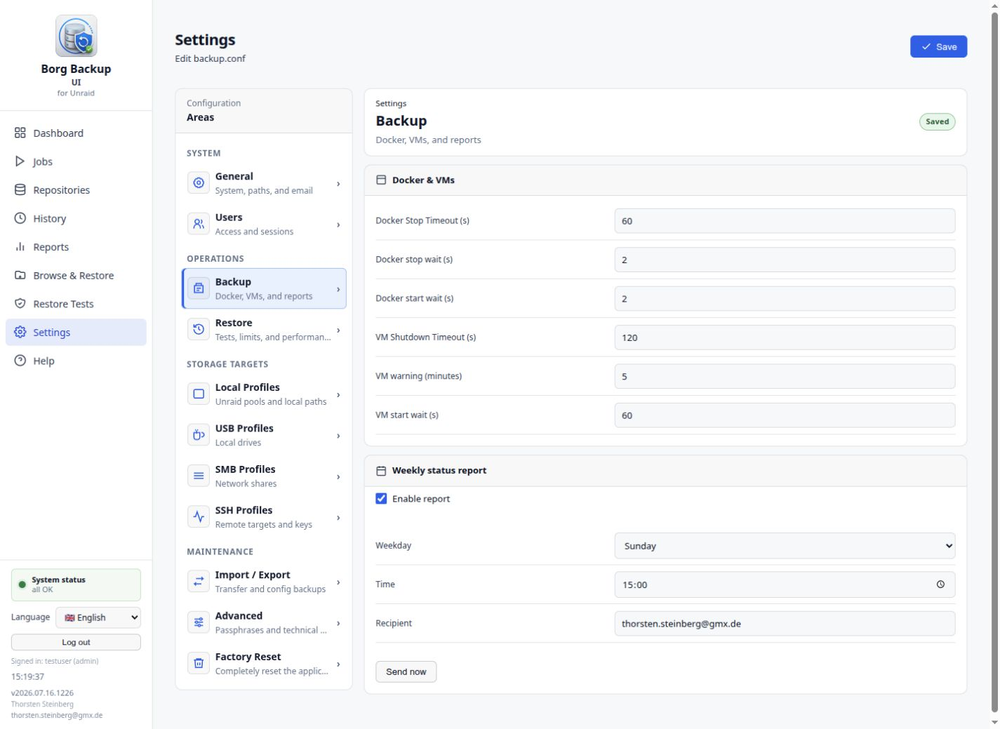

The **Backup** section contains defaults and technical limits for backup runs.

Typical settings:

- default compression
- retention defaults
- Docker and VM wait times
- Borg timeouts
- report and runtime options

These values affect new jobs or global runtime limits. Job-specific settings in the job wizard may override them.

### 9.5 Restore

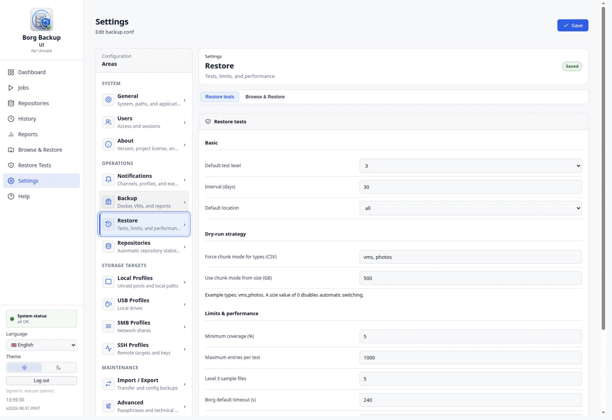

The **Restore** section contains two subsections:

- **Restore Tests**
- **Browse & Restore**

#### Restore Tests

This area manages defaults for restore tests, such as default test level, interval, runtime limits, and verification parameters.

#### Browse & Restore

This area manages allowed restore target roots. By default, only `/mnt/user` is allowed. Additional root paths must be added deliberately.

> **Warning:** Do not add overly broad paths such as `/`, `/mnt`, `/mnt/disks`, or `/mnt/remotes`. Use concrete targets such as `/mnt/disks/<name>` or `/mnt/remotes/<name>`.

### 9.6 Local Profiles

Local profiles define concrete storage targets below `/mnt`, for example `/mnt/backup`, `/mnt/cache/backups`, or a dedicated pool. The repository wizard offers only storage targets that have already been created and checked.

Functions:

- create a profile with a unique display name
- select or enter a concrete base path
- test availability and write access
- edit the profile
- delete an unused profile

Overly broad or dangerous targets such as `/`, `/mnt`, and system directories are rejected. A profile cannot be deleted while repositories or jobs still reference it.

> **Recommendation:** Use one profile per physical pool or mount and assign a clear name such as `Local Backup` or `USB-5TB`.

### 9.7 USB Profiles

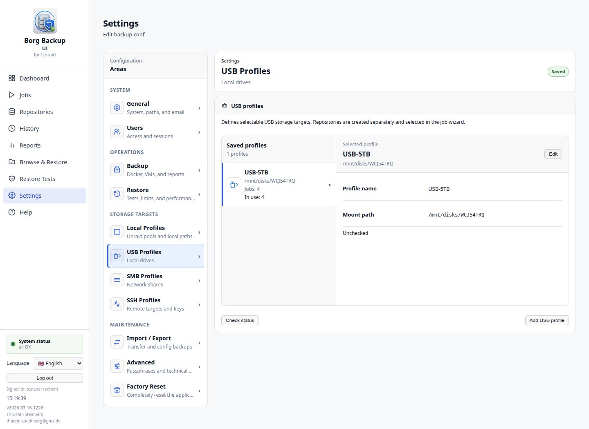

USB profiles describe local disks or Unassigned Devices targets. They are used by the job wizard for USB jobs.

Functions:

- add profile
- edit profile
- delete profile if it is no longer used by jobs
- check status

Important fields:

- profile name
- mount path

> **Note:** A USB profile does not automatically make a device available. The target must be mounted on Unraid when a backup runs.

### 9.8 SMB Profiles

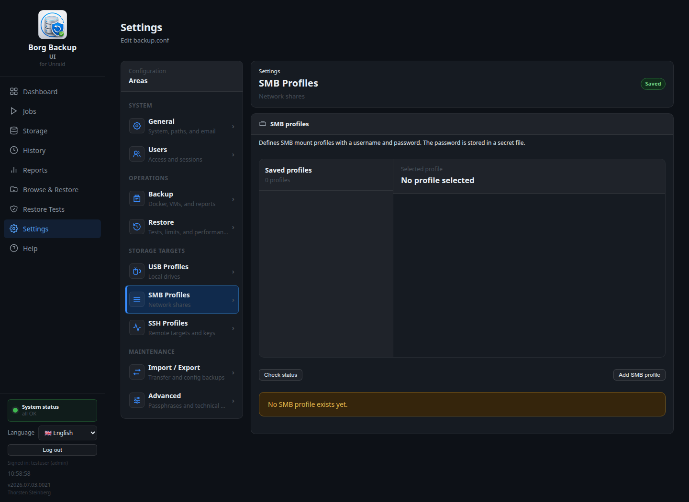

SMB profiles define network shares. Passwords are treated as secrets.

Important fields:

- profile name
- server
- share
- mount path
- username
- password
- SMB version: **Automatic (SMB 2/3)** by default; a fixed modern version can be selected when required
- optional security setting for specific server requirements
- optional mount parameters

The status check verifies TCP port 445, credentials, a temporary mount, the share, write access, and a clean unmount. Errors distinguish network, share name, authentication/permissions, and protocol/mount options. SMB1 is not supported and is never used as an automatic fallback.

> **Tip:** Start with automatic SMB 2/3 negotiation. Select a fixed version only when the server documentation explicitly requires it.

Typical actions:

1. Add profile.
2. Enter credentials.
3. Save.
4. Check status.
5. Open the repository under **Repositories** and refresh its information.

### 9.9 SSH Profiles

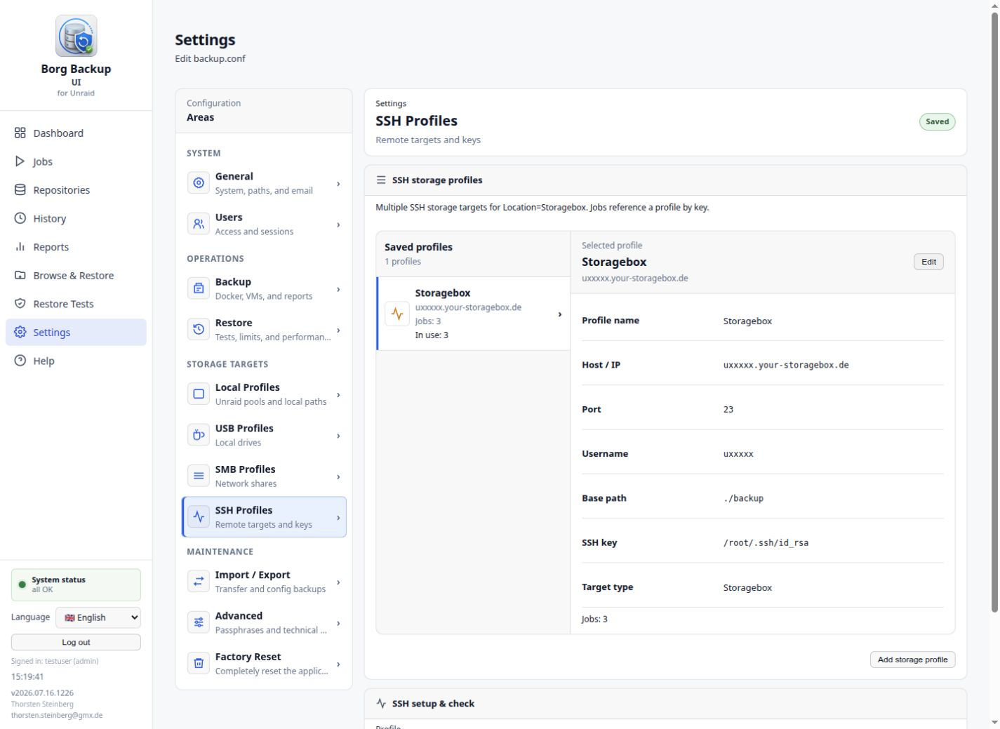

SSH profiles are used for Storagebox or other SSH targets.

Important fields:

- profile name
- host
- port
- user
- base path
- SSH key path
- target type

Functions:

- generate SSH key
- show public key
- deploy key
- test connection
- save profile

Generating an SSH key never overwrites existing key files. If a key already exists at the configured path, the interface shows a warning and continues to use the existing key.

> **Note:** For Hetzner Storage Box, a relative base path such as `./backup` is typical. Check the resolved repository path on the **Repositories** page.

The **Borg Server** target type is intended for restricted SSH accounts that start `borg serve` directly after login and do not provide a normal remote shell. For this type, the profile check therefore skips shell-based path, Borg-binary, and write tests. Actual repository access is verified while creating or importing the repository. Because directory listing through a shell is unavailable, the repository directory browser is disabled; enter the relative repository path manually.

The **Storagebox**, **Synology**, and **Generic SSH** target types continue to use normal shell mode. Select **Borg Server** only when the target account is actually restricted to `borg serve`.

### 9.10 Import / Export

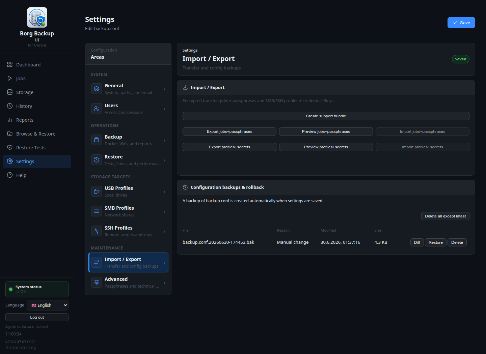

The **Import / Export** section is used to back up and transfer application configuration.

Functions:

- export jobs
- export jobs with passphrases
- export profiles and secrets
- preview imports before applying them
- choose conflict strategy
- view config backups
- prepare rollback
- create support bundle

Import strategies can keep, replace, or rename existing entries depending on the import type.

> **Warning:** Store export passwords securely. Encrypted exports cannot be restored without the matching password.

New encrypted exports use a versioned, authenticated envelope. Wrong passwords and damaged, truncated, or manipulated files are checked before import data is written. Older AES-CBC exports remain importable but show a legacy warning in the preview. Create a new export in the current format after a legacy import.

### 9.11 Advanced

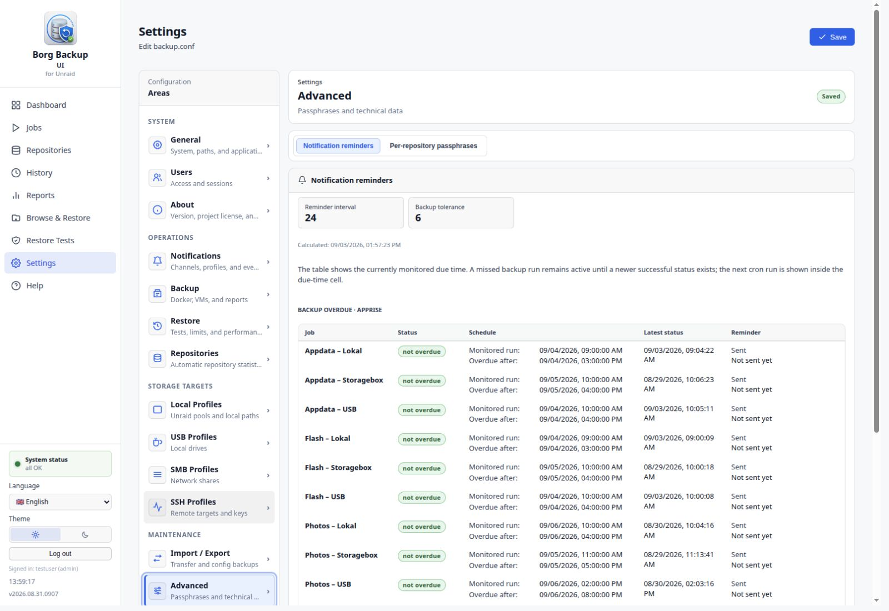

The **Advanced** section contains technical data that regular users should only inspect when needed.

Subsections:

- **Notification reminders:** Diagnostics for backup and restore test overdue notifications.
- **Per-repository passphrases:** Overview of repository-specific passphrase assignments.

Reminder diagnostics show when a run was expected, when it becomes overdue, when it was last sent, and when the next reminder is allowed. This view does not send notifications; it is diagnostic only.

### 9.12 Factory Reset

**Factory Reset** is the final entry in the **Maintenance** group. It removes the application configuration and configured operational data, then restarts Borg Backup UI at the administrator first-setup page.

Before resetting, the application checks for running backups, restores, restore tests, and repository maintenance. Managed Borg repositories inside a directory scheduled for deletion block the operation. External Borg repositories and the plugin installation are not deleted.

Approval requires every risk acknowledgment, the server name, the current administrator password, and the confirmation text `FACTORY RESET`.

> **Warning:** Users, jobs, schedules, storage targets, repository assignments, secrets, Borg keyfiles, logs, status, and history data are permanently removed. Back up `/boot/config/borg-backup` first.

### 9.13 System Status and Migration


The system status is visible at the bottom left of the sidebar. Clicking it opens the related diagnostics area inside Settings.

The area shows, among other things:

- system checks
- job checks
- migration status
- executed migrations
- runtime recovery
- setup and maintenance notes
- secret file checks

For completed migrations, **Applied** is the immutable time at which the
migration actually changed data. **Last checked** instead indicates when the
migration state was verified during the latest plugin startup. A newer check
time therefore does not mean that the migration ran again. **Audit details**
provide a readable view of recorded actions, changed keys, affected files, and
available migration backups.

For older installations, the historical application time may be unavailable
when earlier versions did not store it separately and no successful audit
event can prove it. The application reports that limitation instead of showing
the current startup time as the application time.

Plugin startup first performs read-only detection of the required conversion to permanent job identities. A required or unclear migration keeps the plugin in maintenance. Explicitly select **Prepare migration** and wait for the successfully verified backup. Download the protected backup, save and check an independent copy, and acknowledge it separately. Only **Run migration now** starts conversion using the verified plan. The backup may contain credentials; do not share it publicly.

The migration is idempotent and records actions and progress in a structured audit log. Closing the browser or restarting the plugin retains the plan, IDs, migration snapshot and journal; it does not authorize automatic continuation. An interrupted operation may only be explicitly continued after validation. If a required migration fails, later migrations and write operations remain blocked until a failure-free restart. Sign-in, System Health, migration details, and support-bundle creation remain available for diagnosis.

> **Warning:** Before a plugin update, keep an independent backup of at least `/boot/config/borg-backup`. A migration snapshot created and verified after explicit preparation protects affected data, but it is neither a complete system backup nor an automatic plugin downgrade. Unraid normally installs only the current plugin version. Repair or manual restoration must therefore be performed transparently with the installed or a corrected version.

Runtime recovery indicates that Docker containers or VMs were stopped during a backup and must be checked after a crash, abort, or restart.

> **Warning:** Mark runtime recovery notes as resolved only after the affected containers or VMs have actually been checked or started manually.

## 10. Help

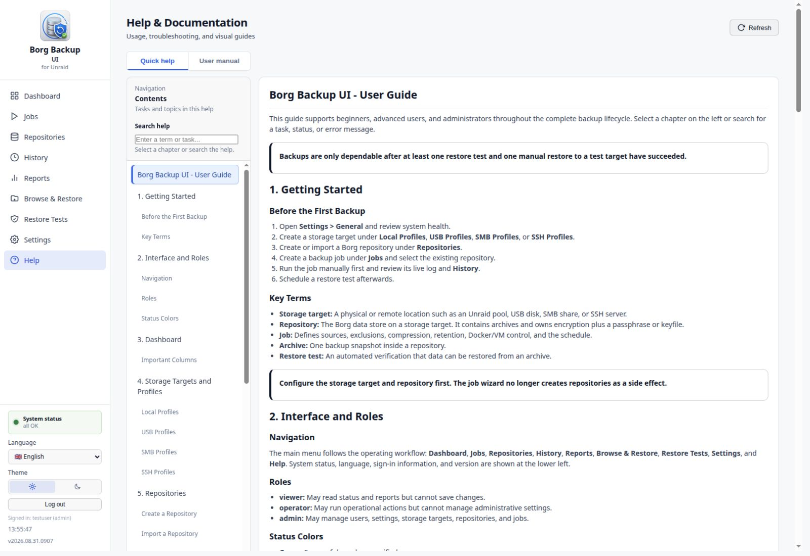

The **Help** page shows the application's integrated quick help.

### 10.1 Purpose of the Page

The help page provides quick orientation directly in the UI. It is shorter than this manual and is useful for:

- looking up terms
- checking common workflows
- reading typical error cases
- refreshing UI concepts

### 10.2 Functions

- **Refresh:** Reloads the help document.
- **Table of contents:** Jumps to sections.
- **Search:** Filters the table of contents and chapters for terms such as `restore`, `SMB`, or `passphrase`.
- **Callouts:** Highlight recommendations, warnings, and security-relevant information.
- **Language-dependent content:** Help follows the selected UI language.

## 11. Typical Tasks

### 11.1 Create a New Backup Job

1. Open **Jobs**.
2. Click **New job**.
3. Enter the job name, complete archive prefix and icon, then choose the storage target and repository.
4. Select the folders or files to back up.
5. Select the storage target first and then an existing repository.
6. Configure Docker or VM control if needed.
7. Set compression and retention. Encryption and passphrase belong to the repository.
8. Optionally enable a schedule.
9. Review the flow preview.
10. Save the job.
11. Start the job manually once and check **History**.

### 11.2 Check a Repository

1. Open **Repositories**.
2. Select the storage target and repository.
3. Refresh the repository information.
4. Open **Maintenance** and start the required check if needed.
5. Check passphrase, profile, mount, or SSH connection when an error occurs.

### 11.3 Restore Files

1. Open **Browse & Restore**.
2. Select the job.
3. Select an archive.
4. Mark files or directories.
5. Select target directory and conflict strategy.
6. Review the summary.
7. Start the restore.
8. Watch the live log.
9. Check the entry in **Restore History**.

### 11.4 Schedule a Restore Test

1. Open **Restore Tests**.
2. Select the desired job.
3. Set policy to scheduled.
4. Choose interval and level.
5. Save the policy.
6. Optionally start a manual test.
7. Review the verification report.

### 11.5 Configure Notifications

1. Open **Settings > General**.
2. Open the **Notifications** area.
3. Configure Unraid, email, or an Apprise profile.
4. Select the desired events.
5. Set reminder interval and backup tolerance.
6. Send a test message.
7. Check diagnostics under **Settings > Advanced > Notification reminders**.

## 12. Status, Warnings, and Best Practices

### 12.1 Backup Operation

- Test new jobs manually before enabling schedules.
- Check Dashboard, History, and Restore Tests regularly.
- Do not schedule large jobs too close together.
- Verify USB and network targets before production schedules.
- Keep Borg passphrases and export passwords secure.

### 12.2 Restore Safety

- Restore to a separate target directory first.
- Use **Do not overwrite** if you are unsure.
- Allow additional restore target roots only deliberately.
- Check Restore History after every restore.

### 12.3 Docker and VMs

- For a full appdata backup, stop all Docker containers where possible.
- For a full domains backup, shut down all VMs where possible.
- Use selective control only if it is clear which services write data.
- Treat runtime recovery notes seriously and resolve them only after checking.

### 12.4 Failure Analysis

Recommended order:

1. **Dashboard** for overview.
2. **History** for the concrete run.
3. Open the log file from History.
4. **Repositories** for repository information and maintenance status.
5. **Settings > System status and migration** for configuration problems.
6. Create a support bundle if the error needs to be shared.

> **Tip:** A successful backup is truly reliable only after restore tests and at least one manual restore into a test target have also succeeded.

## 13. Troubleshooting

### 13.1 Backup Succeeds but Contains No Data

An existing but empty source directory is technically valid. Do not rely on the exit code alone:

1. Open the job and compare the source path character by character with the Unraid path. Linux paths are case-sensitive.
2. Verify that the path contains readable files.
3. Review exclusion paths. An overly broad exclusion can remove all content.
4. Run the job again and check file count and original size in History or Reports.

If a configured source path is missing, Borg-Backup-UI stops the run. This prevents an apparently successful but incomplete archive.

### 13.2 Repository Lock or SSH Disconnect

A lock normally means that another Borg process is using the repository or that a previous connection did not close cleanly. Borg-Backup-UI waits for a limited time. Before removing any lock manually, verify:

- Is a backup, restore, restore test, or check still running?
- Is an SSH connection still active?
- Is another computer accessing the repository?

`Connection reset by peer` or `Broken pipe` means that the SSH connection was interrupted. Check WAN connectivity, the target server, and SSH keepalive, then restart the action. Borg does not resume an interrupted full check from its previous progress position.

### 13.3 Storage Target Is Unavailable

- **USB:** Confirm that the configured mount path is actually mounted.
- **SMB:** Test port 445, share, user, password, and SMB 2/3 compatibility in the profile check.
- **SSH/Storagebox:** Check host, port, public key, and base path.
- **Local:** Verify that the pool or disk is online and writable.

Depending on the protection rule, an unavailable managed target results in **Skipped** or **Failed**. The run log contains the exact reason.

### 13.4 Email, ntfy, or Apprise Is Not Sent

1. Send a test notification.
2. Verify that the specific event is enabled for the channel.
3. Check recipient, server, topic, provider URL, and authentication.
4. Open **Settings > Advanced > Notification Reminders** to see whether a reminder was already sent and when the next one is allowed.
5. Review the application log for SMTP or Apprise errors. `WRONG_VERSION_NUMBER` usually indicates an invalid port and TLS-mode combination.

### 13.5 Migration or System Check Failed

A failed required migration places the application in restricted maintenance mode. Open **Settings > System Status & Migration**, read the reason and affected file, and use the referenced migration backup. Normal write operations remain blocked until the problem is resolved.

> **Warning:** Do not edit JSON files without a backup. Use a support bundle and the structured migration log when requesting support.

## 14. FAQ

### Do I Need BorgBackup Experience?

No. The wizards guide you through common workflows. You should still understand repository, archive, retention, and restore; this manual explains them in context.

### Does a Backup Job Create Its Repository Automatically?

No. Storage targets are managed under **Settings**, repositories are created or imported under **Repositories**, and a job then selects an existing repository. This separation prevents accidental duplicate or incorrectly encrypted repositories.

### Where Is Encryption Configured?

When the repository is created. A job defines sources, compression, retention, and schedule but does not change encryption for an existing repository.

### Can Multiple Jobs Write to the Same Repository?

The application maintains an explicit repository assignment. Do not schedule overlapping access. Separate repositories per backup purpose are usually easier to operate when data sets or retention policies differ.

### Why Are Only Previously Running Containers or VMs Restarted?

This prevents Borg-Backup-UI from starting services that an administrator intentionally left stopped. Runtime recovery records the targets that were actually stopped and supports verification after an abort or restart.

### Is a Successful Backup Enough?

No. Also verify repository health, notifications, restore tests, and a real restore to a separate test target at regular intervals.

### Is a Support Bundle Anonymous?

No. It is **sanitized**, not fully anonymous. Secrets are masked, but technical paths, names, and infrastructure references may still identify the environment. Review the bundle before sharing it.

### What Is Removed When the Plugin Is Uninstalled?

Uninstallation stops the service and removes the plugin-owned program payload under `/boot/config/plugins/borg-backup-ui` together with remaining legacy startup and runtime entries. User data outside that plugin directory remains intact, including jobs, histories, configured data paths, and Borg repositories. Uninstallation still does not replace a verified configuration and repository backup.

## 15. Recommended Operating Practices

### 15.1 Backup Strategy

Use the 3-2-1-0-0 principle:

- three data copies including the original
- two different media or storage locations
- one offsite copy
- zero unnoticed backup failures
- zero untested backups through regular restore tests

A typical Unraid setup combines the original data on the array with a local or USB repository and an SSH/Storagebox repository.

### 15.2 Repository Layout and Secrets

- Use clear display names.
- Separate important data sets into understandable repositories.
- Back up passphrases and keyfiles outside the Unraid server.
- Export configuration and secrets in encrypted form and test the import preview.
- Delete repositories only through the protected Administration workflow and only after reviewing every job assignment.

### 15.3 Scheduling and Performance

- Leave sufficient time between large jobs.
- Avoid parallel maintenance actions on the same repository.
- Run full data checks less frequently than normal checks.
- Select compression based on hardware and data; stronger compression consumes more CPU time.
- Avoid checking offsite targets during known WAN maintenance windows.

### 15.4 Restore Readiness

- Schedule L3 tests for critical jobs at suitable intervals.
- Perform a manual restore to a test directory after major changes.
- Document where passphrases, keyfiles, and export passwords are securely stored.
- After updates, verify migration, jobs, repository assignments, and at least one representative backup run.
